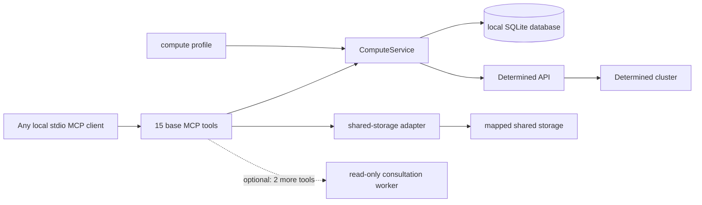

# Compute service reference

[English](compute-service.md) | [简体中文](compute-service.zh.md)

This document describes the configuration and public MCP interface of the local
Determined compute service. For an agent-neutral sequence for preparing, launching,
and checking work, see [Agent workflow](agent-workflow.md). For the optional
server-side advice worker, see [Consultation backend](consultation.md).

## Architecture and trust boundary



The MCP server is a local stdio service for one trusted user. It binds `owner` at
startup; no tool accepts an owner argument. Separate processes can use separate owner
names with one database, while collaborators can deliberately share a name. This is a
namespace boundary, not multi-user authentication. A remotely exposed service needs
its own authenticated transport.

`ComputeService` owns planning, idempotent submission, status, logs, usage measurements,
cancellation, discovery, adoption, and conservative reconciliation. Its local `task_id`
remains stable across restarts and is distinct from the Determined `remote_id`. Keep the
SQLite database on durable local storage. Keep source, data, packages, checkpoints,
logs, and outputs on mapped shared storage.

The default consultation backend is `none`. That mode registers 15 base tools and does
not import the consultation worker, require Codex, or require a repository skill
directory. Enabling the Codex backend adds `compute_consult` and `workflow_status`, for
17 tools in total. Consultation is advisory and cannot submit or cancel work.

## Compute profile

Pass the profile with `--profile PATH` or `DETERMINED_COMPUTE_PROFILE`. Its schema is:

```yaml
cluster_identity: optional-deployment-label
mounts:
  - host_path: /shared/projects
    container_path: /workspace
  - host_path: /shared/reference
    container_path: /reference
    read_only: true
defaults:
  image: your-image
  pool: your-pool
  slots: 1
shell_inactivity_seconds: 7200
```

At least one mount is required. `host_path` is the path on cluster agents and need not
exist on the MCP client machine. Requests use `container_path`; container roots cannot
overlap, so each container path maps through one corresponding mount. When validating
a host-path alias against overlapping host roots, the most specific root controls and
read-only wins a tie. `workdir`, `output_dir`, and explicit checkpoint targets must be
under writable mounts; reading reference data under a read-only mount remains valid.
These checks are service policy and do not replace filesystem permissions.

The image, resource pool, and slot count are defaults that a request can override.
`slots` must be a non-negative integer; zero asks for CPU-only auxiliary capacity when
the pool supports it. `shell_inactivity_seconds` is optional and advisory. The service
does not enforce an idle timeout.

`cluster_identity` is an optional operator-facing label. Submitted local records bind
to the profile fingerprint and the resolved Determined endpoint, including this label.
Cancellation, reconciliation, and launch retries require that exact binding. If only the
profile changed and the endpoint and label still match, status, logs, and usage remain
available read-only after the service verifies the remote owner and submission marker;
see [Cross-profile observation](#cross-profile-observation). A changed endpoint or label
blocks every operation on those records.

## Request object and planning

`compute_plan` and `compute_launch` accept the same request object:

| Field | Type | Meaning |
| --- | --- | --- |
| `name` | string | Optional display name, at most 128 characters |
| `description` | string or null | Optional display description, at most 2,048 characters |
| `allow_queue` | boolean | Allow submission when current capacity is insufficient; default `false` |
| `kind` | `auto`, `command`, `shell`, or `experiment` | Execution mode; default `auto` |
| `interactive` | boolean | Requires shell mode; in auto mode selects `shell` |
| `overnight` | boolean | In auto mode selects `experiment` |
| `command` | string or string array | Command or experiment entrypoint; shell mode rejects it |
| `workdir` | absolute container path | Working directory under a writable configured mount |
| `output_dir` | absolute container path | Output directory under a writable configured mount |
| `slots` | non-negative integer | Requested slots; defaults to the profile value |
| `pool`, `image` | string | Optional overrides of profile defaults |
| `code_revision` | string or null | Caller-provided revision or content identifier |
| `experiment_config` | object | Extra experiment configuration; requires experiment mode |
| `create_directories` | array of `output_dir`, `checkpoint_storage` | Directories that launch creates before submission; default none. See [Launch-path checks](#launch-path-checks) |
| `gpu_admission` | object, `false`, or null | Optional in-container GPU check before the workload; see [GPU admission](#gpu-admission) |

Unknown request fields and upload/context fields are rejected. In auto mode,
`interactive` selects `shell`, then `overnight` or `experiment_config` selects
`experiment`, and all other requests select `command`. An explicit `kind` is retained;
an overnight command therefore stays a command and receives an advisory.

Planning does not contact Determined: it does not authenticate, inspect capacity, create
projects, or submit work. It returns `kind`, `name`, `description`, `allow_queue`,
rendered `config`, `code_revision`, and `advisories`, plus `create_directories` and
`gpu_admission` when the request uses them and `path_checks` from the CLI and MCP server. If `name` is omitted, the service creates one and
adds an advisory. Commands and shells place the name on the first description line;
experiments use their native name field. Top-level display metadata overrides matching
experiment fields.

Command and experiment entrypoints create `output_dir`, change to `workdir`, and then
run the command through `/bin/bash -lc`. Command and shell configs use
`resources.slots`; experiments use `resources.slots_per_trial`. The service supplies
profile bind mounts and manages `COMPUTE_WORKDIR`, `COMPUTE_OUTPUT_DIR`,
`COMPUTE_CODE_REVISION`, the `COMPUTE_GPU_ADMISSION*` policy variables, and the private
submission marker. A request cannot override those variables or bind mounts.

Experiments require `command` or `experiment_config.entrypoint`, but not both. An
explicit `checkpoint_storage` must have `type: shared_fs`, a writable mapped
`host_path`, and an optional `storage_path` that remains inside that host path. Legacy
`checkpoint_path` and `tensorboard_path` aliases are rejected. If checkpoint storage is
omitted, Determined applies its cluster default, which offline planning cannot inspect.

### Launch-path checks

The CLI and MCP server give planning a read-only view of shared storage through the
storage configuration. The plan then gains `path_checks`, one entry per launch path in
the cluster-agent host namespace: every profile bind mount (`bind_mounts[i].host_path`),
the `workdir` of a command or experiment, an experiment's
`experiment_config.checkpoint_storage.host_path`, and `output_dir`. Each entry has
`field`, `host_path`, `container_path` (null for a checkpoint path without a configured
container path), `required`, `status`, and `reason`. `output_dir` is not required,
because the entrypoint creates it, unless `create_directories` names it.

A path is decided only through a trusted local view: an explicit `local_mounts` entry of
the storage configuration, which is trusted as configured, or, in `auto` or `local` mode,
a profile host root that exists locally and is detected as a mount point on this machine
(a same-filesystem bind mount and a directory below a mount are not detected; map such a
root to itself with `local_mounts`). A same-named local directory that is not detected as
a mount point may be an unrelated disk, so it is not trusted. When a `local_mounts` entry
covers a path but its local path is missing or unreadable, the service does not fall back
to the host root.

`status` is `present`, `missing`, `not_directory`, `unverified`, or `will_create`. Decide
on `status`; `reason` is diagnostic and open-ended, so new values can appear. A path the
client cannot decide is `unverified`; its reasons include `not_locally_visible`,
`local_mount_unavailable` (the covering `local_mounts` entry is not usable),
`local_view_unconfirmed` (the host root exists locally but is not detected as a mount
point),
`ssh_only_access`, `permission_denied`, `timeout`, `storage_config_unavailable` (the
storage configuration cannot be loaded), `invalid_storage_path` (the local view resolves
through a symlink outside its mapped root), and `os_error:<ERRNO>` such as
`os_error:ESTALE` or `os_error:ELOOP`; another unexpected probe error is reported by its
exception name. A `missing` path can carry `parent_not_directory`, and `will_create`
carries `missing` or the earlier unverified reason. All probes share a 10-second deadline,
so a stalled network mount cannot hang planning. Before reporting a path missing, the
service lists its parent and checks again, which refreshes cached negative lookups on
network filesystems. Unverified paths never fail. A required path that is `missing` or
`not_directory` fails `compute_plan` and `compute_launch` with `path_not_found`;
`details.missing_paths` lists its `field`, `host_path`, and `status`. `path_checks` is an
observation: planning only reads the filesystem, and `path_checks` never changes `config`
or `advisories` and is not part of the idempotency payload.

Launch runs the same checks after it looks up `request_id` and before it checks capacity,
so a failed check writes no task record and submits nothing. An existing `request_id` is
returned unchanged without checks, even if a path was removed later. When a directory
named in `create_directories` did not answer within the deadline, launch fails with the
retryable `storage_timeout` at this point instead of creating through a stalled mount.
After the checks and also before the capacity check, launch builds the Determined API
client, so a login or client configuration error likewise leaves no task record and no
created directory, and a retry with the same `request_id` can still submit.

`create_directories` explicitly asks launch to create `output_dir`, `checkpoint_storage`
(the experiment's `checkpoint_storage.host_path`, which Determined bind-mounts when the
container starts and which therefore must exist before the entrypoint runs), or both.
Nothing is created implicitly or while planning; the plan reports `will_create`. After
the capacity check and before the task record is claimed, launch creates each directory
with its parents and the default umask: through the trusted local view when one exists,
otherwise with `mkdir -p` on the configured SSH login node in `auto` or `ssh` mode, and
otherwise it fails with `configuration_required`. It never creates through an untrusted
same-named directory or an unusable `local_mounts` entry. Each local creation has the same
10-second deadline and otherwise fails with the retryable `storage_timeout`; a directory
that appears after the deadline is reported with `created: false` on retry. Creation over
SSH is bounded by the storage `timeout_seconds` and likewise fails with the retryable
`storage_timeout`. A directory that is itself a profile mount root is never created: an
existing root is reported with `created: false`, and a missing one fails the launch, with
`invalid_storage_path` when it is checked over SSH. A new submission's
result gains `prepared_directories`, a list of `{field, host_path, created}`. Nothing is
ever deleted. `checkpoint_storage` requires an experiment with `checkpoint_storage`. A
non-empty list is part of the idempotency payload; an absent or empty list leaves earlier
payloads unchanged.

### GPU admission

`gpu_admission` adds an optional preflight that runs inside the container after the
entrypoint changes to `workdir` and before the workload starts. It applies to commands
and single-node experiments with at least one slot; a shell has no managed entrypoint and
rejects it. An experiment with more than one slot must set
`experiment_config.resources.is_single_node: true`, because Determined's default lets a
trial span several agents and each container would then see only its own agent's GPUs.
`false` or null disables it. The object accepts:

| Field | Meaning |
| --- | --- |
| `count` | Positive integer; the number of GPUs that NVML reports must equal it. Default: the requested slots |
| `names` | Up to 8 case-sensitive `fnmatch`-style patterns of at most 128 printable characters without `\|`; every reported GPU name must match one |
| `driver_versions` | Patterns of the same form for the driver version |
| `min_free_mib`, `min_total_mib` | Non-negative integers checked for every reported GPU |
| `receipt` | Receipt file name under `output_dir`, ending in `.json`; default `gpu-admission.json` |

The checks apply to the GPUs that NVML reports inside the container, which are the
devices that `nvidia-smi` would list there. They do not apply `CUDA_VISIBLE_DEVICES`,
which the receipt records only for diagnosis. On a resource manager that restricts GPUs
only through `CUDA_VISIBLE_DEVICES` (for example Slurm without cgroup device
constraints), set `count` and the memory floors for the whole node or do not use
`gpu_admission`.

The plan gains the normalized `gpu_admission` object, the config gains the managed
`COMPUTE_GPU_ADMISSION*` variables, and the entrypoint becomes
`mkdir -p OUTPUT && cd WORKDIR && python3 -c '<script v1>' determined-compute-gpu-admission || exit $?`
with `COMMAND` on the next line, so a failed step ends the shell before any statement of
`COMMAND` runs. Because `COMMAND` is its own line, a `COMMAND` of only comments does
nothing and exits 0 once admission passes; a blank `COMMAND` is rejected with or without
admission.

The task image must provide `python3` (3.6 or newer) and the `nvidia-ml-py` package,
which supplies the `pynvml` module (for example `pip install nvidia-ml-py`). The
versioned script reads the driver version and each GPU's index, UUID, name, and total and
free memory through NVML, and waits at most 60 seconds for the answer. It atomically
writes the receipt, appends the same JSON record as one line to the receipt's `.jsonl`
history so experiment restarts keep earlier attempts, prints one
`determined-compute gpu_admission: passed|failed ...` line, and exits 86 on failure so
the workload never starts. A missing `nvidia-ml-py`, an NVML library or driver that
cannot initialise, a failed NVML query, or no answer within 60 seconds fails admission.
Without `python3` on `PATH`, the shell ends the task with exit code 127 and no receipt;
the workload still does not start. The receipt records `schema_version`
(`determined-compute-gpu-admission-v1`), `status`, `observed_at`, `policy`, `devices`
(index, UUID, name, driver version, and total and free MiB, rounded down), `failures`,
`cuda_visible_devices`, `nvidia_visible_devices`, `hostname`, and the Determined task,
allocation, and trial IDs when set; it records no other environment value.

The receipt holds the latest record from any task or trial that uses the same
`output_dir` and `receipt`, so concurrent trials of one experiment overwrite each other's.
The `.jsonl` line whose `determined.allocation_id` matches the attempt is authoritative;
give tasks or experiments that run at the same time separate `output_dir` or `receipt`
values. A workload can also exit 86 by itself, so exit code 86 alone is only a hint:
confirm a failed admission by the `determined-compute gpu_admission: failed` log line or
by the matching record. Conversely, a failed admission can end a command task with another
exit code: the task runs in a login shell, where a failed mkdir, cd, or admission step
calls `exit`, which runs the container user's `~/.bash_logout`, and an `exit` in that file
replaces the exit code. Confirm the admission result by the log line or the matching
`.jsonl` record, not by the exit code or task state alone. In an experiment, a failed
admission consumes a restart; set `max_restarts: 0` in `experiment_config` to stop after
one failure. A request without the field renders exactly as before.

## Start the MCP server

Start one persistent stdio process per configured client:

```bash
determined-compute-mcp \
  --profile /absolute/path/to/compute-profile.yaml \
  --db /absolute/local/path/to/tasks.sqlite3 \
  --owner your-owner \
  --secrets-file /absolute/path/to/credentials.env \
  --verify-ssl
```

`--profile`, `--db`, and `--owner` correspond to
`DETERMINED_COMPUTE_PROFILE`, `DETERMINED_COMPUTE_DB`, and
`DETERMINED_COMPUTE_OWNER`. `--storage-config` corresponds to
`DETERMINED_COMPUTE_STORAGE`; `--secrets-file` can instead be supplied through
`DETERMINED_COMPUTE_SECRETS`. The API URL, token, and TLS verification default to
`DET_MASTER`, `DET_API_TOKEN`, and `DET_VERIFY_SSL`; keep credentials in the existing
provider or secrets file rather than the profile, database, tool arguments, or reports.

The default database path used by the CLI is
`~/.local/state/determined-compute/tasks.sqlite3`, but MCP deployments should specify
an absolute local path. MCP rejects `:memory:`. After an upgrade, restart every MCP
process that shares the database so all processes load the same tool set and additive
schema.

Optional client-side access to mapped storage uses the same profile and a separate
storage configuration. See [Shared-storage access](shared-storage-access.md).

## MCP API

The base server exposes 15 tools. The `owner` below is always the startup-bound
namespace and never a tool argument.

| Tool | Arguments | Return value and effect |
| --- | --- | --- |
| `compute_plan` | `request` | Offline normalized plan; no cluster or database mutation |
| `compute_launch` | `request`, `request_id` | Persisted task record; may submit once |
| `compute_status` | `task_id` | Local task record, refreshed remote state, remote entity when bound, and `binding` |
| `compute_logs` | `task_id`, optional `tail=200`, `include_binding=false` | Chronological list of the newest remote log records, or `{task_id, binding, logs}` with `include_binding=true` |
| `compute_usage` | `task_id`, optional `window_seconds=3600`, `allocation_id`, `trial_id`, `metrics`, `include_samples=false` | Read-only summary of one task's measured CPU, memory, and GPU use |
| `compute_cancel` | `task_id` | Updated record, remote cancellation response, and acknowledgement |
| `compute_reconcile` | `task_id`, `remote_id` | Record bound only after marker verification |
| `compute_list_tasks` | none | Local records in the bound owner namespace, each with an offline `binding` |
| `compute_discover` | `kind`, optional `limit=50`, `offset=0` | One current-account remote page; no local mutation |
| `compute_adopt` | `kind`, `remote_id` | Idempotently registered local record; no remote submission |
| `compute_resources` | optional `slots=1`, `pool` | Current scheduler capacity and candidate pools |
| `storage_check` | `path` | Access information for a mapped container path |
| `storage_sync` | `local_dir`, `shared_dir`, optional `dry_run=true` | Preview or copy local directory contents to shared storage |
| `storage_fetch` | `shared_dir`, `local_dir`, optional `dry_run=true` | Preview or copy shared directory contents locally |
| `storage_snapshot` | `repo_dir`, optional `revision="HEAD"`, `include`, `exclude`, `dry_run=true`, `verify=false` | Preview or publish a git revision as a read-only, content-addressed shared workdir |

`compute_consult(question, request_id, context?)` and
`workflow_status(workflow_id)` appear only with an enabled consultation backend. Their
configuration, lifecycle, and limits are in [Consultation backend](consultation.md).

### Plan, capacity, and launch

Call `compute_plan` first and review resolved paths, mode, image, pool, slots,
advisories, and `path_checks`. `compute_resources` is a live snapshot, not a reservation. Positive slot
requests inspect schedulable agent slots; zero checks auxiliary-container capacity.
Candidate pools are suggestions and are never substituted automatically.

`compute_launch` checks capacity unless `allow_queue` is explicitly true. Its
`request_id` is an idempotency key within the bound owner. Repeating the same ID and
equivalent request returns the established record. Reusing it with different content
returns `idempotency_conflict`. Once a local row has claimed an ID, a retry cannot
submit a second remote task, even after restart.

The adapter sends command and shell configs as mappings. It serializes experiment
configs as YAML and requests activation. It rejects source upload aliases, never
creates a project, removes API envelopes, sanitizes retained identity material, and
returns an entity with an `id`.

### Task records, status, logs, and cancellation

A public task record includes `task_id`, `request_id`, `owner`, `origin`, `kind`, local
`state`, `remote_id`, `remote_state`, display metadata, paths, revision, cluster/account
binding fields, an optional fixed `error_code`, and timestamps. Internal request hashes,
profile hashes, and submission markers are never public. The service stores no full
request body, generated config, API response, logs, or raw exception text in a task
record.

`compute_status`, `compute_usage`, and `compute_logs` with `include_binding=true` report
`binding`: `mode` (`profile`, `cross_profile`, or `adopted`), `profile_matches` (null for
an adopted task), `cluster_identity_matches`, `verified` (the checks made for this call:
none for `profile`, `remote_owner` and `submission_marker` for `cross_profile` with a
remote ID, and `remote_cluster` and `remote_owner` for `adopted`), `mutations_allowed`,
and `message`. `compute_list_tasks` adds an offline `binding` to each row without
contacting Determined; its `mode` can also be `mismatch` when the endpoint or label
differs, or `unknown` when the client configuration cannot be resolved, and
`mutations_allowed` is null for adopted records because their checks are live.

`compute_status` returns local state without contacting Determined when no remote ID is
bound. Otherwise it fetches the entity, updates `remote_state`, and includes the
sanitized entity as `remote`. A stale `pending` or `submitting` row becomes
`submission_uncertain`; this never causes automatic resubmission.

`compute_logs` requires a positive `tail`. Command and shell logs come from their task
log API. Experiment logs come from the highest numeric trial ID, which a server-side
sort selects even when an experiment has more than 100 trials; an experiment with no
trials returns an empty list. Results are ordered oldest to newest. A task with no
remote ID also returns an empty list.

`compute_cancel` uses the task kill endpoint for commands and shells and the experiment
cancel endpoint for experiments. It requires a bound remote ID and returns
`cancellation_acknowledged: true` when the API call completes. Remote termination alone
does not prove success; inspect exit information and expected shared-storage artifacts.

For a running shell, use the sanitized `reconnectCommand`, currently
`det shell show_ssh_command <remote-id>`. The adapter removes `privateKey`; never put
private key material in task records, consultation context, or reports.

### Task usage measurements

`compute_usage` is read-only and summarizes the measured CPU, memory, and GPU use of one
owned task; `compute_resources` describes scheduler capacity instead. It requires a
Determined master from the research-cluster fork 0.40.1 or later on which an
administrator has configured `integrations.task_resources` (`prometheus_url` and
`det_cluster`).

The service validates arguments first and then applies the same owner and binding
checks as `compute_status`. A record without a remote ID returns `remote_id_unknown`;
reconcile it first. An adopted task's remote owner is verified again. The service then
asks the master whether task resources are available: a disabled integration returns
`task_resources_disabled`, and a master without the API returns
`task_resources_unsupported`. Neither is retryable.

For a command or shell, `determined_task_id` is the remote ID. An experiment reports one
trial: the highest-ID trial by default, or `trial_id` when given. A requested trial that
belongs to another experiment returns `trial_not_found`; a nonexistent or inaccessible
trial ID returns Determined's HTTP 404. Other kinds reject `trial_id`. The service
measures the selected trial's newest Determined task. An experiment with no trial, or a
trial with no task, returns `task_not_started`. `allocation_id` restricts results to one
allocation listed for that task; any other value returns `allocation_not_found`.

`window_seconds` must be 60 through 604,800 (seven days); the default is 3,600. The
window ends at the task end time for an ended task, capped at the current time, and
otherwise at the current time. If every selected allocation ended before that, as for a
paused trial or an earlier allocation named by `allocation_id`, the window ends when the
last of them ended instead. It starts `window_seconds` earlier, but never before the
task start or the requested allocation's start, and always at least one second before
its end. `window.anchor` reports which end applied: `task_end`, `allocation_end`, or
`now`. The step is the larger of 15 seconds and the window length divided by 1,439,
rounded up to a whole second, so no series exceeds 1,440 points. `metrics` is a
non-empty list drawn from `allocation_active` (count), `cpu_cores` (cores),
`memory_working_set_bytes` and `memory_rss_bytes` (bytes), `gpu_utilization_percent`
(percent), `gpu_memory_used_bytes` (bytes), `gpu_power_watts` (watts), and
`gpu_temperature_celsius` (celsius); omit it to keep every returned series.

The result contains:

| Field | Meaning |
| --- | --- |
| `task_id`, `kind`, `remote_id` | Local task identity |
| `determined_task_id` | Determined task whose measurements were read |
| `trial` | `null` for commands and shells; otherwise `id`, `state`, `selection` (`latest` or `requested`), `experiment_trial_count` (`null` when `trial_id` was given), `task_count`, and the trial progress and summary-metric fields described below |
| `resource_pool` | The task's pool as `name` and the operator-written `description` from Determined, trimmed and truncated to 4,096 characters. `description` is `null` when the pool has none or is not in the pool list returned to this account. The whole field is `null` when the pool name is unknown |
| `task_start_time`, `task_end_time` | Lifetime of the Determined task |
| `allocations` | Each allocation's `allocation_id`, `state`, `is_ready`, UTC `start_time` and `end_time`, `slots`, `exit_reason` (at most 1,024 characters), and `status_code` |
| `allocation_details_limit` | Present, as 8, only when the task has more than 8 allocations; see below |
| `allocation_id` | Requested allocation filter, or `null` |
| `window` | `start` and `end` in Unix seconds, `step` in seconds, plus `start_at`, `end_at`, `anchor`, and `expected_points` |
| `series` | One summary per metric and label set |
| `gpus` | One GPU comparison per allocation; see below |
| `warnings` | Determined's `{code, message}` warnings, passed through unchanged |
| `context_unavailable` | Context lookups that failed: `resource_pool`, `allocation_details`, or `gpu_models` |
| `explanation`, `advisory` | How to read this result |
| `observed_at` | Time the service built the result |

Each series has `metric`, `unit`, the labels `allocation_id`, `node`, and `gpu_uuid`,
`gpu_model`, `points`, `available_points`, `first_at`, `last_at`, and `last`, `min`,
`max`, `mean`, `p50`, and `p95` over the available samples. `p50` and `p95` are
nearest-rank percentiles. `gpu_model` is the model name the Determined agent reports for
`gpu_uuid`, or `null` for a non-GPU series or an unknown device. A
`gpu_utilization_percent` series also has `idle_fraction`, the share of its available
samples below 10%.

Values are point samples taken every `step` seconds, so `min`, `max`, `mean`, and the
percentiles describe those samples rather than every instant. A null or missing value
means no measurement, never zero use. `allocation_active` above zero means the
allocation was running. CPU and memory series are per allocation and node; GPU series
are per GPU UUID and cover the whole assigned device, which can include other processes.
Inspect `warnings`, such as `rss_unverified` or `gpu_full_device`, before drawing
conclusions. An empty `series` list means no data for the window, not an idle task; if a
`metrics` filter removed every returned series, `explanation` names the metrics that
were returned. When `trial_id` is omitted and the experiment has several trials,
`explanation` states how many exist and which one is reported.

`gpus` compares the GPUs within each allocation. It has one entry per `allocation_id`
with GPU utilization or memory series and uses every such series returned for the
window, even those a `metrics` filter hides from `series`; with `allocation_id`, it
covers that allocation only. Each entry has `gpu_count` (distinct GPU UUIDs with a
returned utilization or memory series, even if every sample is null), `requested_slots`
(the allocation's slot count, or `null` when unknown), `gpu_models` (distinct known
model names, possibly empty), and statistics of per-GPU mean utilization:
`mean_utilization_percent` averages the per-GPU means so each GPU counts equally,
`min_gpu_mean_utilization_percent` and `max_gpu_mean_utilization_percent` are the lowest
and highest, `utilization_spread_percent` is their difference, and
`least_utilized_gpu_uuid` names the lowest, with ties going to the lexicographically
first UUID. These utilization statistics include only GPUs with at least one available
utilization sample, so they can cover fewer GPUs than `gpu_count`. `idle_fraction` is
instead the share of all the allocation's utilization samples below
`idle_threshold_percent` (10). `max_memory_used_bytes` is the largest single-GPU memory
sample in the allocation, not a true peak; GPU memory capacity is not reported. A large
spread points to an idle or straggling GPU, starting with `least_utilized_gpu_uuid`, and
a high `idle_fraction` means the GPUs spent much of the window below the threshold. A
`gpu_count` below `requested_slots` means fewer GPUs returned a series than the
allocation holds; check `warnings` and monitoring coverage before calling the rest
unused.

For an experiment, `trial` also carries Determined's values for the whole trial, not for
the measurement window: `total_batches_processed`, `wall_clock_seconds`, and `restarts`,
each `null` when missing or malformed. `total_batches_processed` is the highest reported
`steps_completed`, and `restarts` is capped at the experiment's `max_restarts`.
`batches_per_second_lower_bound` divides batches by wall-clock seconds and is `null`
when either is unknown or wall-clock time is zero; its unit is whatever the workload
reports as `steps_completed`. It is a floor, because `wall_clock_seconds` adds up each
allocation from when Determined first reports its resources pulling or running until it
ends, or until now while it runs. That can include image pull, startup, initialization,
and allocations lost to restarts; scheduler queue time and gaps between allocations,
such as pauses, are not counted. `summary_metrics` keeps Determined's per-group,
per-metric statistics, reduced to `type` and the finite numeric `count`, `sum`, `min`,
`max`, `last`, and `mean`; group names such as `avg_metrics` (training) and
`validation_metrics` are Determined's and are passed through unchanged. At most 100
metric entries are kept: `validation_metrics` first, then `avg_metrics`, then other groups
by name, with metrics in name order within each group; `summary_metrics_truncated` is
true when more existed. These fields depend on the
workload reporting through Determined's Core API. A `total_batches_processed` of 0,
which `explanation` then notes, is expected for a workload that does not, such as a
plain bash entrypoint, or that has not reported yet, and does not mean it made no
progress. `summary_metrics` is `{}`
when the workload reports no metrics.

Pool, allocation-detail, and GPU-model context is best-effort and read after the
measurements. A Determined API error in one of these lookups, including a transport
failure or malformed response, adds `resource_pool`, `allocation_details`, or
`gpu_models` to `context_unavailable` and leaves the affected fields empty or `null`;
the measurements are still returned. After a transport failure, the remaining lookups are
skipped and reported the same way, so an unresponsive master delays the result by one
timeout rather than one per lookup. A submitted task needs one extra entity read, which
`compute_logs` does not make, to learn its pool name, and a failure there reports
`resource_pool`; an adopted task reuses the entity read for its ownership check.
Determined serves an ended command or shell for only 24 hours after it ends and not
after a master restart; for such a task, `resource_pool` is then `null` without a
`context_unavailable` entry. The
pool list is read only when the pool name is known. Allocation details are read for the
first eight allocations in Determined's order (allocations without an end time, such as
queued or running ones, first, then most recently ended) plus a requested
`allocation_id`; other allocations keep `null` details, and `allocation_details_limit`
reports the limit. The agent list, which supplies GPU model names, is read only when a
GPU series exists. When RBAC hides device UUIDs from the current account, `gpu_model` is
`null` and `gpu_models` is empty without any `context_unavailable` entry.

`include_samples=true` adds `samples_omitted`. When `samples_omitted` is false, each
series also has `samples` as `[unix_seconds, value_or_null]` pairs. When the selected
series together exceed 2,880 points, the service omits samples and reports
`samples_limit`; narrow the window, select fewer metrics, or choose one allocation.

The master limits a query to a seven-day range, a 15-second minimum step, 1,440 points
per series, and a 10-second timeout, and runs at most four resource queries at once.
HTTP 503 means the measurement backend is busy or unavailable and is retryable. The
master rejects an end more than 60 seconds ahead of its own clock with HTTP 400, so a
client clock far ahead of the master can cause that error. HTTP 404 means the Determined
task, or a requested trial ID, is missing or inaccessible. See
[troubleshooting](troubleshooting.md#usage-measurements-are-unavailable-or-empty).

### Discover and adopt

`compute_discover` accepts `kind` equal to `command`, `shell`, or `experiment`. `limit`
must be 1 through 100 and `offset` must be non-negative. It queries only tasks owned by
the currently authenticated Determined account and returns the actual cluster ID,
account identity, sanitized metadata, any matching `local_task_id`, and consistent
pagination including `next_offset`. It neither writes a local record nor submits work.
Command and shell remote IDs are UUIDs; experiment remote IDs are positive integers.

`compute_adopt` fetches one remote task and verifies both its normalized ID and
`userId` against `/me` before writing. Administrative visibility cannot be used to
adopt another user's task. Registration identity is the local owner, actual cluster ID,
kind, and remote ID; the record also binds and verifies the authenticated user ID. A
previously submitted record in the same database is returned unchanged rather than
replaced.

New adopted records have `origin: "adopted"`, local `state: "adopted"`, and an internal
adoption request ID. They retain only whitelisted identity, state, name, and description
metadata. Unknown `workdir`, `output_dir`, and `code_revision` are exposed as `null`;
the store does not infer them or retain raw remote configuration. Later status, logs,
usage, and cancellation re-check the actual cluster and account binding. Adopted tasks
do not use the submitting profile as their authority and gain no storage permissions.

Use discovery and adoption for work created by the WebUI, native CLI, or another device
under the same account. Use reconciliation for a local submission whose acceptance was
uncertain. An adopted task cannot be reconciled or used as a launch retry.

### Reconciliation and recovery

A transport timeout can leave remote acceptance unknown. The service preserves the
local task and returns its `task_id` in error details. It does not resubmit that request
automatically. `compute_reconcile(task_id, remote_id)` fetches the proposed entity and
binds it only if its reserved `COMPUTE_SUBMISSION_MARKER` equals the local unguessable
marker. A mismatch returns `identity_mismatch`. First-line description markers are
considered only for migrated legacy records without stored display metadata.

This marker separates reconciliation from adoption: an uncertain local submission with
a matching marker must be reconciled, while an independently created remote task can be
adopted. If evidence is unavailable, investigate rather than launching the same work
again.

### Cross-profile observation

Submitted local tasks remain bound to the original profile fingerprint and endpoint for
every mutation. Cancellation and reconciliation require both and otherwise return
`binding_mismatch` before any remote call. Adoption that resolves to a record submitted
with another profile returns `binding_mismatch` after its read-only cluster, account, and
entity lookups. A launch retry with a changed profile returns `idempotency_conflict`,
because the profile fingerprint is part of the request hash. Status, logs, and usage are
read-only and also accept a record submitted with another profile when its stored
endpoint and label equal the current ones. Before reading task data, the service calls
`/me`, fetches the entity, and requires its `userId` to be the authenticated account
(`ownership_mismatch` otherwise), its ID to equal the record's remote ID, and its
submission marker to equal the record's marker, or, for a legacy record without display
metadata, its first description line (`identity_mismatch` otherwise). The marker proves
that the remote task is this record's submission even if IDs repeat after a master is
reinstalled at the same address. A cross-profile read therefore needs the live entity.
When the entity read returns HTTP 404, the read fails with `cross_profile_unverifiable`
before any task data is read. For a command or shell, the usual cause is that Determined
dropped the entity, which it does 24 hours after the task ends and on a master restart;
the task's original profile can still read its logs and usage. For an experiment, the 404
means it was deleted or is not visible to the account; deleting an experiment also
deletes its logs, so the original profile can read them only if the experiment still
exists. Other entity-read errors are returned unchanged. Such a read costs one `/me`
call, plus one entity read for logs; usage moves its usual entity read before the
measurements and requires it to succeed. The exact-profile path makes no extra call. A
cross-profile status writes only the cached `remote_state`, and a record without a remote
ID is returned as stored, without remote calls or the stale-submission transition. To
cancel, reconcile, or retry a launch, use the task's original profile. A changed endpoint
or label still blocks every operation. Adopted tasks remain bound to the actual cluster
ID and authenticated user ID. These checks prevent a changed profile or account from
operating on an unrelated task.

### Errors

MCP failures use `isError: true`; their text content is compact JSON of this form:

```json
{"error":{"code":"invalid_request","message":"...","retryable":false,"details":{}}}
```

`retryable` and `details` appear only when available, and structured content is null.
Safe details can include the local task ID, capacity information, and `missing_paths`
for `path_not_found`. Authentication,
permission, transport, and response-shape failures are errors rather than empty
results. Error messages and reports may contain sanitized commands, paths, IDs, states,
and error classes, but must not include credentials or secret-file contents.

A Determined HTTP failure, including a gRPC-gateway error body, appears as
`<status> <message>`. HTTP 429 and 5xx responses other than 501 are retryable; 501 means
the master lacks the route. Usage-specific codes are described in
[Task usage measurements](#task-usage-measurements).

On the Determined fork 0.40.1 or later with basic authorization, only the task's
Determined owner or an administrator can kill or cancel commands, shells, and
experiments. For a task owned by another account, `compute_cancel` therefore returns
HTTP 403 for a command or shell and HTTP 404 `experiment '<id>' not found` for an
experiment. Submitted records bind to the profile and endpoint rather than the account,
so switching credentials to another account can produce these errors. Cancel with the
owning account or ask an administrator.

## CLI equivalents

The JSON CLI uses the same service boundaries and can share the database and owner with
MCP. It accepts request JSON/YAML inline or from a file and wraps success as
`{"ok":true,"result":...}` and failure as `{"ok":false,"error":...}`. The
following is a complete short setup; replace `TASK_ID` and `REMOTE_ID` with returned
identifiers:

```bash
export DETERMINED_COMPUTE_PROFILE="$PWD/.local/profile.yaml"
export DETERMINED_COMPUTE_DB="$PWD/.local/tasks.sqlite3"
export DETERMINED_COMPUTE_OWNER="$USER"
export DETERMINED_COMPUTE_SECRETS="$PWD/.local/credentials.env"
export DET_VERIFY_SSL=true

determined-compute plan --request-file .local/request.json
determined-compute launch --request-file .local/request.json --request-id my-job-001
determined-compute status TASK_ID
determined-compute logs TASK_ID
determined-compute usage TASK_ID --window-seconds 7200 --metric gpu_utilization_percent

determined-compute logs TASK_ID --with-binding

determined-compute discover command --limit 20 --offset 0
determined-compute adopt command REMOTE_ID

determined-compute --storage-config .local/storage.yaml snapshot "$PWD" --revision HEAD
```

`plan` and `launch` read `--storage-config` or `DETERMINED_COMPUTE_STORAGE` for
[launch-path checks](#launch-path-checks); when that file cannot be loaded, they report
the paths as `unverified` and continue. `logs --with-binding` returns the
`{task_id, binding, logs}` envelope. `snapshot` previews by default and publishes with
`--execute`; see [Shared-storage access](shared-storage-access.md#publish-a-code-snapshot).

For file staging and retrieval, use the separate
[shared-storage guide](shared-storage-access.md). For the full agent sequence around
these deterministic calls, use [Agent workflow](agent-workflow.md).
