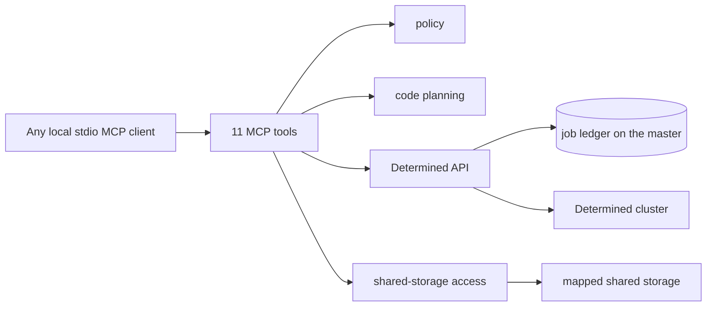

# Compute service reference

[English](compute-service.md) | [简体中文](compute-service.zh.md)

This document describes the configuration and public MCP interface of the local
Determined compute service. For an agent-neutral sequence for preparing, launching,
and checking work, see [Agent workflow](agent-workflow.md).

## Architecture and trust boundary



The MCP server is a local stdio service for one trusted user. It keeps no local state:
the Determined master records every job, keyed by the `request_id` that a plan mints,
and `job_id` is the only handle for a job. The owner of a job is the authenticated
Determined user, so every client of that user, including the WebUI and the CLI, sees
the same jobs through `compute_list`. A remotely exposed service needs its own
authenticated transport.

The master owns identity, idempotency, plan binding, admission, placement, and the
exit class of every allocation. The MCP owns the policy, which is narrower than the
master's access control, the user's working tree, code delivery, and the
interpretation of results. Keep source, data, packages, checkpoints, logs, and outputs
on mapped shared storage.

The service needs a Determined master that speaks submission protocol 1 or later.

## Policy

Pass the policy file with `--profile PATH` or `DETERMINED_COMPUTE_PROFILE`. It is
YAML, or JSON when its name ends in `.json`, and has these keys:

```yaml
mounts:
  - host_path: /shared/projects
    container_path: /workspace
  - host_path: /shared/reference
    container_path: /reference
    read_only: true
defaults:
  image: your-image
  pool: your-pool
  slots: 1
pools: [your-pool, your-other-pool]
max_slots: 8
allow_overwrite: false
```

| Key | Meaning |
| --- | --- |
| `mounts` | Required. Maps each container path to the host path that the administrator binds on every agent (`task_container_defaults.bind_mounts`). The MCP never sends a bind mount; it uses the map to check paths and to reach shared storage. `read_only: true` refuses an `output_dir` or a sync target beneath it |
| `defaults` | Required `image` and `pool`, and `slots` (default 1). A request that omits them gets these values, and pool and slots are always sent explicitly |
| `pools` | The pools a request may name. When omitted, only the default pool is allowed |
| `max_slots` | The most slots one request may hold: slots per trial times the concurrent trials of a search |
| `allow_overwrite` | Whether `storage_sync` and `storage_fetch` may replace existing files (default `false`) |

Unknown keys are rejected. `host_path` need not exist on the MCP client machine. These
checks narrow what the MCP sends; they do not replace the master's access control or
filesystem permissions.

## Start the MCP server

Start one persistent stdio process per configured client:

```bash
determined-compute-mcp \
  --profile /absolute/path/to/profile.yaml \
  --storage-config /absolute/path/to/storage.yaml \
  --secrets-file /absolute/path/to/credentials.env \
  --verify-ssl
```

| Flag | Environment | Meaning |
| --- | --- | --- |
| `--profile` | `DETERMINED_COMPUTE_PROFILE` | Policy file; required |
| `--storage-config` | `DETERMINED_COMPUTE_STORAGE` | Optional [storage access](shared-storage-access.md) file |
| `--secrets-file` | `DETERMINED_COMPUTE_SECRETS` | `KEY=VALUE` credentials file |
| `--api-url` | `DET_MASTER` | Master URL, when the secrets file does not name it |
| `--api-token` | `DET_API_TOKEN` | API token, when the secrets file does not supply credentials |
| `--verify-ssl`, `--no-verify-ssl` | `DET_VERIFY_SSL` | TLS verification |

The master URL is `--api-url`, else the secrets file's `DET_MASTER`, else the
environment's `DET_MASTER` (`DET_MASTER_ADDR` and `DET_MASTER_HOST` are also read). A
secrets file that names its master supplies the credentials for that master alone: the
environment's `DET_API_TOKEN`, `DET_USERNAME` and `DET_PASSWORD` are then ignored, and
when the environment names a different master, startup refuses. `--api-token` always
wins. The credentials are either `DET_API_TOKEN` or both `DET_USERNAME` and
`DET_PASSWORD`. Keep them in the secrets file, never in the policy, tool arguments, or
reports.

At startup the server reads `GET /api/v1/master`, which needs no login, and exits with
status 2 when the master's submission protocol is below 1 or missing, whatever its
release string. It also exits with status 2 for an invalid policy, storage file, or
credential source. An unreachable master does not stop startup: the storage tools
keep working, and the same protocol check runs before the first call to the master.
Startup errors go to stderr, because stdout carries MCP frames.

## TaskSpec

`compute_plan` and `compute_launch` take a `TaskSpec`:

| Field | Type | Meaning |
| --- | --- | --- |
| `kind` | `command`, `shell`, or `experiment` | Required |
| `name` | string | Required display name, at most 128 characters |
| `command` | string | Required for a command and an experiment; a shell has none |
| `code` | object or omitted | How code reaches the container; see below |
| `workdir` | relative path | Directory below the code root to run in; default `.` |
| `output_dir` | absolute container path | Required for a command and an experiment; created before the command runs, and exported as `COMPUTE_OUTPUT_DIR` |
| `admission` | `queue` | The only supported value; `immediate` is refused with `admission_unsupported` and nothing is created |
| `image`, `pool`, `slots` | string, string, integer ≥ 0 | Overrides of the policy defaults |
| `env` | object | Environment variables; the `COMPUTE_` prefix is reserved |
| `workspace`, `project` | string | Names. A command or shell takes a workspace; an experiment takes both or neither |
| `experiment` | object | Experiment config; only for an experiment |

Unknown fields are rejected, and so is a shell with a command, an `output_dir`, a
`workdir`, or git code. The master validates everything else through the dry run.

**Code sources.**

| `code.source` | Fields | Code root (`COMPUTE_CODE_ROOT`) | Delivery |
| --- | --- | --- | --- |
| `git` | `repo` (container path on shared storage), `revision` (default `HEAD`) | `/run/determined/code` | The task clones `repo` at the pinned commit; nothing is uploaded |
| `context` | `repo` (absolute local path of a working tree), `revision`, `include`, `exclude` | `/run/determined/workdir` | Tracked files at `revision` plus the `include` paths from the working tree, uploaded as the task context, at most 99,614,720 bytes |
| `path` | `dir` (container path on shared storage) | `dir` | Runs in place; never pinned |

The plan pins `revision` to a full commit SHA, and the resolved spec carries it, so a
launch never re-resolves a branch. A `git` repository must lie under a policy mount
and be readable on this machine through a local mount: this release plans `git` code
only through a local mount, not over SSH, so map the repository's root in the storage
access file's `local_mounts` (with `mode: auto` or `local`) or send the code as
`context`. The commit must be on a branch or tag (`commit_not_on_ref`), because the
task's clone borrows objects from the repository and `git gc` prunes unreachable ones.
Partial clones, linked worktrees, and repositories with alternates are refused, a
missing LFS object is `lfs_object_missing`, and planning needs git 2.32 or later. The
image must provide `git`, and `git-lfs` when the commit has LFS files.

A `context` upload never includes hard secret matches (keys, credentials, the
configured secrets file); secret-like names are uploaded only when `include` names them,
and both are listed as `excluded`. Anyone who can read the job can read its context.

**Rendering.** Commands run under `bash -lc` and experiment entrypoints under `sh -c`,
as `<prelude> || exit $?`, a newline, and the command. The prelude delivers the code,
creates `output_dir`, and enters `workdir`; if any step fails, including a workdir that
resolves outside the code root, it prints one line starting with `compute:` and the
job exits before any user statement. The config carries `COMPUTE_CODE_SOURCE`,
`COMPUTE_CODE_ROOT`, `COMPUTE_CODE_COMMIT` (for `git` and `context`), and
`COMPUTE_OUTPUT_DIR`. The MCP never sends `work_dir` or a bind mount.

**Experiments.** The MCP types only its own fields and does not vendor Determined's
experiment schema. `experiment` may not set `entrypoint` (use `command`), `name`,
`workspace` or `project` (use the top-level fields), `resources.resource_pool`,
`resources.slots_per_trial`, `environment.image`, or `environment.environment_variables`
(use `pool`, `slots`, `image`, and `env`), or `bind_mounts`. A search must set
`searcher.max_concurrent_trials`, so that slots times concurrency stays under
`max_slots`. A legacy `module:Class` command is refused. `checkpoint_storage` may not
set `host_path`, `container_path`, `checkpoint_path`, or `tensorboard_path`; it sets
`type: shared_fs` with a relative `storage_path` without `..`, and inherits
`host_path` from the workspace or master default.

Secrets typed into a command line or `env` are stored in the job's config, which its
readers can see. Keep secrets in files on shared storage that the workload reads.

## MCP API

| Tool | Arguments | Return value and effect |
| --- | --- | --- |
| `compute_plan` | `spec` | Resolved spec, a new `request_id`, the master's `request_digest`, and the effective config; nothing is created |
| `compute_launch` | `spec`, `request_id`, `request_digest` | Creates the planned job, or returns the job this `request_id` already created |
| `compute_status` | `job_id` | The job, its tasks and allocations, and an explanation of its state |
| `compute_list` | optional `kind`, `state`, `limit=50`, `cursor` | The user's jobs from every client, newest first, with their `request_id` |
| `compute_logs` | `job_id`, optional `trial_id`, `tail=200` | The last log lines of the job's task, oldest first |
| `compute_usage` | `job_id`, optional `trial_id`, `allocation_id`, `window_seconds=3600`, `metrics`, `include_samples=false` | Measured CPU, memory, and GPU use; read-only |
| `compute_resources` | optional `pool` | The pools and their device models, stamped with `observed_at` |
| `storage_check` | `path` | Whether a container path exists and is readable and writable, from a stated viewpoint |
| `compute_cancel` | `job_id` | Records a cancel and waits briefly for the job to end |
| `storage_sync` | `local_dir`, `shared_dir`, optional `dry_run=true`, `overwrite=false` | Previews or copies a local directory into shared storage |
| `storage_fetch` | `shared_dir`, `local_dir`, optional `dry_run=true`, `overwrite=false` | Previews or copies a shared directory to this machine |

### Plan and launch

`compute_plan(spec)` pins the code revision, applies the policy, renders the request,
and makes one create call with `dry_run` on the master. It returns:

| Field | Meaning |
| --- | --- |
| `spec` | The resolved spec: revision pinned, and `pool`, `slots`, and `image` explicit |
| `request_id` | A new UUID; every plan mints one |
| `request_digest` | The master's digest of the exact request; opaque |
| `commit`, `content_digest` | The pinned commit; the content digest is the SHA for `git`, the manifest digest for `context`, and `unpinned` for `path` |
| `code` | What was planned: for `context` the file count, size, `included`, `excluded`, and `skipped` paths; for `path` the observed commit and dirty state, labelled unverified |
| `effective_config` | The master's merged config, reduced to reviewable fields and redacted; `observed` says that master and pool defaults are not bound by the plan and apply as they stand at launch |
| `warnings` | `{code, message, paths}`: for example `path_not_bind_mounted`, `lfs_required`, `lfs_pointer`, `startup_hook`, `submodule_not_checked_out`, `secret_like_included`, or `current_slots_exceeded` |
| `placement` | Always "not evaluated": the scheduler decides after launch |

Review the resolved spec, commit, effective config, and warnings, then call
`compute_launch` with the returned `spec`, `request_id`, and `request_digest`. The
launch renders the spec again and creates the job with `request_id` as its idempotency
key, bound to the digest. It returns `job_id`, `request_id`, `replayed`, `outcome`
(`queued`), `submitted_at`, and the job's current `state` with an `explanation`; an
active experiment whose trials wait for resources reads `running`, and the explanation
says it waits for the scheduler.

- **Retry.** A launch repeated with the same arguments returns the same job with
  `replayed: true`. This holds even when the spec no longer renders, for example after
  an included file was deleted, a branch was amended, or the policy changed: the
  service then asks the master for the job of this `request_id` before it reports the
  error, and the result carries a `note`.
- **Plan drift.** If the code or request differs from the plan, for example because
  the spec still names a moving branch, the launch returns `plan_changed` with the new
  `commit` and `content_digest` and creates nothing. Plan again and review the new plan.
- **Key reuse.** A `request_id` already used for a different request returns
  `key_conflict` naming that `job_id`.
- **Uncertain outcome.** `unavailable` on a launch is retryable: repeat it with the
  same arguments. `internal` is not: the job may have been created, so repeat the
  launch once with the same arguments, which returns the job if it exists; if the same
  error comes back, nothing was created, so fix the request and plan again. Never plan
  again with a new `request_id` while an outcome is uncertain; `compute_list` shows
  every job with its `request_id`.

### Status, list, logs, and cancellation

`compute_status(job_id)` returns the job: `job_id`, `kind`, `entity_id` (the command,
shell, or experiment ID), `name`, `owner_id`, `owner`, `workspace_id`, `project_id`,
`request_id`, `request_digest`, `admission`, `submitted_at`, `ended_at`, `state`,
`exit_class`, `exit_reason`, and `tasks` with their allocations, plus an
`explanation`. The states are `queued`, `running`, `paused`, `completed`, `failed`,
`canceled`, and `deleted`. Each allocation has an `exit_class` once it ends:

| Exit class | Meaning |
| --- | --- |
| `none` | It ended without a failure: completed or cancelled |
| `workload_failed` | The workload exited with an error; a failed prelude counts too and prints a `compute:` line |
| `workload_initialization_failed` | The container failed before the workload started, for example pulling the image |
| `node_preflight_failed` | The node refused the allocation |
| `placement_unsatisfied` | The scheduler could not place the job as its admission required |
| `infrastructure_failed` | An agent or its connection was lost, or the master could not restore the task |

Jobs submitted before the ledger have no exit class, and neither has a cancelled
experiment whose trial never started.

`compute_list` filters by `kind` and `state` and pages with `next_cursor`; `limit` is 1
through 1,000. It covers every client of the user, so a lost `job_id` is recovered by
its `request_id`. An active experiment whose trials wait for resources is listed as
`running`, not `queued`.

`compute_logs` returns `job_id`, `task_id`, `trial_id`, and `lines`, each with
`timestamp`, `level`, `source`, `stdtype`, `allocation_id`, `rank_id`, and `log`. For an
experiment, `trial_id` selects the trial, by default the latest; a job without a task
returns no lines and a `note`. `tail` is 0 through 10,000.

`compute_cancel` records the cancel on the master, which ends the job even if it has
not started, then polls briefly. It returns the job with `cancel: "ended"` when the job
ended in that time, or `"recorded"` otherwise; `compute_status` shows when it ends. An
ended job is returned unchanged. Under basic authorization, only the job's owner or an
administrator can cancel it.

### Resources and storage

`compute_resources` projects each pool as Determined reports it: `name`, `description`,
`type`, `num_agents`, `slots_available`, `slots_used`, `slot_type`, `slots_per_agent`,
`aux_container_capacity`, and `aux_containers_running`, with `device_models` counted
from the agents. It is a snapshot with no verdict: placement is not evaluated before
launch, and a job whose slots exceed what the pool has now waits in the queue.

`storage_check(path)` translates a container path through the policy and reports
`host_path`, `exists`, `type`, `readable`, `writable`, `read_only`, and the
`viewpoint`: the `backend` (`local` with its `local_root`, or `ssh` with its
`ssh_host`), the `user` it runs as, and a note that the permissions are that user's,
not the container user's. See [Shared storage access](shared-storage-access.md) for
transfers.

### Task usage measurements

`compute_usage` is read-only and summarizes the measured CPU, memory, and GPU use of
one job's task. It needs a master on which an administrator has configured
`integrations.task_resources`; without it the result is labelled `measurement:
"unmeasured"` and still describes the allocations.

For a command or shell it measures the job's task. For an experiment it reports one
trial: the latest by default, `trial_id` when given, or the trial that holds
`allocation_id`. It measures that trial's newest task, or the task that holds
`allocation_id`. A job without a task returns `task_not_started`, a trial or allocation
of another job returns `not_found`, and an allocation of another trial than `trial_id`
returns `invalid_request`.

`window_seconds` must be 60 through 604,800; the default is 3,600. The window ends when
the job ended, capped at the current time, or at the current time; if every selected
allocation ended before that, it ends when the last of them ended. It starts
`window_seconds` earlier, but never before submission or the requested allocation's
start. The step is at least 15 seconds and keeps each series at or below 1,440 points.
`metrics` is a non-empty list drawn from `allocation_active`, `cpu_cores`,
`memory_working_set_bytes`, `memory_rss_bytes`, `gpu_utilization_percent`,
`gpu_memory_used_bytes`, `gpu_power_watts`, and `gpu_temperature_celsius`.

| Field | Meaning |
| --- | --- |
| `job_id`, `kind`, `task_id` | The job and the measured task |
| `trial` | `null` for a command or shell; otherwise `id`, `selection` (`latest`, `requested`, or `allocation`), `experiment_trial_count`, `task_count`, `state`, `total_batches_processed`, `wall_clock_seconds`, `restarts`, `batches_per_second_lower_bound`, `summary_metrics`, and `summary_metrics_truncated` |
| `allocation_id`, `allocations` | The requested filter, and the task's allocations as the job reports them |
| `resource_pool` | `name` and the administrator's `description` |
| `submitted_at`, `ended_at` | The job's lifetime |
| `measurement`, `window` | `measured` or `unmeasured`; `start`, `end`, `step`, `start_at`, `end_at`, `anchor` (`job_end`, `allocation_end`, or `now`), and `expected_points` |
| `series` | One summary per metric and label set: `metric`, `unit`, `allocation_id`, `node`, `gpu_uuid`, `gpu_model`, `points`, `available_points`, `first_at`, `last_at`, `last`, `min`, `max`, `mean`, `p50`, `p95`, and for GPU utilization `idle_fraction` |
| `gpus` | Per allocation: `gpu_count`, `requested_slots`, `gpu_models`, the mean, lowest, and highest per-GPU mean utilization, their spread, `least_utilized_gpu_uuid`, `idle_fraction`, and `max_memory_used_bytes` |
| `warnings` | Determined's `{code, message}` warnings |
| `context_unavailable` | Best-effort lookups that failed: `trial`, `resource_pool`, or `gpu_models` |
| `explanation`, `advisory`, `observed_at` | How to read the result, and when it was built |

Values are point samples taken every `step` seconds, so `min`, `max`, and `mean`
describe those samples. A null or missing value means no measurement, never zero use,
and an empty `series` means no data for the window, not an idle task. GPU metrics cover
the whole assigned device, which can include other processes. `idle_fraction` is the
share of GPU utilization samples below 10%. `batches_per_second_lower_bound` is a floor
over the trial's lifetime, because wall-clock time includes image pulls, startup, and
restarts; `total_batches_processed` is 0 for a workload that does not report through
Determined's Core API. `include_samples=true` adds each series' samples as
`[unix_seconds, value]` pairs, unless together they exceed 2,880 points, in which case
`samples_omitted` is true.

### Errors

A failed tool call has `isError: true`, and its text is `Error executing tool <name>:`
followed by compact JSON:

```json
{"error":{"code":"invalid_request","message":"...","retryable":false,"details":{}}}
```

`details` appears when there is something to add. A spec or argument that fails
validation is `invalid_request`, with `details.errors` listing each location and
reason, without the rejected values.

| Code | Meaning | What to do |
| --- | --- | --- |
| `invalid_request` | The spec, an argument, or the master's validation refused the request | Fix the request and plan again |
| `admission_unsupported` | `admission: immediate` | Use `queue` |
| `plan_changed` | The code or request differs from the plan; nothing was created | Review `details.commit` and `content_digest`, then plan again |
| `key_conflict` | The `request_id` names another request's job, in `details.job_id` | Plan again for a new `request_id` |
| `unavailable` | The master did not answer or is busy; retryable | Repeat the call; repeat a launch with the same arguments |
| `internal` | The master failed | On a launch, repeat once with the same arguments; if the same error returns, nothing was created, so plan again |
| `invalid_response` | The master's answer was malformed | As `unavailable` on a launch; otherwise report it |
| `not_found`, `permission_denied` | The job, trial, pool, or workspace is missing, or the account may not use it | Check the handle and the account |
| `protocol_unsupported` | The master is below submission protocol 1 | Upgrade the master |
| `pool_not_allowed`, `slots_exceed_limit`, `path_not_mounted`, `read_only_storage`, `invalid_policy` | The policy refused the request, or the policy file is invalid | Choose an allowed pool, fewer slots, or a writable mounted path |
| `commit_not_on_ref`, `revision_not_found`, `partial_clone`, `lfs_object_missing`, `git_too_old`, `context_too_large`, `unsafe_symlink`, `invalid_include`, and other code checks | Code planning refused the source | Fix the repository or the code fields |
| `storage_not_local`, `configuration_required`, `invalid_storage_path`, `storage_not_found`, `overwrite_not_allowed`, and other storage codes | Storage access refused or failed | See [Shared storage access](shared-storage-access.md) |
| `task_not_started` | The job has no task yet | Wait, then ask again |

Error messages and reports may contain commands, paths, IDs, states, and error
classes, but never credentials or secrets-file contents.
