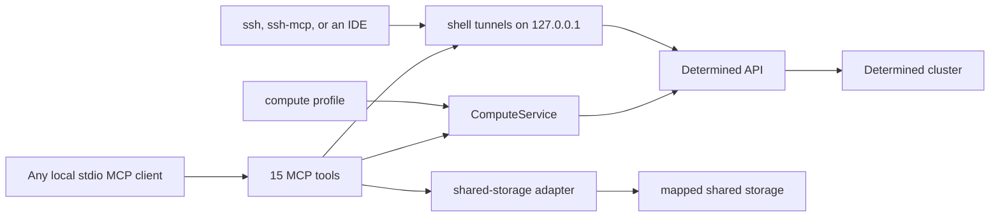

# Compute service reference

[English](compute-service.md) | [简体中文](compute-service.zh.md)

This document describes the configuration and public MCP interface of the local
Determined compute service. For an agent-neutral sequence for preparing, launching,
and checking work, see [Agent workflow](agent-workflow.md).

## Architecture and trust boundary



The MCP server is a local stdio service for one trusted user. It acts as the Determined
account selected by its credentials, and only on tasks that account owns. A remotely
exposed service needs its own authenticated transport.

`ComputeService` plans and submits requests and reads and controls the account's tasks:
status, logs, usage measurements, cancellation, pause and resume, and listing. Shell
access relays local SSH connections to the account's running shells. The service keeps
no task records. Determined holds the tasks, their logs, and their experiment data, and
every tool addresses a task by its kind and Determined's own ID. Keeping a record of
submitted work, such as the IDs that `compute_launch` returns, is the caller's
responsibility. Keep source, data, packages, checkpoints, logs, and outputs on mapped
shared storage.

## Compute profile

Pass the profile with `--profile PATH` or `DETERMINED_COMPUTE_PROFILE`. Its schema is:

```yaml
mounts:
  - host_path: /shared/projects
    container_path: /workspace
  - host_path: /shared/reference
    container_path: /reference
    read_only: true
defaults:
  image: your-image
  pool: your-pool
  slots: 1
shell_inactivity_seconds: 7200
```

At least one mount is required. `host_path` is the path on cluster agents and need not
exist on the MCP client machine. Requests use `container_path`; container roots cannot
overlap, so each container path maps through one corresponding mount. When validating
a host-path alias against overlapping host roots, the most specific root controls and
read-only wins a tie. `workdir`, `output_dir`, and explicit checkpoint targets must be
under writable mounts; reading reference data under a read-only mount remains valid.
These checks are service policy and do not replace filesystem permissions.

The image, resource pool, and slot count are defaults that a request can override.
`slots` must be a non-negative integer; zero asks for CPU-only auxiliary capacity when
the pool supports it. `shell_inactivity_seconds` is optional and advisory. The service
does not enforce an idle timeout.

## Request object and planning

`compute_plan` and `compute_launch` accept the same request object:

| Field | Type | Meaning |
| --- | --- | --- |
| `name` | string | Optional display name, at most 128 characters |
| `description` | string or null | Optional display description, at most 2,048 characters |
| `allow_queue` | boolean | Allow submission when current capacity is insufficient; default `false` |
| `kind` | `auto`, `command`, `shell`, `generic`, or `experiment` | Execution mode; default `auto` |
| `interactive` | boolean | Requires shell mode; in auto mode selects `shell` |
| `overnight` | boolean | In auto mode selects `experiment` |
| `command` | string or string array | Command, generic task, or experiment entrypoint; shell mode rejects it |
| `workdir` | absolute container path | Working directory under a writable configured mount |
| `output_dir` | absolute container path | Output directory under a writable configured mount |
| `slots` | non-negative integer | Requested slots; defaults to the profile value |
| `prefer_gpu_topology` | `"soft"`, `"strong"`, `false`, or null | GPU placement for 2 or more slots; requires the research-cluster fork 0.42.0 or later. `"strong"` takes all GPUs from one NUMA node of one agent and waits until one has them free; `"soft"` does not queue extra to wait for a better GPU topology, never guarantees one NUMA node, and prefers the best-connected free GPUs of the chosen agent. Sent only with 2 or more slots and `"soft"` or `"strong"`. An experiment sets it here, not in `experiment_config.resources` |
| `pool`, `image` | string | Optional overrides of profile defaults |
| `code_revision` | string or null | Caller-provided revision or content identifier |
| `experiment_config` | object | Extra experiment configuration; requires experiment mode |
| `parent` | string or null | Generic only: Determined task ID (a UUID) of a generic parent task owned by the same account |
| `inherit_context` | boolean | Generic only: inherit the parent's context directory; requires `parent`; default `false` |
| `pausable` | boolean | Generic only: the task can be paused, and resuming reruns it from the start; default `false` |
| `preemption_timeout` | non-negative integer | Generic only: seconds a task gets to stop after a pause request; Determined's default is 0. An experiment sets it in `experiment_config` |

Unknown request fields and upload/context fields are rejected. In auto mode,
`interactive` selects `shell`, then `overnight` or `experiment_config` selects
`experiment`, and all other requests select `command`. Auto mode never selects
`generic`. An explicit `kind` is retained; an overnight command therefore stays a
command and receives an advisory. The four generic-only fields are rejected for every
other kind.

Planning is offline and does not authenticate, inspect capacity or pool access, create
projects, or submit work. It returns `kind`, `name`, `description`, `allow_queue`,
rendered `config`, `code_revision`, and `advisories`. If `name` is omitted, the service
creates one and adds an advisory. Commands and shells place the name on the first
description line; experiments and generic tasks use their native name and description
fields. Top-level display metadata overrides matching experiment fields.

Command, generic, and experiment entrypoints render as
`mkdir -p <output_dir> && cd <workdir> || exit $?`, a newline, and then the command, so a
failed setup step exits with its status before any statement of the command runs.
Commands and generic tasks run this text through `/bin/bash -lc`. Command, generic, and
shell configs use `resources.slots`; experiments use `resources.slots_per_trial`. The service supplies
profile bind mounts and manages `COMPUTE_WORKDIR`, `COMPUTE_OUTPUT_DIR`,
`COMPUTE_CODE_REVISION`, and the private submission marker. A request cannot override
those variables or bind mounts.

Experiments require `command` or `experiment_config.entrypoint`, but not both. An
explicit `checkpoint_storage` must have `type: shared_fs`, a writable mapped
`host_path`, and an optional `storage_path` that remains inside that host path. Legacy
`checkpoint_path` and `tensorboard_path` aliases are rejected. If checkpoint storage is
omitted, Determined applies its cluster default, which offline planning cannot inspect.

### Generic tasks

A generic task is Determined's lower-level task type: one container that runs an
entrypoint, with no trials, searcher, or checkpoint lifecycle, which can have child tasks
and, when launched with `pausable: true`, be paused and resumed. It requires a Determined
master from the research-cluster fork with WU-CVGL/determined#27, which lists generic
tasks with their owners; without that list the service could create a generic task but
never verify its owner, so it could not manage it. Before submitting a generic task, the
service reads one entry of the list (`GET /api/v1/generic-tasks?limit=1`), and a master
that answers HTTP 404, 405, or 501 makes the launch fail with `unsupported` before
anything is created. Its plan is a command plan with these differences:

- The config carries `name`, `description` when set, and `preemption_timeout` when set,
  next to the same `entrypoint`, `resources`, `environment`, and `bind_mounts` as a
  command.
- The plan has a `task_options` object with `parent`, `inherit_context`, and
  `pausable`. Plans of other kinds have no such key.
- A pausable plan has the `generic_restart_safety` advisory.

At launch, the service reads `parent` from Determined, verifies that it is a generic task
owned by the authenticated account (see
[Task identity and ownership](#task-identity-and-ownership)), and sends it as
`parentId`; otherwise the launch fails before anything is submitted. The task is submitted with
an empty context directory, because code and data stay on shared mounts, so
`inherit_context` inherits nothing from a parent launched through this service. No
project is sent, so Determined places the task in its default project, as it does for
experiments launched by this service. Capacity admission uses `resources.slots`, as for
a command.

Generic task lifecycle:

- Exit status 0 ends the task as `COMPLETED`. A non-zero exit or a lost agent ends it as
  `ERROR`. Determined never restarts a generic task automatically.
- Only a task launched with `pausable: true` can be paused; pausing any other generic
  task fails and leaves it running, so it runs once. Pausing stops the task's container.
  The workload is notified through Determined's
  Core API preemption signal and gets `preemption_timeout` seconds (default 0, an
  immediate stop) to exit. A plain script that does not use the Core API is simply
  stopped.
- Resuming starts a new container under the same task ID and runs the entrypoint again
  from the beginning. The workload must be restart-safe: skip outputs that are already
  complete, and resume or clean up partial ones.
- Killing (`compute_cancel`) acts on the task and all its descendants. Pausing acts on
  the task and its pausable descendants, and resuming resumes the paused ones; a child
  that is not pausable keeps running when its parent is paused. The service always sends
  Determined's `noPause` as the opposite of `pausable`, because masters differ in how they
  treat an unset value.

## Start the MCP server

Start one stdio process per configured client:

```bash
determined-compute-mcp \
  --profile /absolute/path/to/compute-profile.yaml \
  --secrets-file /absolute/path/to/credentials.env
```

`--profile` corresponds to `DETERMINED_COMPUTE_PROFILE` and `--storage-config` to
`DETERMINED_COMPUTE_STORAGE`; `--secrets-file` can instead be supplied through
`DETERMINED_COMPUTE_SECRETS`. A secrets
file that sets `DET_MASTER` supplies the API URL and the credentials together: the
environment's `DET_API_TOKEN`, `DET_USERNAME`, and `DET_PASSWORD` are then ignored, and an
`--api-url` or environment `DET_MASTER` that names a different master is rejected before
any request. A secrets file without `DET_MASTER` uses `--api-url` or else `DET_MASTER`,
and `DET_API_TOKEN` from the environment before the file. `--api-token` replaces any
other token or login and is sent only to the selected master. Keep credentials in the
existing provider or secrets file rather than the profile, tool arguments, or reports.

The server writes no files of its own except for [shell access](#shell-access): key files
for the shells it connects and a generated ssh-mcp config, in the directory that
`--shell-access-dir` or `DETERMINED_COMPUTE_SHELL_ACCESS` selects. After an upgrade,
restart every MCP process so that it loads the current tool set.

Optional client-side access to mapped storage uses the same profile and a separate
storage configuration. See [Shared-storage access](shared-storage-access.md).

### Optional HTTPS

Plain HTTP needs no TLS settings. To reach the master over HTTPS, set
`DET_MASTER=https://determined.example.org` in the secrets file; a URL with a scheme is
used as given, and only a bare host gets `:8080`. Turn verification on with
`--verify-ssl`, or with `DET_VERIFY_SSL=true` in the MCP process environment. Without it
the connection is encrypted but the master's identity is not checked, and Requests prints
`InsecureRequestWarning`. Requests reads `REQUESTS_CA_BUNDLE`, for a private CA, and
`HTTPS_PROXY`, `HTTP_PROXY`, and `NO_PROXY`, or their lowercase forms, which take
precedence, from the MCP process environment, which comes from the client and its `env`
settings; the secrets file supplies only the master and credentials, so TLS and proxy
variables there are not applied. When a proxy cannot reach the master, list the master's
host or domain suffix in both `NO_PROXY` and `no_proxy`:

```json
{
  "command": "/absolute/path/to/determined_cluster_mcp/.venv/bin/determined-compute-mcp",
  "args": [
    "--profile", "/absolute/path/to/profile.yaml",
    "--secrets-file", "/absolute/path/to/credentials.env",
    "--verify-ssl"
  ],
  "env": {
    "REQUESTS_CA_BUNDLE": "/absolute/path/to/organization-ca-bundle.pem",
    "NO_PROXY": "determined.example.org",
    "no_proxy": "determined.example.org"
  }
}
```

The secrets file binds its credentials to the master it names, so an `--api-url` or
`DET_MASTER` with a different URL, such as `https://` instead of `http://`, is rejected.
Change `DET_MASTER` in that client's secrets file or use a separate secrets file for
HTTPS; another tool that reads the same file switches with it. Troubleshooting covers
[certificate](troubleshooting.md#tls-certificate-verification-fails) and
[proxy](troubleshooting.md#the-master-is-unreachable-through-a-proxy) failures.

### Upgrading from a version with a task database

The server does not accept `--db` or `--owner`, and the profile does not accept
`cluster_identity`; remove them from MCP client configurations and profiles.
`DETERMINED_COMPUTE_DB` and `DETERMINED_COMPUTE_OWNER` are not read and can be unset.

The server neither reads, migrates, nor deletes an old task database, by default
`~/.local/state/determined-compute/tasks.sqlite3`. Before you delete it yourself, note the
Determined task IDs (the remote IDs) of any work you still need. `compute_list` finds the
account's tasks that Determined still serves; an ended command or shell that Determined
no longer serves, 24 hours after it ended or after a master restart, does not appear
there.

## MCP API

The server exposes 15 tools. `kind` is `command`, `shell`, `generic`, or `experiment`.
`id` is Determined's own task ID: a UUID for a command, shell, or generic task, and a
positive integer for an experiment, which can also be passed as a numeric string.

| Tool | Arguments | Return value and effect |
| --- | --- | --- |
| `compute_plan` | `request` | Offline normalized plan; no cluster access |
| `compute_launch` | `request` | Submits once; returns `kind`, `id`, `name`, `description`, `state`, `submission_marker`, `advisories`, and any `warnings` |
| `compute_status` | `kind`, `id` | Task summary, submission marker, sanitized remote entity, and the task's place in its pool's job queue |
| `compute_logs` | `kind`, `id`, optional `tail=200` | Chronological list of the newest remote log records |
| `compute_usage` | `kind`, `id`, optional `window_seconds=3600`, `allocation_id`, `trial_id`, `metrics`, `include_samples=false` | Read-only summary of one task's measured CPU, memory, and GPU use |
| `compute_cancel` | `kind`, `id` | Task summary, remote cancellation response, and `cancellation_acknowledged` |
| `compute_pause` | `kind`, `id` | Experiments and generic tasks: task summary, remote response, and `pause_acknowledged` |
| `compute_resume` | `kind`, `id` | Experiments and generic tasks: task summary, remote response, and `resume_acknowledged` |
| `compute_list` | `kind`, optional `limit=50`, `offset=0`, `marker`, `states` | One page of the account's tasks, newest first; with `states`, only experiments or generic tasks in those states; with `marker`, the tasks on that page whose config carries it |
| `compute_shell_connect` | `id`, optional `local_port` | Opens or returns a local SSH tunnel to one of the account's running shells; see [shell access](#shell-access) |
| `compute_shell_disconnect` | `id` | Closes that tunnel and deletes the shell's key file; the shell keeps running |
| `compute_resources` | optional `slots=1`, `pool`, `prefer_gpu_topology` | Current scheduler capacity and candidate pools. With `"strong"` and 2 or more slots, each pool adds `max_numa_node_free_slots` (largest `"strong"` task that fits now) and `max_numa_node_slots` (largest the master accepts with the current agents). Each pool also has `description` and `gpu_models` |
| `storage_check` | `path` | Access information for a mapped container path |
| `storage_sync` | `local_dir`, `shared_dir`, optional `dry_run=true` | Preview or copy local directory contents to shared storage |
| `storage_fetch` | `shared_dir`, `local_dir`, optional `dry_run=true` | Preview or copy shared directory contents locally |

### Plan, capacity, and launch

Call `compute_plan` first and review resolved paths, mode, image, pool, slots, and
advisories. `compute_resources` is a live snapshot, not a reservation. Positive slot
requests inspect schedulable agent slots; zero checks auxiliary-container capacity.
Candidate pools are suggestions and are never substituted automatically. On the
research-cluster fork 0.42.0 or later, the pool list holds only the pools the account may
use, so a requested pool missing from it is reported as not present or not available to
you, with unknown availability.

Each pool in `pools` and `selected_pool` also carries two facts from the same two reads.
`description` is the operator's free-text pool description, passed through: trimmed,
truncated to 4,096 characters, or `null` when the pool has none. It states the agents'
hardware only if the operator wrote it there. `gpu_models` lists, sorted and without
duplicates, the device brand Determined reports for each GPU slot of the pool's agents (the
GPU product name on CUDA; on ROCm, Determined reports the card vendor, which does not tell
card classes apart), busy, disabled, or draining slots included. It is `[]` when the pool's
connected agents have no GPU slot, and `null` when the pool has no agents, the agent list
does not match the pool, or a slot's device or GPU brand is unreadable. Neither fact changes
admission.

Admission counts slots as the pool does: a drained or disabled slot, and every slot of a
disabled agent, is not capacity, and a draining slot or agent counts only the slots that
still hold a container. A command, shell, or generic task, and an experiment with
`is_single_node: true`, needs one schedulable agent with the requested free slots. For 1 or
more slots, capacity is unknown when the pool's used-slot count differs from the slots
holding containers, which means a task is starting or stopping. An experiment with 2 or
more `slots_per_trial` and without `is_single_node: true` may span agents, which admission
does not check: it is admitted when one agent has the free slots and is otherwise
`capacity_unknown`, so set `is_single_node: true` when it fits on one agent, or use
`allow_queue: true` when the user agrees to wait.

With `prefer_gpu_topology: "strong"` and 2 or more slots, every kind, an experiment
included, needs one schedulable agent with N free GPUs on one NUMA node of that agent;
`"soft"` is checked like no preference. For `"strong"`, capacity is also unknown when an
agent's GPU topology is not visible to the account or does not match its slots. A
`"strong"` request that the master refuses with the pool's current agents, static or
provisioned, fails with `capacity_unavailable` and `retryable: false`: when no agent has N
slots, the request needs fewer slots or another pool; when an agent has N slots but no NUMA
node does, `"soft"` may fit. A pool that is not static and has no agents yet waits for them.
With 0 or 1 slot the preference has no effect: it is not sent, and the
plan carries the advisory `gpu_topology_ignored`. Admission does not see waiting tasks: a
higher-priority task waiting for a NUMA node can keep an admitted lower-priority task
queued.

`compute_launch` checks capacity unless `allow_queue` is explicitly true, then submits
the request once. A pool missing from the account's pool list fails that check with
`capacity_unknown`; a pool that the master refuses fails with `permission_denied` (see
[Errors](#errors)). Every call is a new submission: launching the same request twice
starts two tasks. On success it returns `kind`; `id`, Determined's task ID (a UUID
string for a command, shell, or generic task, an integer for an experiment); `name` and
`description`; the `state` reported at creation, or `null`; `submission_marker`; the
plan's `advisories`; and, for a shell, `reconnect_command`. Keep the kind and ID: the
service does not remember them.

Each launch adds a random `COMPUTE_SUBMISSION_MARKER=determined-compute:<uuid>`
environment variable to the submitted config. The service does not store it.
`compute_list(kind, marker=...)` matches it against each task's stored config, and
`compute_status` reports it as `submission_marker`. It is a correlation label, not an
identity: a config copied outside this service, such as a task forked in the WebUI,
carries the same marker. A request cannot set this variable.

The adapter sends command and shell configs as mappings. It serializes experiment and
generic task configs as JSON text, which the master's YAML parser reads literally, so a
string such as `y`, `n`, or `1e-3` stays a string. It requests activation of an
experiment, and sends a generic task config with an empty `contextDirectory`, no
`projectId`, and the resolved `parentId`, `inheritContext`, and `noPause` options. It
rejects source upload aliases, never creates a project, removes API envelopes, redacts
secrets from returned entities, and returns an entity with an `id`.

No launch is retried. Master launch warnings for a generic task, such as a request
exceeding current slots, appear in `warnings` with code `launch_warning`.

### Unconfirmed launches

A launch request can reach the master without a confirmed answer: a transport failure
or timeout after the request was sent, an HTTP 5xx response, a redirect (HTTP 3xx,
which no mutation follows), or a response without a task ID. Determined may or may not
have created the task. The service never retries such a launch. It returns a
`submission_uncertain` error that is not retryable, whose message names the next step
and whose `details` carry `kind` and `submission_marker`:

```json
{"error":{"code":"submission_uncertain","message":"The command submission is unconfirmed (...); ...","retryable":false,"details":{"kind":"command","submission_marker":"determined-compute:<uuid>"}}}
```

Look for the task with `compute_list(kind, marker=submission_marker)`, with a small
`limit`, and follow `pagination.next_offset` when needed. Every task it returns carries
the marker. One returned task is most likely the submission; several share a copied
config, so show them to the user instead of choosing one. An empty result does not prove
that the submission failed: each search covers one page, the master may store the task
after the search, and Determined stops serving an ended command or shell after 24 hours.
Do not launch again automatically. Whether to submit again is the user's decision after
checking, for example in the WebUI or with a later search. A duplicate cancelled
afterwards may already have had effects, such as files it wrote, that cancelling does not
undo. A definite rejection, such as HTTP 400, 401, or 403, is an ordinary error: nothing
was submitted. When the research-cluster fork 0.42.0 or later cannot check whether the
account may use the requested pool, it answers a launch or resume with HTTP 503 `could not
check access to resource pool "<pool>": ...; try again`. The service reports that answer as
`submission_uncertain`, like any other 5xx; check a launch with the marker as above, and a
resume with `compute_status`.

A failure before any connection was open (a refused connection, a failed name lookup, a
connect timeout, or an unreachable HTTP proxy) is a retryable `transport_error`: the
request was never sent, so nothing was created. So is an answer from an HTTP proxy whose
RFC 9209 `Proxy-Status` header reports that it never connected to the next hop, with the
error type `dns_error`, `dns_timeout`, `destination_not_found`,
`destination_unavailable`, `connection_refused`, `connection_timeout`,
`destination_ip_prohibited`, or `destination_ip_unroutable`; its `details` carry
`source: "proxy"`, `status_code`, and `proxy_error`. The service parses the header as an
RFC 8941 structured-field list, reads the `error` parameter of every member, and ignores
a header that does not parse.

Everything after the connection opened, including a read timeout, a dropped connection,
a TLS error, or any other HTTP 5xx, is unconfirmed. A 5xx counts as an HTTP proxy's
answer rather than Determined's when its body is empty or not JSON, so it is no Determined
error, and it carries a `Proxy-Connection`, `Via`, or `Proxy-Status` header. The error
then says that a proxy, not Determined, answered and that the master was probably
unreachable, and its `details` add `source: "proxy"`, `status_code`, and, when
`Proxy-Status` names one, `proxy_error`. It stays unconfirmed, because a proxy can also
fail after forwarding the request. A 5xx with a Determined JSON error body is never
attributed to a proxy. A read answered this way fails with the same label and is
retryable. Cancel, pause, and resume follow the same rules; check `compute_status` after
an unconfirmed one.

### Task identity and ownership

Status, logs, usage, cancel, pause, and resume, and a generic task's `parent`, first
read the authenticated account (`GET /api/v1/me`) and the task from Determined. They
proceed only when the task's `userId` equals the account's ID and the returned ID
matches the requested one, and fail before any further request otherwise. Another
owner fails with `ownership_mismatch`, so an administrator account cannot act on other
users' tasks through this service. A returned ID that is malformed or differs from the
requested one fails with `invalid_response`. The service reads the account once per
process, because the credentials are fixed when it starts.

A generic task's owner comes from Determined's generic task list
(`GET /api/v1/generic-tasks?taskIds=`), which the research-cluster fork has from
WU-CVGL/determined#27 on. When the master cannot report the owner, the call fails with
`ownership_unavailable` instead of guessing.

Determined serves an ended command or shell for only 24 hours after it ends, and not
after a master restart. After that its owner cannot be verified, so every call on it,
including `compute_usage`, returns Determined's HTTP 404.

### Status, logs, and cancellation

`compute_status` returns the task summary: `kind`, `id`, `name`, `description`, `state`,
`username`, `resource_pool`, `start_time`, and `end_time`. Commands and shells carry
the name on the first line of their description. It adds `submission_marker` when the
task's config carries one and the sanitized entity as `remote`. For a generic task, the
entity combines the task record (`GET /api/v1/tasks/{id}`) with its submitted config
(`GET /api/v1/tasks/{id}/config`), whose environment variables are redacted, and adds
`resourcePool`, `name`, and `description` from that config; `jobId`, and `resourcePool`
when the config sets none, come from the generic task list item. Its `taskState` is
reported in `state` with the `GENERIC_TASK_STATE_` prefix replaced by `STATE_`, the
experiment vocabulary:

| `state` | Meaning |
| --- | --- |
| `STATE_ACTIVE` | Queued or running |
| `STATE_STOPPING_PAUSED` | Pause requested; the container is stopping |
| `STATE_PAUSED` | Paused; not terminal, and `compute_resume` can continue it |
| `STATE_STOPPING_COMPLETED`, `STATE_STOPPING_ERROR`, `STATE_STOPPING_CANCELED` | Ending |
| `STATE_COMPLETED` | Terminal: the entrypoint exited with status 0 |
| `STATE_ERROR` | Terminal: non-zero exit or lost agent |
| `STATE_CANCELED` | Terminal: killed |

The entity's `allocations` list each run of the task; a resumed task has one allocation
per run.

For a task that has not ended, `compute_status` also reads one page of its pool's job
queue (`GET /api/v1/job-queues-v2` with the task's `resourcePool` and `limit=1000`) after
the ownership check, and reports the task's own job as `queue`:

| Field | Meaning |
| --- | --- |
| `resource_pool` | Pool whose queue holds the job |
| `state` | The scheduler's state: `STATE_QUEUED`, `STATE_SCHEDULED`, or `STATE_SCHEDULED_BACKFILLED` |
| `jobs_ahead` | The job's position in the pool's queue: the number of jobs the scheduler ranks ahead of it, which can include jobs already running. It is not a prediction of wait time; `null` when the pool's scheduler does not rank jobs (fair share) |
| `requested_slots`, `allocated_slots` | Slots the job requests and holds |
| `placement` | List of `{agent_id, device_ids}`, one per agent where the job holds slots; `device_ids` are the agent's slot device IDs, ascending, which equal the `nvidia-smi` index on that agent's node only for NVIDIA GPU slots. `[]` for a queued or zero-slot job; `null` on a master older than the research-cluster fork 0.42.0 |

A task with an end time has ended; a command or shell, which reports no end time, has
ended once its state is `STATE_TERMINATED`. An ended task gets `queue: null` without a
request. When the job is not found, `queue` is `null` and `queue_note` says why: the task
reports no resource pool or job ID, and no request is sent; the job is not in the pool's
queue because it is not yet queued, paused, or just ended; or the pool has more than 1000
jobs and the job is not among the first 1000. A failed lookup gives `queue: null` and
`context_unavailable: ["queue"]`; it never means that the task is not queued, and `state`
remains the authority. The lookup does not page, poll, or return other jobs.

`compute_logs` requires a positive `tail`. Command, shell, and generic task logs come
from their task log API; a resumed generic task's logs include every run. Experiment
logs come from the highest numeric trial ID, which a server-side sort selects even when
an experiment has more than 100 trials; an experiment with no trials returns an empty
list. Results are ordered oldest to newest.

`compute_cancel` uses the task kill endpoint for commands and shells, the experiment
cancel endpoint for experiments, and the generic task kill endpoint, which also kills
the task's descendants but never its ancestors, for generic tasks. It returns the task
summary with `cancellation_acknowledged: true` and the remote response as `remote`; a
command or shell response also updates `state`. Cancelling a shell also closes its
[shell-access](#shell-access) tunnel and reports `shell_access_closed`: `true` when a
tunnel was closed, `false` when there was none, and `null` when closing failed. Remote termination alone does not prove
success; inspect exit information and expected shared-storage artifacts.

### Pause and resume

`compute_pause(kind, id)` and `compute_resume(kind, id)` apply to experiments and
generic tasks; a command or shell returns `unsupported_kind` without contacting
Determined. They apply the ownership check of
[Task identity and ownership](#task-identity-and-ownership). Each returns the task
summary, the remote acknowledgement as `remote`, and `pause_acknowledged` or
`resume_acknowledged`; poll `compute_status` for the resulting state.

For an experiment, pause and resume call Determined's experiment pause and activate
endpoints. The experiment reports `STATE_PAUSED` as soon as the pause is accepted, while
its trials receive the preemption signal and get the experiment's `preemption_timeout`
(one hour by default) to save a checkpoint and exit. Resuming continues each trial from
its latest checkpoint, or from the beginning when it has none. Determined refuses a
pause or resume of an experiment in an incompatible state with HTTP 400.

For a generic task, pause and resume call the task pause and unpause endpoints, which
also act on its pausable descendants; see [Generic tasks](#generic-tasks). The task
reports `STATE_STOPPING_PAUSED`, then `STATE_PAUSED`. Resume is accepted only for a task
in `STATE_PAUSED` whose descendants have finished stopping, and it runs the entrypoint
again from the start. A master with the research-cluster fork's generic-task fixes
refuses a pause, resume, or kill with HTTP 404 for a missing task, HTTP 400 for a state
that does not allow it (such as pausing a paused task or one that is not pausable),
and HTTP 409 while another pause, resume, or kill is in progress; these are ordinary
errors that carry the master's reason. An older master reports the same refusals as
server errors, which arrive as `submission_uncertain` errors whose message includes the
master's reason; check `compute_status` before repeating the call.

Resuming does not check capacity: the task queues until it fits, and with
`prefer_gpu_topology: "strong"` it waits, without a time limit, until one NUMA node has its
slots free.

### Shell access

A shell is a container whose sshd the master serves through its proxy. `det shell open`
reaches it with an SSH `ProxyCommand` that carries the connection over a WebSocket to
`<master>/proxy/<shell id>/`. An SSH client that takes only a host and a port, such as an
SSH MCP server, needs a TCP port instead, which `compute_shell_connect(id, local_port)`
provides:

1. It checks that the account owns the shell and that its state is `STATE_RUNNING`;
   otherwise it fails with `ownership_mismatch` or `shell_not_running` before reading any
   key.
2. It reads the shell's key pair from `GET /api/v1/shells/{id}`. Determined generates the
   pair for each shell: sshd accepts the private key for login and uses the same pair as
   its host key. The private key is written only to a `key` file with mode 0600 in the
   shell's subdirectory of the shell-access directory; no tool result contains it.
3. It listens on `127.0.0.1`, at `local_port` (1024 to 65535) or else a free port, and
   relays each connection over a new WebSocket to the shell's proxy. The WebSocket uses
   the master URL, token, and TLS verification of the MCP server, and the same proxy
   variables as Requests (`http_proxy` for `http://`, `https_proxy` for `https://`, and
   `no_proxy`, lowercase before uppercase). With `--verify-ssl`, the CA bundle is
   `REQUESTS_CA_BUNDLE`, else `CURL_CA_BUNDLE`, else Requests' default bundle.
4. It writes a `known_hosts` entry for that port and regenerates `ssh-mcp.toml`.
5. When the shell's allocation reports ready, it opens the proxy once and reads sshd's
   identification line as `probe`.

The result has these fields:

| Field | Meaning |
| --- | --- |
| `kind`, `id`, `state` | `shell`, the shell's ID, and its state |
| `ready` | Whether the allocation reports ready, which is when sshd listens; `null` with `context_unavailable: ["ready"]` when that lookup failed |
| `probe` | `{ok: true, banner}` with sshd's identification line, or `{ok: false, error}`; not attempted while `ready` is `false` |
| `reused` | `true` when the tunnel was already open in this process |
| `host`, `port` | Always `127.0.0.1`, and the listening port |
| `user` | Login user: the account's agent user, else `root`, as for `det shell open` |
| `key_path`, `known_hosts_path` | Private key file and the pinned host-key entry for this port |
| `host_key_type`, `host_key_fingerprint` | The shell's host key, such as `ssh-ed25519` and `SHA256:...` |
| `ssh_command` | An OpenSSH command line that logs in with strict host-key checking |
| `ssh_mcp` | `config_path` of the generated ssh-mcp config, this shell's `profile` name, and `profile_toml`, the same profile as standalone text |
| `advisories` | `tunnel_lifetime`, `ssh_mcp_reload`, and, for a root login, `root_login` |

A failed probe does not close the tunnel: sshd may still be starting, and calling
`compute_shell_connect` again returns the open tunnel with a new probe. A second call
returns the open tunnel (`reused: true`) unless it asks for a different `local_port`,
which replaces it. A busy port fails with `port_unavailable`. `compute_shell_disconnect`
stops the listener, closes open connections, and deletes the shell's key directory,
without contacting the master; `compute_cancel` of a shell does the same.

Tunnels belong to the MCP process that opened them. They stop when it exits, and the next
start deletes key directories that ended processes left behind. While another MCP
process that is still running holds a shell's tunnel, connecting that shell fails with
`shell_access_conflict`; use or disconnect it there. The tunnel listens on the loopback
interface only. Other local processes can connect to the port, but they reach only
sshd, which still requires the private key, and the pinned host key verifies the shell
end to end. sshd allows TCP forwarding, so `ssh -L` through the tunnel can reach a port
inside the container.

The login user is `root` unless an administrator linked the account to an agent user.
Treat an agent's commands in the shell like any other root access to the container and its
mounts: SSH MCP servers such as ssh-mcp advise against root accounts, so keep their
approval gate on.

#### Shell-access directory

The directory defaults to `~/.cache/determined-compute/shell-access`; `--shell-access-dir`
or `DETERMINED_COMPUTE_SHELL_ACCESS` selects another. It is created with mode 0700 on the
first connect, group and world permissions are removed from an existing one, and a
directory that is a symbolic link or belongs to another user is refused. It holds:

| Path | Content |
| --- | --- |
| `<shell id>/key` | The shell's private key, mode 0600 |
| `<shell id>/known_hosts` | `[127.0.0.1]:<port>` and the shell's public key |
| `<shell id>/tunnel.json` | The tunnel record: process ID, port, user, paths, and host-key fingerprint |
| `ssh-mcp.toml` | ssh-mcp config with one profile per open tunnel of every running MCP process that shares the directory; removed when none is open |

#### Use the shell from ssh-mcp

[ssh-mcp](https://github.com/tufantunc/ssh-mcp) is an MCP server that runs commands over
SSH, with command classification, approval, and audit logging. It needs Node.js.

1. Install it with `npm install -g ssh-mcp` and register it with the generated config and
   strict host-key checking, which every generated profile satisfies because it pins
   `trustedHostKey`. For Claude Code:

   ```bash
   claude mcp add --transport stdio ssh-mcp -- \
     ssh-mcp --config /home/me/.cache/determined-compute/shell-access/ssh-mcp.toml \
     --hostKeyMode strict
   ```

   Use the absolute path of the configured shell-access directory.
2. Launch a shell, wait until `compute_status` reports `STATE_RUNNING`, and call
   `compute_shell_connect(id)`.
3. Restart or reconnect ssh-mcp (in Claude Code, `/mcp`): it reads its config only when
   it starts. Before the first connect the file does not exist, so ssh-mcp starts
   unconfigured and refuses tool calls.
4. Call ssh-mcp's tools, such as `open-session` and `run-command`, with the profile
   named in `ssh_mcp.profile`.
5. When done, call `compute_shell_disconnect(id)`, and `compute_cancel("shell", id)` to
   free the shell's slots.

Each generated profile has `name`, `host`, `port`, `user`, `auth = "key"`, `keyRef`,
`trustedHostKey`, and `group = "dev"`; `[defaults]` names the newest as `defaultProfile`.
ssh-mcp's own defaults apply to everything else: role `operator`, and approval mode
`ask-destructive`, which asks before destructive commands. The file is rewritten on every
connect and disconnect, so edits to it are lost. For other policy settings, copy
`profile_toml` into your own ssh-mcp config and edit it there, remembering that the port
and key path change on every connect.

#### Use the shell from other SSH clients

`ssh_command` logs in with OpenSSH. An IDE or other client can use the same values in an
SSH config entry:

```text
Host det-shell
  HostName 127.0.0.1
  Port <port>
  User <user>
  IdentityFile <key_path>
  IdentitiesOnly yes
  UserKnownHostsFile <known_hosts_path>
  StrictHostKeyChecking yes
```

`compute_launch` still returns `reconnect_command`, currently
`det shell show_ssh_command <id>`, for users of the native CLI. The adapter removes
`privateKey` from every task entity; never put private key material in reports.

### Task usage measurements

`compute_usage` is read-only and summarizes the measured CPU, memory, and GPU use of one
task owned by the account; `compute_resources` describes scheduler capacity instead. It
requires a Determined master from the research-cluster fork 0.40.1 or later on which an
administrator has configured `integrations.task_resources` (`prometheus_url` and
`det_cluster`).

The service validates arguments first and then applies the ownership check of [Task
identity and ownership](#task-identity-and-ownership). It then asks the master whether
task resources are available: a disabled integration returns `task_resources_disabled`,
and a master without the API returns `task_resources_unsupported`. Neither is retryable.

For a command, shell, or generic task, `determined_task_id` is the task's ID. An
experiment reports one trial: the highest-ID trial by default, or `trial_id` when given.
A requested trial that belongs to another experiment returns `trial_not_found`; a
nonexistent or inaccessible trial ID returns Determined's HTTP 404. Other kinds reject
`trial_id`. The service measures the selected trial's newest Determined task. An
experiment with no trial, or a trial with no task, returns `task_not_started`.
`allocation_id` restricts results to one allocation listed for that task; any other
value returns `allocation_not_found`.

`window_seconds` must be 60 through 604,800 (seven days); the default is 3,600. The
window ends at the task end time for an ended task, capped at the current time, and
otherwise at the current time. If every selected allocation ended before that, as for a
paused trial or an earlier allocation named by `allocation_id`, the window ends when the
last of them ended instead. It starts `window_seconds` earlier, but never before the
task start or the requested allocation's start, and always at least one second before
its end. `window.anchor` reports which end applied: `task_end`, `allocation_end`, or
`now`. The step is the larger of 15 seconds and the window length divided by 1,439,
rounded up to a whole second, so no series exceeds 1,440 points. `metrics` is a
non-empty list drawn from `allocation_active` (count), `cpu_cores` (cores),
`memory_working_set_bytes` and `memory_rss_bytes` (bytes), `gpu_utilization_percent`
(percent), `gpu_memory_used_bytes` (bytes), `gpu_power_watts` (watts), and
`gpu_temperature_celsius` (celsius); omit it to keep every returned series.

The result contains:

| Field | Meaning |
| --- | --- |
| `kind`, `id` | The task, as identified in the call |
| `determined_task_id` | Determined task whose measurements were read |
| `trial` | `null` for commands, shells, and generic tasks; otherwise `id`, `state`, `selection` (`latest` or `requested`), `experiment_trial_count` (`null` when `trial_id` was given), `task_count`, and the trial progress and summary-metric fields described below |
| `resource_pool` | The task's pool as `name` and the operator-written `description` from Determined, trimmed and truncated to 4,096 characters. `description` is `null` when the pool has none or is not in the pool list returned to this account. The whole field is `null` when the pool name is unknown |
| `task_start_time`, `task_end_time` | Lifetime of the Determined task |
| `allocations` | Each allocation's `allocation_id`, `state`, `is_ready`, UTC `start_time` and `end_time`, `slots`, `exit_reason` (at most 1,024 characters), and `status_code` |
| `allocation_details_limit` | Present, as 8, only when the task has more than 8 allocations; see below |
| `allocation_id` | Requested allocation filter, or `null` |
| `window` | `start` and `end` in Unix seconds, `step` in seconds, plus `start_at`, `end_at`, `anchor`, and `expected_points` |
| `series` | One summary per metric and label set |
| `gpus` | One GPU comparison per allocation; see below |
| `warnings` | Determined's `{code, message}` warnings, passed through unchanged |
| `context_unavailable` | Context lookups that failed: `resource_pool`, `allocation_details`, or `gpu_models` |
| `explanation`, `advisory` | How to read this result |
| `observed_at` | Time the service built the result |

Each series has `metric`, `unit`, the labels `allocation_id`, `node`, and `gpu_uuid`,
`gpu_model`, `points`, `available_points`, `first_at`, `last_at`, and `last`, `min`,
`max`, `mean`, `p50`, and `p95` over the available samples. `p50` and `p95` are
nearest-rank percentiles. `gpu_model` is the model name the Determined agent reports for
`gpu_uuid`, or `null` for a non-GPU series or an unknown device. A
`gpu_utilization_percent` series also has `idle_fraction`, the share of its available
samples below 10%.

Values are point samples taken every `step` seconds, so `min`, `max`, `mean`, and the
percentiles describe those samples rather than every instant. A null or missing value
means no measurement, never zero use. `allocation_active` above zero means the
allocation was running. CPU and memory series are per allocation and node; GPU series
are per GPU UUID and cover the whole assigned device, which can include other processes.
Inspect `warnings`, such as `rss_unverified` or `gpu_full_device`, before drawing
conclusions. An empty `series` list means no data for the window, not an idle task; if a
`metrics` filter removed every returned series, `explanation` names the metrics that
were returned. The MCP cannot read the cluster's task-mapping delay
(`observability.task_mapping_delay`, 5 minutes by default in the fork; only `0s` turns it
off). If it is nonzero, measurements from the first minutes of each allocation, counted
from allocation start including image pull, are not attributed to the task and are never
backfilled, so an allocation that ended sooner has none, `allocation_active` included; a
wider window or an `allocation_id` can still return an earlier allocation's data.
`advisory` says so only when the delay can explain missing data: no series was returned,
or an allocation's first 5 minutes fall inside the window.
`explanation` says so when no measurements were returned. When
`trial_id` is omitted and the experiment has several trials, `explanation` states how
many exist and which one is reported.

`gpus` compares the GPUs within each allocation. It has one entry per `allocation_id`
with GPU utilization or memory series and uses every such series returned for the
window, even those a `metrics` filter hides from `series`; with `allocation_id`, it
covers that allocation only. Each entry has `gpu_count` (distinct GPU UUIDs with a
returned utilization or memory series, even if every sample is null), `requested_slots`
(the allocation's slot count, or `null` when unknown), `gpu_models` (distinct known
model names, possibly empty), and statistics of per-GPU mean utilization:
`mean_utilization_percent` averages the per-GPU means so each GPU counts equally,
`min_gpu_mean_utilization_percent` and `max_gpu_mean_utilization_percent` are the lowest
and highest, `utilization_spread_percent` is their difference, and
`least_utilized_gpu_uuid` names the lowest, with ties going to the lexicographically
first UUID. These utilization statistics include only GPUs with at least one available
utilization sample, so they can cover fewer GPUs than `gpu_count`. `idle_fraction` is
instead the share of all the allocation's utilization samples below
`idle_threshold_percent` (10). `max_memory_used_bytes` is the largest single-GPU memory
sample in the allocation, not a true peak; GPU memory capacity is not reported. A large
spread points to an idle or straggling GPU, starting with `least_utilized_gpu_uuid`, and
a high `idle_fraction` means the GPUs spent much of the window below the threshold. A
`gpu_count` below `requested_slots` means fewer GPUs returned a series than the
allocation holds; check `warnings` and monitoring coverage before calling the rest
unused.

For an experiment, `trial` also carries Determined's values for the whole trial, not for
the measurement window: `total_batches_processed`, `wall_clock_seconds`, and `restarts`,
each `null` when missing or malformed. `total_batches_processed` is the highest reported
`steps_completed`, and `restarts` is capped at the experiment's `max_restarts`.
`batches_per_second_lower_bound` divides batches by wall-clock seconds and is `null`
when either is unknown or wall-clock time is zero; its unit is whatever the workload
reports as `steps_completed`. It is a floor, because `wall_clock_seconds` adds up each
allocation from when Determined first reports its resources pulling or running until it
ends, or until now while it runs. That can include image pull, startup, initialization,
and allocations lost to restarts; scheduler queue time and gaps between allocations,
such as pauses, are not counted. `summary_metrics` keeps Determined's per-group,
per-metric statistics, reduced to `type` and the finite numeric `count`, `sum`, `min`,
`max`, `last`, and `mean`; group names such as `avg_metrics` (training) and
`validation_metrics` are Determined's and are passed through unchanged. At most 100
metric entries are kept: `validation_metrics` first, then `avg_metrics`, then other groups
by name, with metrics in name order within each group; `summary_metrics_truncated` is
true when more existed. These fields depend on the
workload reporting through Determined's Core API. A `total_batches_processed` of 0,
which `explanation` then notes, is expected for a workload that does not, such as a
plain bash entrypoint, or that has not reported yet, and does not mean it made no
progress. `summary_metrics` is `{}`
when the workload reports no metrics.

Pool, allocation-detail, and GPU-model context is best-effort and read after the
measurements. A Determined API error in one of these lookups, including a transport
failure or malformed response, adds `resource_pool`, `allocation_details`, or
`gpu_models` to `context_unavailable` and leaves the affected fields empty or `null`;
the measurements are still returned. After a transport failure, the remaining lookups
are skipped and reported the same way, so an unresponsive master delays the result by
one timeout rather than one per lookup. The pool name comes from the task entity read
for the ownership check, and the pool list is read only when that name is known.
Allocation details are read for the first eight allocations in Determined's order
(allocations without an end time, such as queued or running ones, first, then most
recently ended) plus a requested `allocation_id`; other allocations keep `null` details,
and `allocation_details_limit` reports the limit. The agent list, which supplies GPU
model names, is read only when a GPU series exists. When RBAC hides device UUIDs from
the current account, `gpu_model` is `null` and `gpu_models` is empty without any
`context_unavailable` entry.

`include_samples=true` adds `samples_omitted`. When `samples_omitted` is false, each
series also has `samples` as `[unix_seconds, value_or_null]` pairs. When the selected
series together exceed 2,880 points, the service omits samples and reports
`samples_limit`; narrow the window, select fewer metrics, or choose one allocation.

The master limits a query to a seven-day range, a 15-second minimum step, 1,440 points
per series, and a 10-second timeout, and runs at most four resource queries at once.
HTTP 503 means the measurement backend is busy or unavailable and is retryable. The
master rejects an end more than 60 seconds ahead of its own clock with HTTP 400, so a
client clock far ahead of the master can cause that error. HTTP 404 means the Determined
task, or a requested trial ID, is missing or inaccessible. See
[troubleshooting](troubleshooting.md#usage-measurements-are-unavailable-or-empty).

### List tasks and find a submission

`compute_list(kind, limit=50, offset=0, marker=None, states=None)` lists the tasks owned by the
authenticated account, newest first by start time. `limit` must be 1 through 100 and
`offset` must be non-negative. The result has `kind`, `account` (`id` and `username`),
`tasks`, and `pagination` with `offset`, `limit`, `total`, and `next_offset`, which is
`null` on the last page. Each task has the summary fields of `compute_status` without
the remote entity. Determined filters the list by owner, and the service checks the
owner of every returned task again; a mismatch is an `ownership_mismatch` error, not a
silently shortened page. Use it for work created by this service, the WebUI, the native
CLI, or another device under the same account.

Generic tasks are listed through Determined's generic task list, which needs a master
with WU-CVGL/determined#27; an older master returns `unsupported`.

`states` is a non-empty list of state names, and Determined filters the list by them, so
`pagination.total` is the filtered total; the result repeats the filter as
`filters: {"states": [...]}`. It applies to experiments and generic tasks only: Determined's
command and shell lists have no state filter, so `states` with `kind` `command` or `shell`
is `invalid_request`. The accepted names are the states Determined stores:

| `kind` | Accepted `states` |
| --- | --- |
| `experiment` | `STATE_ACTIVE`, `STATE_PAUSED`, `STATE_STOPPING_COMPLETED`, `STATE_STOPPING_CANCELED`, `STATE_STOPPING_ERROR`, `STATE_STOPPING_KILLED`, `STATE_COMPLETED`, `STATE_CANCELED`, `STATE_ERROR`, `STATE_DELETING`, `STATE_DELETE_FAILED` |
| `generic` | `STATE_ACTIVE`, `STATE_PAUSED`, `STATE_STOPPING_PAUSED`, `STATE_STOPPING_CANCELED`, `STATE_STOPPING_COMPLETED`, `STATE_STOPPING_ERROR`, `STATE_CANCELED`, `STATE_COMPLETED`, `STATE_ERROR` |

Determined stores a running or waiting experiment as active and lists it as
`STATE_QUEUED`, `STATE_PULLING`, `STATE_STARTING`, or `STATE_RUNNING`. A filter on one of
those four names would fail or match nothing, so it is `invalid_request`: filter with
`STATE_ACTIVE`, which returns all four. Any other name, such as `STATE_DELETED`, is also
`invalid_request`, and no request is sent for a rejected filter. Determined ignores a
filter it does not apply instead of refusing it, so the service checks the state of every
returned task against the requested states, counting the four listed active states as
`STATE_ACTIVE` for experiments; a task outside them is an `invalid_response` error, not an
unfiltered page shown as a filtered one. `states` filters the list itself. `marker` and
`states` combine: the marker search covers the selected page of the filtered list, and each
returned task shows the state from its own detail read, which can be newer than the state the
filter matched, such as a task listed as active that has completed by then; that state is not
checked against `states` again. To follow a batch of experiments or generic tasks, page
through `compute_list(kind, states=[...])`; to follow one task, call `compute_status(kind, id)`.

`marker` is a submission marker of the form `determined-compute:<uuid>`, as returned by
`compute_launch` or by an unconfirmed launch. List entries do not contain the config, so
the service reads each task of the selected page, newest first, with one request for a
command, shell, or experiment and three for a generic task, and returns every task whose
stored config carries the marker, each with `submission_marker`. A marker is a
correlation label, so more than one task can match, and the service never chooses among
them. The search covers only the selected page: the result adds `marker` and `searched`,
the number of tasks read, and `pagination.next_offset` points to the next older page as
for any listing. An empty `tasks` list means only that no task on that page carries the
marker. A task launched moments ago is among the newest, so a small `limit` such as 5 or
10 keeps each search short. A task without a marker, such as one created in the WebUI,
never matches.

### Errors

MCP failures use `isError: true`; their text content is compact JSON of this form:

```json
{"error":{"code":"invalid_request","message":"...","retryable":false,"details":{}}}
```

`retryable` and `details` appear only when available, and structured content is null.
[Shell access](#shell-access) adds `shell_not_running`, `shell_access_conflict`,
`port_unavailable`, and `unsupported` when the `websocket-client` package is missing.
Safe details can include the kind and submission marker of an unconfirmed launch;
`source: "proxy"`, `status_code`, and `proxy_error` when an HTTP proxy answered instead
of Determined; capacity information; and the refused pool of a `permission_denied`
error. Authentication, permission, transport, and response-shape failures are errors
rather than empty results. Error messages and reports may contain sanitized commands,
paths, IDs, states, and error classes, but must not include credentials or secret-file
contents.

A Determined HTTP failure, including a gRPC-gateway error body, appears as
`<status> <message>`. HTTP 429 and 5xx responses other than 501 are retryable; 501 means
the master lacks the route. Usage-specific codes are described in
[Task usage measurements](#task-usage-measurements).

HTTP 403, Determined's permission refusal, has the code `permission_denied` and is not
retryable. The research-cluster fork 0.42.0 or later checks the resource pool when a task
is launched and when an experiment or generic task is resumed. When it refuses a pool the
account may not use, the message is the master's own refusal in the form `403 <message>`,
for example `403 failed to prepare launch params: user "<username>" may not use resource
pool "<pool>": the pool is restricted; choose another pool or ask an administrator for
access (...)`, and `details.resource_pool` names the pool. Any other 403 keeps the same
form. A 403 whose body is not Determined's JSON error, such as an HTTP proxy's page, keeps
the code 403.

The service acts only on tasks owned by the authenticated account and checks this
before acting on a task, so another account's task returns `ownership_mismatch` even when the
credentials belong to an administrator. Use the owning account's credentials, or ask an
administrator to act through Determined directly. Determined applies its own permissions
as well: on the fork 0.40.1 or later with basic authorization, only a task's owner or an
administrator can kill, cancel, pause, or resume it, and other accounts receive
`permission_denied` (HTTP 403), or HTTP 404 for an experiment.
