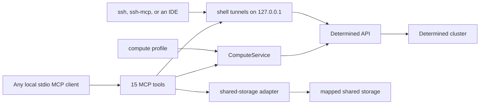

<a id="compute-service-reference"></a>
# 计算服务参考

[English](compute-service.md) | [简体中文](compute-service.zh.md)

本文说明本地 Determined 计算服务的配置和公开 MCP 接口。准备、提交和检查任务的通用 agent
流程见 [Agent 工作流](agent-workflow.zh.md)。

<a id="architecture-and-trust-boundary"></a>
## 架构与信任边界



MCP server 是供一个可信用户使用的本地 stdio 服务。它以凭据选定的 Determined 账户身份运行，
并且只操作该账户拥有的任务。若要远程暴露服务，需要另行设计带认证的传输层。

`ComputeService` 负责规划和提交请求，并读取和控制该账户的任务：状态、日志、用量测量、
取消、暂停与恢复以及列表。Shell 访问把本地 SSH 连接中继到该账户正在运行的 shell。服务不保存
任务记录。任务、日志和 experiment 数据都保存在 Determined 中，每个工具都通过任务的 kind 和 Determined 自身的 ID 指定任务。记录已提交的
工作（例如 `compute_launch` 返回的 ID）是调用方的责任。源码、数据、包、检查点、日志和输出
应放在映射的共享存储上。

<a id="compute-profile"></a>
## 计算配置

通过 `--profile PATH` 或 `DETERMINED_COMPUTE_PROFILE` 传入配置。其结构如下：

```yaml
mounts:
  - host_path: /shared/projects
    container_path: /workspace
  - host_path: /shared/reference
    container_path: /reference
    read_only: true
defaults:
  image: your-image
  pool: your-pool
  slots: 1
shell_inactivity_seconds: 7200
```

至少需要一个挂载。`host_path` 是集群 agent 上的路径，不必存在于运行 MCP client 的机器上；
请求使用 `container_path`。容器根路径不能重叠，因此每个容器路径只通过一个对应挂载进行
映射。使用可能重叠的主机根路径验证 host-path 别名时，由最具体的根路径决定策略；匹配程度
相同时只读优先。`workdir`、`output_dir` 和显式检查点目标必须位于可写挂载下，仍可从只读
挂载读取参考数据。这些检查是服务策略，不能替代文件系统权限。

镜像、资源池和 slot 数量是请求可以覆盖的默认值。`slots` 必须是非负整数；若资源池支持，
零表示请求 CPU-only 的辅助容器容量。`shell_inactivity_seconds` 可省略，并且只作为提示；
服务本身不强制 shell 空闲超时。

<a id="request-object-and-planning"></a>
## 请求对象与规划

`compute_plan` 和 `compute_launch` 接受相同的请求对象：

| 字段 | 类型 | 含义 |
| --- | --- | --- |
| `name` | 字符串 | 可选显示名称，最多 128 个字符 |
| `description` | 字符串或 null | 可选显示说明，最多 2,048 个字符 |
| `allow_queue` | 布尔值 | 当前容量不足时允许排队；默认 `false` |
| `kind` | `auto`、`command`、`shell`、`generic` 或 `experiment` | 执行模式；默认 `auto` |
| `interactive` | 布尔值 | 要求 shell 模式；在 auto 模式下选择 `shell` |
| `overnight` | 布尔值 | 在 auto 模式下选择 `experiment` |
| `command` | 字符串或字符串数组 | command、generic 任务或 experiment 的入口；shell 模式拒绝此字段 |
| `workdir` | 容器绝对路径 | 可写已配置挂载下的工作目录 |
| `output_dir` | 容器绝对路径 | 可写已配置挂载下的输出目录 |
| `slots` | 非负整数 | 请求的 slot 数；默认使用配置值 |
| `prefer_gpu_topology` | `"soft"`、`"strong"`、`false` 或 null | 2 个及以上 slot 的 GPU 放置偏好；需要 research-cluster fork 0.42.0 或更高版本。`"strong"` 要求全部 GPU 来自同一 agent 的同一 NUMA 节点，并等待到有这样的节点空闲；`"soft"` 不会为等待更好的 GPU 拓扑而额外排队，也不保证同一 NUMA 节点，只在所选 agent 上优先选择连接最好的空闲 GPU。仅在 2 个及以上 slot 且值为 `"soft"` 或 `"strong"` 时发送。experiment 也在这里设置，不能写在 `experiment_config.resources` 中 |
| `pool`、`image` | 字符串 | 可选的配置默认值覆盖 |
| `code_revision` | 字符串或 null | 调用方提供的版本或内容标识 |
| `experiment_config` | 对象 | 额外的实验配置；要求 experiment 模式 |
| `parent` | 字符串或 null | 仅 generic：同一账户拥有的某个 generic 父任务的 Determined 任务 ID（UUID） |
| `inherit_context` | 布尔值 | 仅 generic：继承父任务的 context 目录；要求 `parent`；默认 `false` |
| `pausable` | 布尔值 | 仅 generic：该任务可以暂停，恢复时从头重新运行；默认 `false` |
| `preemption_timeout` | 非负整数 | 仅 generic：收到暂停请求后任务可用于停止的秒数；Determined 默认为 0。experiment 在 `experiment_config` 中设置 |

服务拒绝未知字段以及上传/context 字段。在 auto 模式中，`interactive` 优先选择 `shell`，
其次由 `overnight` 或 `experiment_config` 选择 `experiment`，其余请求选择 `command`。
auto 模式从不选择 `generic`。显式 `kind` 会保留，所以 overnight command 仍是 command，
并收到一条提示。其他任何 kind 都会拒绝这四个仅限 generic 的字段。

规划完全离线，不做认证、容量或资源池权限检查、项目创建或任务提交。它返回 `kind`、`name`、
`description`、`allow_queue`、渲染后的 `config`、`code_revision` 和 `advisories`。省略
`name` 时，服务会生成名称并添加提示。command 和 shell 把名称放在 description 第一行；
experiment 和 generic 任务使用原生 name 与 description 字段。顶层显示元数据会覆盖同名的
experiment 字段。

command、generic 和 experiment 的入口渲染为 `mkdir -p <output_dir> && cd <workdir> || exit $?`，
换行后再接命令，因此准备步骤失败时会以其退出码退出，命令中的任何语句都不会运行。command 和
generic 任务通过 `/bin/bash -lc` 运行这段文本。command、generic 和 shell 配置使用
`resources.slots`，experiment 使用 `resources.slots_per_trial`。服务提供配置中的 bind mount，并管理 `COMPUTE_WORKDIR`、
`COMPUTE_OUTPUT_DIR`、`COMPUTE_CODE_REVISION` 和私有提交标记；请求不能覆盖这些环境变量或
bind mount。

experiment 必须提供 `command` 或 `experiment_config.entrypoint`，但不能同时提供。显式
`checkpoint_storage` 必须使用 `type: shared_fs`、可写的映射 `host_path`，且可选的
`storage_path` 必须留在该 host path 内。服务拒绝旧的 `checkpoint_path` 和
`tensorboard_path` 别名。若省略 checkpoint storage，Determined 使用集群默认配置，离线规划
无法检查该默认值。

<a id="generic-tasks"></a>
### Generic 任务

generic 任务是 Determined 较底层的任务类型：一个运行入口命令的容器，没有 trial、searcher
或 checkpoint 生命周期，可以有子任务；以 `pausable: true` 提交时还可以暂停和恢复。它要求
Determined master 来自带有 WU-CVGL/determined#27 的 research-cluster fork，该版本能列出
generic 任务及其所有者；没有该列表时，服务虽能创建 generic 任务，却无法验证其所有者，因而
无法管理它。提交 generic 任务之前，服务先读取该列表的一个条目
（`GET /api/v1/generic-tasks?limit=1`）；master 返回 HTTP 404、405 或 501 时，提交在创建任何
内容之前以 `unsupported` 失败。它的规划与 command 相同，区别如下：

- 配置除了与 command 相同的 `entrypoint`、`resources`、`environment` 和 `bind_mounts` 外，
  还包含 `name`、已设置时的 `description`，以及已设置时的 `preemption_timeout`。
- 规划包含 `task_options` 对象，其中有 `parent`、`inherit_context` 和 `pausable`。其他
  kind 的规划没有该键。
- 可暂停的规划带有 `generic_restart_safety` 提示。

提交时，服务从 Determined 读取 `parent`，验证它是已认证账户拥有的 generic 任务（见
[任务身份与所有权](#task-identity-and-ownership)），再以 `parentId` 发送；否则提交会在提交
任何内容之前失败。代码和数据都在共享挂载上，所以任务以空 context 目录提交；对通过本服务
提交的父任务，`inherit_context` 不会继承任何内容。服务不发送项目，所以 Determined 把任务放入默认项目，与本服务提交的
experiment 相同。容量准入与 command 一样使用 `resources.slots`。

generic 任务的生命周期：

- 退出状态 0 使任务以 `COMPLETED` 结束；非零退出或 agent 丢失使其以 `ERROR` 结束。
  Determined 从不自动重启 generic 任务。
- 只有以 `pausable: true` 提交的任务可以暂停；暂停其他 generic 任务会失败，任务继续运行，
  因此只运行一次。暂停会停止任务的容器。工作负载通过 Determined Core API 的抢占信号收到通知，并有
  `preemption_timeout` 秒（默认 0，即立即停止）可用于退出。不使用 Core API 的普通脚本会被
  直接停止。
- 恢复会在同一任务 ID 下启动新容器，并从头再次运行入口命令。工作负载必须可安全重跑：
  跳过已完成的输出，并续做或清理不完整的输出。
- 终止（`compute_cancel`）作用于任务及其所有后代。暂停作用于任务及其可暂停的后代，恢复则
  会恢复已暂停的后代；不可暂停的子任务在父任务暂停时继续运行。由于不同 master 对未设置的值
  处理不同，服务总是把 Determined 的 `noPause` 作为 `pausable` 的相反值发送。

<a id="start-the-mcp-server"></a>
## 启动 MCP server

为每个已配置的 client 启动一个 stdio 进程：

```bash
determined-compute-mcp \
  --profile /absolute/path/to/compute-profile.yaml \
  --secrets-file /absolute/path/to/credentials.env
```

`--profile` 对应 `DETERMINED_COMPUTE_PROFILE`，`--storage-config` 对应
`DETERMINED_COMPUTE_STORAGE`；`--secrets-file` 也可通过 `DETERMINED_COMPUTE_SECRETS`
提供。设置了 `DET_MASTER` 的 secrets 文件同时提供 API
URL 和凭据：此时忽略环境中的 `DET_API_TOKEN`、`DET_USERNAME` 和 `DET_PASSWORD`；若
`--api-url` 或环境中的 `DET_MASTER` 指向另一个 master，会在发出任何请求前被拒绝。没有
`DET_MASTER` 的 secrets 文件使用 `--api-url`，否则使用 `DET_MASTER`；环境中的
`DET_API_TOKEN` 优先于文件中的 token。`--api-token` 取代其他 token 或登录方式，且只发送给
选定的 master。凭据应放在现有凭据提供方或 secrets 文件中，不要写入配置、工具参数或报告。

除[shell 访问](#shell-access)外，服务自身不写入任何文件。shell 访问会在 `--shell-access-dir` 或
`DETERMINED_COMPUTE_SHELL_ACCESS` 选定的目录中写入所连接 shell 的密钥文件、生成的 `ssh_config`、
`ssh_hosts` 和 `ssh-mcp.toml` 文件，以及一个锁文件；还会为 OpenSSH 多路复用 socket 创建一个私有目录：该目录下的
`cm/`，若该路径过长，则为 `$XDG_RUNTIME_DIR/determined-compute` 或 `~/.ssh/det-cm`。
升级后应重启所有 MCP 进程，使其加载当前的工具集。

客户端访问映射共享存储的可选功能使用同一计算配置和独立的存储配置。参见
[共享存储访问](shared-storage-access.zh.md)。

<a id="optional-https"></a>
### 可选 HTTPS

纯 HTTP 无需任何 TLS 设置。要通过 HTTPS 访问 master，在 secrets 文件中设置
`DET_MASTER=https://determined.example.org`；带协议的 URL 按原样使用，只有裸主机名才会补上
`:8080`。用 `--verify-ssl` 或 MCP 进程环境中的 `DET_VERIFY_SSL=true` 开启验证。不开启时连接
虽然加密，但不校验 master 的身份，Requests 会输出 `InsecureRequestWarning`。Requests 从 MCP
进程环境读取用于私有 CA 的 `REQUESTS_CA_BUNDLE`，以及 `HTTPS_PROXY`、`HTTP_PROXY` 和
`NO_PROXY` 或其优先生效的小写形式，该环境来自客户端及其 `env` 设置；secrets 文件只提供 master
和凭据，其中的 TLS 和代理变量不会生效。代理无法访问 master 时，把 master 的主机名或域名后缀同时
加入 `NO_PROXY` 和 `no_proxy`：

```json
{
  "command": "/absolute/path/to/determined_cluster_mcp/.venv/bin/determined-compute-mcp",
  "args": [
    "--profile", "/absolute/path/to/profile.yaml",
    "--secrets-file", "/absolute/path/to/credentials.env",
    "--verify-ssl"
  ],
  "env": {
    "REQUESTS_CA_BUNDLE": "/absolute/path/to/organization-ca-bundle.pem",
    "NO_PROXY": "determined.example.org",
    "no_proxy": "determined.example.org"
  }
}
```

Secrets 文件把其凭据绑定到它指定的 master，因此 URL 不同的 `--api-url` 或 `DET_MASTER`（例如
用 `https://` 代替 `http://`）会被拒绝。请修改该客户端 secrets 文件中的 `DET_MASTER`，或为
HTTPS 使用单独的 secrets 文件；读取同一文件的其他工具会随之切换。证书和代理问题分别见
[TLS 证书验证失败](troubleshooting.zh.md#tls-certificate-verification-fails)和
[通过代理无法访问 master](troubleshooting.zh.md#the-master-is-unreachable-through-a-proxy)。

<a id="upgrading-from-a-version-with-a-task-database"></a>
### 从带任务数据库的版本升级

服务不再接受 `--db` 和 `--owner`，计算配置也不再接受 `cluster_identity`；请从 MCP client
配置和计算配置中删除它们。服务不读取 `DETERMINED_COMPUTE_DB` 和 `DETERMINED_COMPUTE_OWNER`，
可以取消设置。

服务既不读取、迁移，也不删除旧的任务数据库（默认为
`~/.local/state/determined-compute/tasks.sqlite3`）。自行删除之前，请记下仍需要的工作的
Determined 任务 ID（即 remote ID）。`compute_list` 能找到 Determined 仍在提供的该账户任务；
Determined 不再提供的已结束 command 或 shell（结束 24 小时后，或 master 重启后）不会出现在
其中。

<a id="mcp-api"></a>
## MCP API

server 提供 15 个工具。`kind` 是 `command`、`shell`、`generic` 或 `experiment`。`id` 是
Determined 自身的任务 ID：command、shell 和 generic 任务为 UUID，experiment 为正整数，也可以
用数字字符串传入。

| 工具 | 参数 | 返回值与作用 |
| --- | --- | --- |
| `compute_plan` | `request` | 离线规范化的规划；不访问集群 |
| `compute_launch` | `request` | 提交一次；返回 `kind`、`id`、`name`、`description`、`state`、`submission_marker`、`advisories`，以及可能存在的 `warnings` |
| `compute_status` | `kind`、`id` | 任务摘要、提交标记、清理后的远端实体，以及任务在其资源池作业队列中的位置 |
| `compute_logs` | `kind`、`id`，可选 `tail=200` | 最新远端日志按时间正序排列的列表 |
| `compute_usage` | `kind`、`id`，可选 `window_seconds=3600`、`allocation_id`、`trial_id`、`metrics`、`include_samples=false` | 一个任务实测 CPU、内存和 GPU 用量的只读摘要 |
| `compute_cancel` | `kind`、`id` | 任务摘要、远端取消响应和 `cancellation_acknowledged` |
| `compute_pause` | `kind`、`id` | experiment 和 generic 任务：任务摘要、远端响应和 `pause_acknowledged` |
| `compute_resume` | `kind`、`id` | experiment 和 generic 任务：任务摘要、远端响应和 `resume_acknowledged` |
| `compute_list` | `kind`，可选 `limit=50`、`offset=0`、`marker`、`states` | 当前账户的一页任务，最新的在前；指定 `states` 时只列出处于这些状态的 experiment 或 generic 任务；指定 `marker` 时返回该页中配置带有该标记的任务 |
| `compute_shell_connect` | `id`，可选 `local_port`、`wait_seconds=0`（最多 600） | 为该账户某个正在运行的 shell 打开或返回本地 SSH 隧道；见[shell 访问](#shell-access) |
| `compute_shell_disconnect` | `id` | 关闭该隧道并删除该 shell 的密钥文件；shell 继续运行 |
| `compute_resources` | 可选 `slots=1`、`pool`、`prefer_gpu_topology` | 当前调度容量和候选资源池。值为 `"strong"` 且请求 2 个及以上 slot 时，每个资源池会增加 `max_numa_node_free_slots`（当前能放下的最大 `"strong"` 任务）和 `max_numa_node_slots`（master 在当前 agent 下接受的最大值）。每个资源池还有 `description` 和 `gpu_models` |
| `storage_check` | `path` | 映射容器路径的访问情况 |
| `storage_sync` | `local_dir`、`shared_dir`，可选 `dry_run=true` | 预览或把本地目录内容复制到共享存储 |
| `storage_fetch` | `shared_dir`、`local_dir`，可选 `dry_run=true` | 预览或把共享目录内容复制到本地 |

<a id="plan-capacity-and-launch"></a>
### 规划、容量与提交

先调用 `compute_plan`，检查解析后的路径、模式、镜像、资源池、slot 和提示。
`compute_resources` 返回实时快照，不保留资源。正 slot 数检查可调度的 agent slot；零检查辅助
容器容量。候选资源池只是建议，服务不会自动替换。在 research-cluster fork 0.42.0 或更高版本
上，资源池列表只包含当前账户可以使用的资源池，因此不在其中的资源池会报告为不存在或对你不可用，
可用性未知。

`pools` 和 `selected_pool` 中的每个资源池还带有来自同样两次读取的两项事实。`description` 是
管理员填写的自由文本资源池说明，原样传递：去掉首尾空白并截断到 4,096 个字符；资源池没有说明时为
`null`。只有管理员写明时才包含 agent 的硬件信息。`gpu_models` 按排序、去重列出 Determined 为该
资源池各 agent 的每个 GPU slot 报告的设备 brand（CUDA 上是 GPU 型号名；ROCm 上 Determined 报告的
是显卡厂商，无法区分显卡型号），包括正在使用、已禁用或正在 drain 的 slot。资源池当前连接的 agent
没有 GPU slot 时为 `[]`；资源池没有 agent、agent 列表与资源池不一致，或某个 slot 的设备或 GPU
brand 无法读取时为 `null`。这两项都不影响准入。

准入按资源池自身的方式计算 slot：已 drain 或已禁用的 slot，以及已禁用 agent 的所有 slot，都不算
容量；正在 drain 的 slot 或 agent 只计入仍有容器占用的 slot。command、shell、generic 任务以及
设置了 `is_single_node: true` 的 experiment 需要一个可调度 agent 有所需数量的空闲 slot。请求 1 个
及以上 slot 时，如果资源池的已用 slot 数与有容器占用的 slot 数不同，说明有任务正在启动或停止，
容量为未知。`slots_per_trial` 为 2 或以上且未设置 `is_single_node: true` 的 experiment 可能跨
agent 运行，准入不检查这种情况：只要有一个 agent 有足够空闲 slot 就放行，否则为
`capacity_unknown`；若任务能放在一个 agent 上，请设置 `is_single_node: true`，或在用户同意等待时
使用 `allow_queue: true`。

设置 `prefer_gpu_topology: "strong"` 且请求 2 个及以上 slot 时，所有任务类型（包括 experiment）
都需要一个可调度 agent 在其同一 NUMA 节点上有 N 个空闲 GPU；`"soft"` 按无偏好的方式检查。对于
`"strong"`，如果某个 agent 的 GPU 拓扑对当前账户不可见或与其 slot 不一致，容量同样为未知。master
在资源池当前的 agent 下（无论静态还是自动扩缩的资源池）会拒绝的 `"strong"` 请求会以
`capacity_unavailable` 和 `retryable: false` 失败：没有 agent 拥有 N 个 slot 时，需要减少 slot 或
换用其他资源池；有 agent 拥有 N 个 slot 但没有 NUMA 节点拥有时，`"soft"` 可能放得下。尚无 agent
的非静态资源池会等待其 agent。请求 0 或 1 个 slot 时该偏好
不起作用：它不会被发送，规划结果带有 advisory `gpu_topology_ignored`。准入看不到正在等待的任务：
一个等待 NUMA 节点的高优先级任务可能让已通过准入的低优先级任务一直排队。

除非显式设置 `allow_queue: true`，`compute_launch` 会先检查容量，然后把请求提交一次。不在
当前账户资源池列表中的资源池会使该检查以 `capacity_unknown` 失败；master 拒绝的资源池会以
`permission_denied` 失败（见[错误](#errors)）。每次调用都是一次新的提交：同一请求提交两次会
启动两个任务。成功时返回 `kind`；`id`，即 Determined 的任务 ID（command、shell 和 generic
任务为 UUID 字符串，experiment 为整数）；`name` 和 `description`；创建时报告的 `state`，或
`null`；`submission_marker`；规划的 `advisories`；对于 shell 还有 `reconnect_command`。请保存
kind 和 ID：服务不会记住它们。

每次提交都会在提交的配置中加入一个随机的
`COMPUTE_SUBMISSION_MARKER=determined-compute:<uuid>` 环境变量。服务不保存它。
`compute_list(kind, marker=...)` 用它与每个任务存储的配置比对，`compute_status` 以
`submission_marker` 报告它。它是关联标签，而不是身份：在本服务之外复制的配置（例如在 WebUI
中 fork 的任务）带有同一个标记。请求不能设置这个变量。

适配器把 command 和 shell 配置作为 mapping 发送；experiment 和 generic 任务配置会序列化为
JSON 文本，master 的 YAML 解析器按字面读取该文本，因此 `y`、`n` 或 `1e-3` 这类字符串仍是
字符串。experiment 提交时请求激活；generic 任务配置与空的 `contextDirectory`、解析后的
`parentId`、`inheritContext` 和 `noPause` 选项一起发送，不带 `projectId`。适配器拒绝源码上传别名，从不
自动创建项目，会移除 API envelope、从返回的实体中去除机密，并返回含 `id` 的实体。

提交不会重试。generic 任务的 master 提交警告（例如请求超过当前 slot）以代码
`launch_warning` 出现在 `warnings` 中。

<a id="unconfirmed-launches"></a>
### 未确认的提交

提交请求可能已到达 master，却没有得到确认的答复：请求发出后出现传输失败或超时、返回
HTTP 5xx、返回重定向（HTTP 3xx，任何变更请求都不会跟随），或响应中没有任务 ID。此时
Determined 可能创建了任务，也可能没有。服务从不重试这样的提交，而是返回不可重试的
`submission_uncertain` 错误；其消息说明下一步操作，`details` 包含 `kind` 和
`submission_marker`：

```json
{"error":{"code":"submission_uncertain","message":"The command submission is unconfirmed (...); ...","retryable":false,"details":{"kind":"command","submission_marker":"determined-compute:<uuid>"}}}
```

用 `compute_list(kind, marker=submission_marker)` 查找该任务，使用较小的 `limit`，需要时
沿 `pagination.next_offset` 继续。它返回的每个任务都带有该标记。只返回一个任务时，它很可能
就是这次提交；返回多个时，它们共用一份复制的配置，应把它们交给用户判断，而不是自行选择。
空结果不能证明提交失败：每次搜索只覆盖一页，master 可能在搜索之后才保存任务，而且 Determined
在已结束的 command 或 shell 结束 24 小时后不再提供它。不要自动再次提交；是否重新提交由用户
在检查之后决定，例如在 WebUI 中查看，或稍后再次搜索。事后取消的重复任务可能已经产生了取消
无法撤销的影响，例如已写入的文件。明确的拒绝（例如 HTTP 400、401 或 403）是普通错误：没有
提交任何任务。research-cluster fork 0.42.0 或更高版本无法检查当前账户能否使用所请求的资源池时，
会以 HTTP 503 `could not check access to resource pool "<pool>": ...; try again` 应答提交或恢复。
服务与其他 5xx 一样，把这种应答报告为 `submission_uncertain`；提交按上文用标记检查，恢复则用
`compute_status` 检查。

在连接建立之前发生的失败（连接被拒绝、域名解析失败、连接超时或 HTTP 代理不可达）是可重试的
`transport_error`：请求从未发出，因此没有创建任何任务。HTTP 代理的应答若带有 RFC 9209
`Proxy-Status` 头，并以 `dns_error`、`dns_timeout`、`destination_not_found`、
`destination_unavailable`、`connection_refused`、`connection_timeout`、
`destination_ip_prohibited` 或 `destination_ip_unroutable` 错误类型表明它从未连上下一跳，也
同样处理；其 `details` 包含 `source: "proxy"`、`status_code` 和 `proxy_error`。服务按 RFC 8941
结构化字段列表解析该头，读取每个成员的 `error` 参数，无法解析的头会被忽略。

连接建立之后的所有失败，包括读取超时、连接中断、TLS 错误以及其他 HTTP 5xx，都属于未确认。
如果 5xx 的响应体为空或不是 JSON（因而不是 Determined 的错误），并且带有 `Proxy-Connection`、
`Via` 或 `Proxy-Status` 头，就视为 HTTP 代理而不是 Determined 的应答。此时错误会说明是代理而
不是 Determined 作出了应答、master 很可能无法访问，`details` 另外包含 `source: "proxy"`、
`status_code`，以及 `Proxy-Status` 给出时的 `proxy_error`。它仍属于未确认，因为代理也可能在
转发请求之后才失败。带有 Determined JSON 错误响应体的 5xx 从不归因于代理。读取请求得到这样的
应答时，会以同样的标注失败，并且可以重试。取消、暂停和恢复遵循同样的规则；出现未确认的结果
后，先用 `compute_status` 检查。

<a id="task-identity-and-ownership"></a>
### 任务身份与所有权

状态、日志、用量、取消、暂停和恢复，以及 generic 任务的 `parent`，都会先读取已认证账户
（`GET /api/v1/me`）和 Determined 中的任务。只有当任务的 `userId` 等于该账户 ID、且返回的
ID 与请求的 ID 一致时才继续，否则在发出任何后续请求之前失败。所有者是其他账户时以
`ownership_mismatch` 失败，因此管理员账户也不能通过本服务操作其他用户的任务。返回的 ID
格式错误或与请求的 ID 不一致时以 `invalid_response` 失败。由于凭据在进程启动时就已确定，
服务在每个进程中只读取一次账户。

generic 任务的所有者来自 Determined 的 generic 任务列表
（`GET /api/v1/generic-tasks?taskIds=`）；research-cluster fork 从 WU-CVGL/determined#27 起
提供该列表。master 无法报告所有者时，调用以 `ownership_unavailable` 失败，而不是猜测。

Determined 只在已结束的 command 或 shell 结束后 24 小时内提供其实体，master 重启后也不再
提供。此后无法验证其所有者，因此对它的每个调用（包括 `compute_usage`）都返回 Determined 的
HTTP 404。

<a id="status-logs-and-cancellation"></a>
### 状态、日志与取消

`compute_status` 返回任务摘要：`kind`、`id`、`name`、`description`、`state`、`username`、
`resource_pool`、`start_time` 和 `end_time`。command 和 shell 把名称放在 description 第一行。
任务配置带有提交标记时还会返回 `submission_marker`，并在 `remote` 中包含清理后的实体。对于
generic 任务，该实体合并任务记录（`GET /api/v1/tasks/{id}`）和提交时的配置
（`GET /api/v1/tasks/{id}/config`，其中环境变量已脱敏），并从该配置补充 `resourcePool`、
`name` 和 `description`；`jobId`（以及配置未设置时的 `resourcePool`）来自 generic 任务列表项。
其 `taskState` 去掉 `GENERIC_TASK_STATE_` 前缀、改用与 experiment 相同的 `STATE_` 前缀后写入
`state`：

| `state` | 含义 |
| --- | --- |
| `STATE_ACTIVE` | 排队或运行中 |
| `STATE_STOPPING_PAUSED` | 已请求暂停，容器正在停止 |
| `STATE_PAUSED` | 已暂停；不是终态，可用 `compute_resume` 继续 |
| `STATE_STOPPING_COMPLETED`、`STATE_STOPPING_ERROR`、`STATE_STOPPING_CANCELED` | 正在结束 |
| `STATE_COMPLETED` | 终态：入口命令以状态 0 退出 |
| `STATE_ERROR` | 终态：非零退出或 agent 丢失 |
| `STATE_CANCELED` | 终态：已终止 |

实体的 `allocations` 列出任务的每次运行；恢复过的任务每次运行各有一个 allocation。

对于尚未结束的任务，`compute_status` 在所有权检查之后还会读取其资源池作业队列的一页
（`GET /api/v1/job-queues-v2`，带任务的 `resourcePool` 和 `limit=1000`），并把任务自己的
作业作为 `queue` 返回：

| 字段 | 含义 |
| --- | --- |
| `resource_pool` | 作业所在队列的资源池 |
| `state` | 调度器状态：`STATE_QUEUED`、`STATE_SCHEDULED` 或 `STATE_SCHEDULED_BACKFILLED` |
| `jobs_ahead` | 作业在资源池队列中的位置：调度器排在它之前的作业数，可能包括已在运行的作业。它不是等待时间的预测；资源池的调度器不为作业排序（fair share）时为 `null` |
| `requested_slots`、`allocated_slots` | 作业请求和持有的槽位数 |
| `placement` | `{agent_id, device_ids}` 列表，作业在哪个 agent 上持有槽位就有一项；`device_ids` 是该 agent 的槽位 device ID，升序排列；只有 NVIDIA GPU 槽位的 device ID 才与该 agent 所在节点上 `nvidia-smi` 的编号一致。排队中或零槽位的作业为 `[]`；早于 research-cluster fork 0.42.0 的 master 为 `null` |

有结束时间的任务已结束；command 和 shell 不报告结束时间，状态为 `STATE_TERMINATED` 时即已结束。
已结束的任务得到 `queue: null`，不发送请求。找不到作业时，`queue` 为 `null`，并由
`queue_note` 说明原因：任务没有报告资源池或作业 ID，此时不发送请求；作业不在该资源池的
队列中，因为它尚未入队、已暂停或刚刚结束；或者资源池有超过 1000 个作业，而该作业不在前
1000 个之中。查询失败时返回 `queue: null` 和 `context_unavailable: ["queue"]`；这绝不表示
任务没有排队，`state` 仍是权威状态。该查询不翻页、不轮询，也不返回其他作业。

`compute_logs` 要求 `tail` 为正数。command、shell 和 generic 任务的日志来自相应 task log
API，恢复过的 generic 任务日志包含每次运行；experiment 日志来自数值最大的 trial ID，该 trial
由服务端排序选出，即使 experiment 超过 100 个 trial 也能正确选择；没有 trial 时返回空列表。
结果按从旧到新排列。

`compute_cancel` 对 command 和 shell 使用 task kill endpoint，对 experiment 使用 experiment
cancel endpoint，对 generic 任务使用 generic task kill endpoint；后者也会终止任务的后代，
但从不终止其祖先。它返回带 `cancellation_acknowledged: true` 的任务摘要，并把远端响应放在
`remote` 中；command 或 shell 的响应还会更新 `state`。取消 shell 时还会关闭其
[shell 访问](#shell-access)隧道，并报告 `shell_access_closed`：关闭了隧道时为 `true`，没有隧道时
为 `false`，关闭失败时为 `null`。远端终止并不能单独证明成功，还应检查退出信息和预期的共享存储
产物。

<a id="pause-and-resume"></a>
### 暂停与恢复

`compute_pause(kind, id)` 和 `compute_resume(kind, id)` 适用于 experiment 和 generic 任务；
command 或 shell 不访问 Determined，直接返回 `unsupported_kind`。它们执行
[任务身份与所有权](#task-identity-and-ownership)中的所有权检查。每个工具返回任务摘要、作为
`remote` 的远端确认，以及 `pause_acknowledged` 或 `resume_acknowledged`；结果状态需用
`compute_status` 轮询。

对于 experiment，暂停与恢复调用 Determined 的 experiment pause 和 activate 端点。暂停被接受后
experiment 立即报告 `STATE_PAUSED`，而其 trial 收到抢占信号，并有 experiment 的
`preemption_timeout`（默认一小时）用于保存检查点后退出。恢复时每个 trial 从其最新检查点继续，
没有检查点则从头开始。Determined 以 HTTP 400 拒绝对处于不兼容状态的 experiment 的暂停或恢复。

对于 generic 任务，暂停与恢复调用任务的 pause 和 unpause 端点，它们也作用于可暂停的后代；见
[Generic 任务](#generic-tasks)。任务先报告 `STATE_STOPPING_PAUSED`，再报告 `STATE_PAUSED`。
只有处于 `STATE_PAUSED` 且后代都已停止的任务才能恢复，恢复会从头再次运行入口命令。包含
research-cluster fork 中 generic 任务修复的 master 拒绝暂停、恢复或终止时，对不存在的任务返回
HTTP 404，对不允许该操作的状态（例如暂停已暂停的任务或不可暂停的任务）返回
HTTP 400，在另一个暂停、恢复或终止进行中时返回 HTTP 409；这些都是带有 master 原因的普通错误。
较旧的 master 把同样的拒绝报告为服务器错误，因此会以 `submission_uncertain` 错误返回，消息中
包含 master 给出的原因；重复调用前先检查 `compute_status`。

恢复不检查容量：任务会排队直到能放下；设置 `prefer_gpu_topology: "strong"` 时，它会无时间限制地
等待，直到某个 NUMA 节点上有足够的空闲 slot。

<a id="shell-access"></a>
### Shell 访问

shell 是一个容器，master 通过其代理提供该容器中的 sshd。`det shell open` 通过 SSH
`ProxyCommand` 连接它，该命令经 WebSocket 把连接传送到 `<master>/proxy/<shell id>/`。只接受
主机和端口的 SSH 客户端（例如 SSH MCP server）需要的是一个 TCP 端口，由
`compute_shell_connect(id, local_port, wait_seconds)` 提供：

1. 它检查该账户拥有这个 shell，且 shell 的状态为 `STATE_RUNNING`；否则在读取任何密钥之前以
   `ownership_mismatch` 或 `shell_not_running` 失败。指定 `wait_seconds`（0 到 600，默认 0）时，
   它每 5 秒检查一次 shell，直到其运行，调用方无需轮询 `compute_status`；期间结束的 shell 立即
   失败，时间用完时仍未运行的 shell 以 `shell_not_running` 失败。
2. 它从 `GET /api/v1/shells/{id}` 读取 shell 的密钥对。Determined 为每个 shell 生成这对密钥：
   sshd 接受用该私钥登录，并把同一对密钥用作自己的主机密钥。私钥只写入 shell 访问目录中该
   shell 子目录下权限为 0600 的 `key` 文件；任何工具结果都不包含私钥。
3. 它在 `127.0.0.1` 上监听 `local_port`（1024 到 65535），未指定时监听一个空闲端口，并通过新建
   的 WebSocket 把每个连接中继到该 shell 的代理。WebSocket 使用 MCP server 的 master URL、token
   和 TLS 验证设置，且从不跟随重定向。它以与 Requests 相同的方式访问 master：经由 Requests 根据
   `HTTPS_PROXY`、`HTTP_PROXY`、`ALL_PROXY` 和 `NO_PROXY`（或其小写形式）选出的代理，否则直接
   连接。只支持 `http://` 代理，经由 HTTP `CONNECT`；其他代理协议以 `unsupported` 失败。开启
   `--verify-ssl` 时，CA bundle 取 `REQUESTS_CA_BUNDLE`，其次是 `CURL_CA_BUNDLE`（文件或目录均
   可），再次是 Requests 的默认 bundle。
4. 它为该端口写入一条 `known_hosts` 记录，并重新生成 `ssh_config` 和 `ssh-mcp.toml`。任何一步
   失败时，它会删除已创建的内容并报告原始错误。
5. shell 的 allocation 报告就绪时，它打开一次代理，并把读到的 sshd 标识行作为 `probe` 返回；指定
   `wait_seconds` 时，它每 5 秒重复一次，直到探测成功或时间用完，然后无论结果如何都返回。
   标识行只表明 sshd 有应答；登录交给 SSH 客户端完成。

结果包含以下字段：

| 字段 | 含义 |
| --- | --- |
| `kind`、`id`、`state` | `shell`、该 shell 的 ID 及其状态 |
| `ready` | allocation 是否报告就绪，即 sshd 是否已在监听；该查询失败时为 `null`，并带有 `context_unavailable: ["ready"]` |
| `probe` | `{ok: true, banner}`（含 sshd 的标识行）或 `{ok: false, error}`；被拒绝的 WebSocket 握手只以其 HTTP 状态报告。`ready` 为 `false` 时不尝试 |
| `reused` | 隧道已在本进程中打开时为 `true` |
| `ssh_command` | `ssh -F <ssh_config_path> <ssh_alias>`：在其后附加要在 shell 中运行的命令 |
| `ssh_alias` | 该 shell 在生成的 `ssh_config` 中的 `Host` 名称，即 `det-<shell ID 的前 8 位十六进制数字>`；若另一条已打开的隧道已使用该名称，则为 `det-<shell id>`；隧道打开期间保持不变 |
| `ssh_config_path` | 生成的 OpenSSH 配置的绝对路径 |
| `control_path_dir` | OpenSSH 多路复用 socket 所在目录；在 Windows 上，或没有足够短且私有的候选目录时为 `null`，此时命令不复用连接 |
| `host`、`port` | 总是 `127.0.0.1`，以及监听端口 |
| `user` | 登录用户：Determined 运行该 shell 所用的 agent user，与 `det shell open` 相同 |
| `key_path`、`known_hosts_path` | 私钥文件的绝对路径，以及该端口固定的主机密钥记录的绝对路径 |
| `host_key_type`、`host_key_fingerprint` | shell 的主机密钥，例如 `ssh-ed25519` 和 `SHA256:...` |
| `ssh_mcp` | 生成的 ssh-mcp 配置的 `config_path`，以及该 shell 的 `profile` 名称 `det-shell-<shell id>` |
| `advisories` | 隧道打开时为 `tunnel_lifetime` 和 `ssh_mcp_reload`；`reused` 为 `true` 时为空 |

探测失败不会关闭隧道：sshd 可能仍在启动，再次调用 `compute_shell_connect` 会返回已打开的隧道并
重新探测。再次调用会返回已打开的隧道（`reused: true`）；在隧道打开期间请求不同的 `local_port` 会
以 `shell_access_conflict` 失败，因此请先调用 `compute_shell_disconnect`。端口被占用时以
`port_unavailable` 失败。`compute_shell_disconnect` 停止监听、关闭已打开的连接并删除该 shell 的
密钥目录，不访问 master；对 shell 调用 `compute_cancel` 也会这样做。

隧道属于打开它的 MCP 进程，进程退出时隧道随之停止。隧道只在回环接口上监听。其他本地进程可以
连接该端口，但只能到达 sshd，而 sshd 仍要求私钥；固定的主机密钥则端到端地验证 shell。sshd 允许
TCP 转发，因此经隧道的 `ssh -L` 可以访问容器内的端口。

登录用户是管理员为该账户或 workspace 配置的 agent user（其 agent user group）。agent 在 shell 中
执行的命令以该用户的权限作用于容器及其挂载，因此请保持 SSH 客户端的审批关卡开启。

<a id="shell-access-directory"></a>
#### Shell 访问目录

该目录默认为 `~/.cache/determined-compute/shell-access`；可用 `--shell-access-dir` 或
`DETERMINED_COMPUTE_SHELL_ACCESS` 选择其他目录，相对路径以 MCP server 的工作目录为基准。请使用
专用目录。首次连接时以权限 0700 创建该目录；已存在的目录若可被其他用户访问、是符号链接或属于
其他用户，会被拒绝且保持不变。

同一时间只有一个 MCP server 使用一个目录。首次连接会在进程的整个生命周期内锁定该目录；此后另一个
MCP server（例如来自第二个客户端会话的 server）连接时会以 `shell_access_conflict` 失败，必须为它
指定自己的 `--shell-access-dir`。在取得锁时，以及在没有其他 server 持有锁的情况下启动时，server
会删除已结束进程遗留的 shell 子目录和 `ssh-mcp.toml`，以及 `ssh_config`；下一次连接会重新生成这两个文件。shell
子目录是以 shell ID 命名、且只包含普通文件 `key` 和 `known_hosts` 的目录。其他内容一律不会被删除：
连接时若发现以该 shell 的 ID 命名的其他目录，会以 `shell_access_conflict` 失败。若 server 运行期间
只有锁文件被删除，server 会锁定新的锁文件并继续工作，除非其他 server 先锁定了它，或其隧道的
key 和 known_hosts 文件已不是它自己写入的那些文件。若该目录被删除，
或被其他 server 接管，本 server 不再改动其中的文件：只要它还有已打开的隧道，连接就会以
`shell_access_conflict` 失败，断开这些隧道时只关闭连接、不删除任何文件；没有已打开的隧道后，
下一次连接会重新取得锁，若其他 server 持有锁则失败。该目录包含：

| 路径 | 内容 |
| --- | --- |
| `<shell id>/key` | shell 的私钥，权限 0600 |
| `<shell id>/known_hosts` | `[127.0.0.1]:<port>` 和 shell 的公钥 |
| `ssh_config` | 供 `ssh -F` 使用的 OpenSSH 配置，本 server 的每条已打开隧道各对应一个 `Host` 块，最后一个块使没有隧道的别名立即失败；没有已打开的隧道时删除 |
| `ssh_hosts` | 相同的隧道块，但不含最后那个块，供在 `~/.ssh/config` 中 `Include`；没有已打开的隧道时删除 |
| `ssh-mcp.toml` | ssh-mcp 配置，本 server 的每条已打开隧道各对应一个 profile；没有已打开的隧道时删除 |
| `cm/` | 多路复用 socket，仅在该目录的路径足够短时使用 |
| `.lock` | 使该目录只由一个 server 使用的锁 |

<a id="use-the-shell-from-openssh-or-an-ide"></a>
#### 从 OpenSSH 或 IDE 使用 shell

以 `ssh_command` 后接命令的形式运行命令，例如
`ssh -F ~/.cache/determined-compute/shell-access/ssh_config det-4ed328fa 'nvidia-smi'`。
拥有用户允许的本地 shell 工具的 agent 可以直接这样做；这也适用于工作期间创建的 shell。生成的
`ssh_config` 为每个别名设置端口、用户、密钥和固定的主机密钥，并设置：

- `BatchMode yes` 和 `LogLevel ERROR`，使 `ssh` 从不提示输入，也不打印提示信息；只有 `ssh` 自身的错误会写到 stderr；
- `ServerAliveInterval 30`，使中断的隧道结束会话，而不是挂起；
- `ControlMaster auto`、`ControlPath <control_path_dir>/%C` 和 `ControlPersist 10m`：第一条命令
  打开一个 SSH 连接，之后的命令复用该连接，直到最后一条命令结束后 10 分钟，无需再次进行 WebSocket
  或 SSH 握手。

隧道打开期间别名保持不变，且每当有隧道打开或关闭时都会重写该配置，因此同一 shell 的命令在各次调用
之间不变。这也使用户可以一次性允许它，例如使用 Claude Code 权限规则
`Bash(ssh -F /home/me/.cache/determined-compute/shell-access/ssh_config det-*)`。在
`~/.ssh/config` 靠前、任何 `Host` 或 `Match` 行之前加入一次
`Include /home/me/.cache/determined-compute/shell-access/ssh_hosts` 后，`ssh det-4ed328fa` 也可
使用，VS Code Remote-SSH 等 IDE 也会列出这些别名。OpenSSH 对每个选项采用它找到的第一个值，因此位于
`Host` 或 `Match` 行之后的 `Include` 只作用于该块，而 `~/.ssh/config` 中更靠前的设置优先于生成的
设置。server 从不编辑 `~/.ssh/config`。通过 `ssh_command` 使用时，没有已打开隧道的别名会立即因连接
`127.0.0.1` 端口 1 被拒绝而失败，而不会被当作主机名去解析。`ssh_hosts` 不含这个兜底块：若它在
`~/.ssh/config` 中最先被包含，就会优先于你自己那些名称形如别名的主机。

Unix socket 路径最多约 104 字节，因此 socket 放在以下目录中第一个路径不超过 42 字节、由本用户拥有且
权限为 0700、并且不含控制字符或 `${` 的目录：shell 访问目录下的 `cm/`、`$XDG_RUNTIME_DIR/determined-compute`，以及 `~/.ssh/det-cm`
（`~/.ssh` 存在时）。都不满足时，`control_path_dir` 为 `null`，每条命令各自打开连接；已选定的目录被删除时会重新创建。断开 shell、
取消 shell 或重启 MCP server 会结束其连接，因此其多路复用 master 会退出并删除其 socket。
Determined 的 sshd 保留 OpenSSH 默认的 `MaxSessions`，即每个连接 10 个会话，因此经由一个 master
最多同时运行 10 条命令；更多的命令会各自打开连接，仍会运行。OpenSSH for Windows 不支持多路复用。

`compute_launch` 仍会返回 `reconnect_command`（当前为 `det shell show_ssh_command <id>`），供原生
CLI 用户使用。适配器会从每个任务实体中移除 `privateKey`；不要把私钥材料写入报告。

<a id="use-the-shell-from-ssh-mcp"></a>
#### 从 ssh-mcp 使用 shell

[ssh-mcp](https://github.com/tufantunc/ssh-mcp) 是一个可选的 MCP server，通过 SSH 运行命令，
提供命令分类、审批和审计日志。本集成已针对 ssh-mcp v2.18.0 验证，该版本需要 Node.js。ssh-mcp
只在启动时读取配置，因此每个新连接的 shell 都需要启动或重新连接 ssh-mcp，这通常需要用户操作；
其审批提示需要支持 elicitation 的 MCP 客户端。

1. 用 `npm install -g ssh-mcp@2.18.0` 安装它，并以生成的配置和严格主机密钥检查注册它；每个生成的
   profile 都固定了 `trustedHostKey`，因此都满足严格检查。对于 Claude Code：

   ```bash
   claude mcp add --transport stdio ssh-mcp -- \
     ssh-mcp --config=/home/me/.cache/determined-compute/shell-access/ssh-mcp.toml \
     --hostKeyMode=strict
   ```

   请使用所配置的 shell 访问目录的绝对路径。ssh-mcp 只接受 `--flag=value` 形式：若用空格代替
   `=`，`--config` 没有路径，`--hostKeyMode` 仍为 `tofu`。
2. 提交一个 shell，然后调用 `compute_shell_connect(id, wait_seconds=300)`；若 `probe.ok`
   仍为 `false`，再调用一次。
3. 启动、重启或重新连接 ssh-mcp（在 Claude Code 中使用 `/mcp`）。该文件只在至少有一条隧道打开时
   存在；在此之前，ssh-mcp 会因 `--config` 文件不存在而在启动时退出，其 MCP 客户端显示它启动
   失败，这是预期行为。
4. 使用 `ssh_mcp.profile` 中给出的 profile 调用 ssh-mcp 的工具，例如 `open-session` 和
   `run-command`。
5. 完成后调用 `compute_shell_disconnect(id)`，并调用 `compute_cancel("shell", id)` 释放该 shell
   的 slot。

每个生成的 profile 包含 `name`、`host`、`port`、`user`、`auth = "key"`、`keyRef`、
`trustedHostKey` 和 `group = "dev"`；配置不设置 `defaultProfile`，因此每次调用都要指定 profile。
其余设置都采用 ssh-mcp 自身的默认值：角色 `operator`，审批模式 `ask-destructive`，即执行 ssh-mcp
判定为破坏性的命令之前先询问。该文件在每次连接和断开时都会重写，因此对它的修改会丢失。如需其他策略设置，把
`ssh-mcp.toml` 中该 shell 的 profile 复制到你自己的 ssh-mcp 配置中再修改。同一 shell 的 `keyRef` 不变，但除非传入相同的
`local_port`，每次重新打开隧道时端口都可能改变。

<a id="task-usage-measurements"></a>
### 任务用量测量

`compute_usage` 是只读工具，汇总当前账户拥有的某个任务实测的 CPU、内存和 GPU 用量；
`compute_resources` 描述的则是调度容量。它要求 Determined master 来自 research-cluster fork
0.40.1 或更高版本，并由管理员配置 `integrations.task_resources`（`prometheus_url` 和
`det_cluster`）。

服务先验证参数，再执行[任务身份与所有权](#task-identity-and-ownership)中的所有权检查。随后
服务向 master 查询任务资源功能是否可用：集成未启用时返回 `task_resources_disabled`，master 不提供该 API 时返回
`task_resources_unsupported`。两者都不可重试。

command、shell 和 generic 任务的 `determined_task_id` 就是该任务的 ID。experiment 只报告一个 trial：默认是
ID 最大的 trial，指定 `trial_id` 时则为该 trial。指定的 trial 属于其他 experiment 时返回
`trial_not_found`；trial ID 不存在或无权访问时返回 Determined 的 HTTP 404。其他任务类型会拒绝
`trial_id`。服务测量所选 trial 最新的 Determined task。experiment 尚无 trial，或 trial 尚无
task 时，返回 `task_not_started`。`allocation_id` 把结果限定为该 task 列出的一个 allocation；
其他值返回 `allocation_not_found`。

`window_seconds` 必须在 60 到 604,800（七天）之间，默认 3,600。已结束任务的窗口终点是任务结束
时间（不晚于当前时间），其他任务的终点是当前时间。如果所选的每个 allocation 都在此之前结束，
例如已暂停的 trial，或通过 `allocation_id` 指定的较早 allocation，窗口终点改为其中最晚的
allocation 结束时间。起点比终点早 `window_seconds`，但不早于任务开始时间或所请求 allocation 的
开始时间，且至少比终点早一秒。`window.anchor` 说明采用的终点：`task_end`、`allocation_end` 或
`now`。步长取 15 秒与窗口长度除以 1,439 后向上取整两者中的较大值，因此每个序列不超过
1,440 个点。`metrics` 是非空列表，取值来自 `allocation_active`（count）、`cpu_cores`
（cores）、`memory_working_set_bytes` 和 `memory_rss_bytes`（bytes）、
`gpu_utilization_percent`（percent）、`gpu_memory_used_bytes`（bytes）、`gpu_power_watts`
（watts）以及 `gpu_temperature_celsius`（celsius）；省略时保留所有返回的序列。

结果包含：

| 字段 | 含义 |
| --- | --- |
| `kind`、`id` | 调用中指定的任务 |
| `determined_task_id` | 实际读取测量值的 Determined task |
| `trial` | command、shell 和 generic 任务为 `null`；否则包含 `id`、`state`、`selection`（`latest` 或 `requested`）、`experiment_trial_count`（指定 `trial_id` 时为 `null`）、`task_count`，以及下文所述的 trial 进度和汇总指标字段 |
| `resource_pool` | 任务所在资源池的 `name`，以及 Determined 中由运维人员填写的 `description`（去除首尾空白，最多 4,096 个字符；资源池没有描述或不在当前账户可见的资源池列表中时为 `null`）；资源池名称未知时整个字段为 `null` |
| `task_start_time`、`task_end_time` | Determined task 的生命周期 |
| `allocations` | 每个 allocation 的 `allocation_id`、`state`、`is_ready`、UTC 时间 `start_time` 和 `end_time`、`slots`、`exit_reason`（最多 1,024 个字符）以及 `status_code` |
| `allocation_details_limit` | 仅当任务的 allocation 超过 8 个时出现，值为 8；见下文 |
| `allocation_id` | 请求的 allocation 过滤条件，或 `null` |
| `window` | 以 Unix 秒表示的 `start` 和 `end`、以秒为单位的 `step`，以及 `start_at`、`end_at`、`anchor` 和 `expected_points` |
| `series` | 每个指标和标签组合一条摘要 |
| `gpus` | 每个 allocation 一条 GPU 对比；见下文 |
| `warnings` | Determined 返回的 `{code, message}` 警告，原样透传 |
| `context_unavailable` | 查询失败的上下文：`resource_pool`、`allocation_details` 或 `gpu_models` |
| `explanation`、`advisory` | 如何解读本结果 |
| `observed_at` | 服务生成结果的时间 |

每个序列包含 `metric`、`unit`，标签 `allocation_id`、`node` 和 `gpu_uuid`，`gpu_model`，
`points`、`available_points`、`first_at`、`last_at`，以及基于可用样本的 `last`、`min`、`max`、
`mean`、`p50` 和 `p95`。`p50` 和 `p95` 是最近秩（nearest-rank）百分位数。`gpu_model` 是
Determined agent 为该 `gpu_uuid` 报告的型号名称；非 GPU 序列或设备未知时为 `null`。
`gpu_utilization_percent` 序列还包含 `idle_fraction`，即其可用样本中低于 10% 的比例。

数值是每 `step` 秒一次的点采样，因此 `min`、`max`、`mean` 和百分位数描述的是这些样本，
而不是每个时刻的值。null 或缺失值表示没有测量，绝不表示用量为零。`allocation_active`
大于零表示该 allocation 在该采样点处于运行状态。CPU 和内存序列按 allocation 和节点区分；GPU
序列按 GPU UUID 区分，覆盖整块分配到的设备，可能包含其他进程。下结论前先检查 `warnings`，
例如 `rss_unverified` 或 `gpu_full_device`。空的 `series` 列表表示该窗口没有数据，
而不是任务空闲；如果 `metrics` 过滤掉了所有返回的序列，`explanation` 会列出实际返回的指标。
MCP 无法读取集群的任务映射延迟（`observability.task_mapping_delay`，该 fork 默认 5 分钟；
只有设为 `0s` 才会关闭）。如果该延迟不为 0，每个 allocation 最初几分钟（从 allocation
开始计时，包括镜像拉取）的测量值不会归属到任务，之后也不会回填，因此在此之前就结束的
allocation 没有数据，`allocation_active` 也不例外；扩大窗口或指定 `allocation_id` 仍可能
返回较早 allocation 已有的数据。
只有当这一延迟可以解释缺失的数据时，`advisory` 才会说明这一点：没有返回任何序列，或某个
allocation 的最初 5 分钟落入窗口。
没有返回任何测量值时，`explanation` 也会说明。
未指定 `trial_id` 且 experiment 有多个 trial 时，`explanation` 会说明 trial 总数以及报告的是
哪一个。

`gpus` 比较每个 allocation 内的各块 GPU。每个带有 GPU 利用率或显存序列的 `allocation_id`
对应一个条目，基于该窗口返回的所有此类序列计算，即使 `metrics` 过滤条件使其不出现在 `series`
中；指定 `allocation_id` 时只覆盖该 allocation。每个条目包含 `gpu_count`（返回了利用率或显存
序列的不同 GPU UUID 数，即使其样本全为 null）、`requested_slots`（该 allocation 的槽位数，
未知时为 `null`）、`gpu_models`（已知的不同型号名称，可能为空），以及各 GPU 平均利用率的统
计：`mean_utilization_percent` 是各 GPU 均值的平均，每块 GPU 权重相同；
`min_gpu_mean_utilization_percent` 和 `max_gpu_mean_utilization_percent` 是其中的最低值和最
高值；`utilization_spread_percent` 是两者之差；`least_utilized_gpu_uuid` 是均值最低的 GPU，
并列时取字典序最小的 UUID。这些利用率统计只包含至少有一个可用利用率样本的 GPU，因此覆盖的
GPU 数可能少于 `gpu_count`。`idle_fraction` 则是该 allocation 全部 GPU 利用率样本中低于
`idle_threshold_percent`（10）的比例。`max_memory_used_bytes` 是该 allocation 中单块 GPU
采样到的最大显存用量，而不是真正的峰值；不报告显存容量。差值较大提示存在空闲或掉队的 GPU，
可先查看 `least_utilized_gpu_uuid`；`idle_fraction` 较高表示这些 GPU 在窗口内大部分时间低于
阈值。`gpu_count` 小于 `requested_slots` 表示返回了序列的 GPU 少于该 allocation 持有的槽位；
在认定其余 GPU 未被使用之前，应先检查 `warnings` 和监控覆盖情况。

对于 experiment，`trial` 还包含 Determined 针对整个 trial（而不是测量窗口）记录的值：
`total_batches_processed`、`wall_clock_seconds` 和 `restarts`，缺失或格式异常时为 `null`。
`total_batches_processed` 是报告过的最大 `steps_completed`，`restarts` 不超过该 experiment
的 `max_restarts`。`batches_per_second_lower_bound` 是批次数除以挂钟秒数，任一值未知或挂钟时
间为零时为 `null`；其单位取决于工作负载以 `steps_completed` 报告的内容。它只是下界，因为
`wall_clock_seconds` 累加每个 allocation 从 Determined 首次报告其资源处于拉取镜像或运行状态
起，到该 allocation 结束（运行中则到当前时间）为止的时间，其中可能包括镜像拉取、启动、
初始化以及因重启损失的 allocation 时间（不含调度排队时间和 allocation 之间的暂停间隔）。
`summary_metrics` 收录 Determined 按组、按指标的统计，其中只保留 `type` 以及有限数值
`count`、`sum`、`min`、`max`、`last` 和 `mean`；`avg_metrics`（训练）和 `validation_metrics`
等组名来自 Determined，原样透传。最多保留 100 个指标条目：先是 `validation_metrics`，
然后是 `avg_metrics`，再按组名排列其他组，每组内按指标名排序；存在更多条目时
`summary_metrics_truncated` 为 true。这些字段依赖工作负载通过 Determined 的
Core API 报告。对于不这样报告的工作负载（例如普通 bash 入口）或尚未报告的工作负载，
`total_batches_processed` 为 0 属于预期，`explanation` 也会说明这一点；这并不表示工作负载
没有进展。工作负载未报告指标时，
`summary_metrics` 为 `{}`。

资源池、allocation 详情和 GPU 型号等上下文以尽力而为的方式获取，并在读取测量值之后进行。
其中某项查询出现 Determined API 错误（包括传输失败或响应格式异常）时，会把 `resource_pool`、
`allocation_details` 或 `gpu_models` 加入 `context_unavailable`，受影响字段为空或 `null`，
测量值仍照常返回。出现传输失败后，其余查询会被跳过并以相同方式报告，因此无响应的 master
只会让结果延迟一次超时，而不是每项查询各一次。资源池名称来自所有权检查时读取的任务实体，
只有已知该名称时才读取资源池列表。allocation 详情只读取 Determined 顺序（先是尚无结束时
间的 allocation，例如排队中或运行中的，再按结束时间由近到远）中的前八个 allocation，
以及请求的 `allocation_id`；其他 allocation 的详情为 `null`，并由 `allocation_details_limit`
报告上限。提供 GPU 型号名称的 agent 列表只在存在 GPU 序列时读取。RBAC 对当前账户隐藏设备
UUID 时，`gpu_model` 为 `null`，`gpu_models` 为空，且 `context_unavailable` 中没有相应条目。

`include_samples=true` 会增加 `samples_omitted`。`samples_omitted` 为 false 时，每个序列还包含
`samples`，格式为 `[unix_seconds, value_or_null]` 对。所选序列合计超过 2,880 个点时，服务省略
样本并报告 `samples_limit`；应缩短窗口、减少指标或选择一个 allocation。

master 限制每次查询最多覆盖七天、最小步长 15 秒、每个序列 1,440 个点、超时 10 秒，并且同时
最多运行四个资源查询。HTTP 503 表示测量后端繁忙或不可用，可以重试。master 会以 HTTP 400 拒绝
比其自身时钟超前 60 秒以上的终点，因此客户端时钟明显快于 master 时可能出现该错误。Determined
task 或指定的 trial ID 不存在或无权访问时返回 HTTP 404。参见
[故障排查](troubleshooting.zh.md#usage-measurements-are-unavailable-or-empty)。

<a id="list-tasks-and-find-a-submission"></a>
### 列出任务并查找提交

`compute_list(kind, limit=50, offset=0, marker=None, states=None)` 列出已认证账户拥有的任务，按开始时间
从新到旧排列。`limit` 必须在 1 到 100 之间，`offset` 必须是非负数。结果包含 `kind`、
`account`（`id` 和 `username`）、`tasks`，以及含 `offset`、`limit`、`total` 和
`next_offset` 的 `pagination`；最后一页的 `next_offset` 为 `null`。每个任务包含
`compute_status` 的摘要字段，但不含远端实体。Determined 按所有者过滤列表，服务还会再次检查
每个返回任务的所有者；不一致时返回 `ownership_mismatch` 错误，而不是悄悄缩短这一页。用它
查找本服务、WebUI、原生 CLI 或同一账户的其他设备创建的工作。

generic 任务通过 Determined 的 generic 任务列表列出，这需要带有 WU-CVGL/determined#27 的
master；较旧的 master 返回 `unsupported`。

`states` 是非空的状态名列表，Determined 按这些状态过滤列表，所以 `pagination.total` 是过滤后的
总数；结果以 `filters: {"states": [...]}` 重复给出该过滤条件。它只适用于 experiment 和 generic
任务：Determined 的 command 和 shell 列表没有状态过滤，所以 `kind` 为 `command` 或 `shell` 时
指定 `states` 会返回 `invalid_request`。接受的名称是 Determined 存储的状态：

| `kind` | 接受的 `states` |
| --- | --- |
| `experiment` | `STATE_ACTIVE`、`STATE_PAUSED`、`STATE_STOPPING_COMPLETED`、`STATE_STOPPING_CANCELED`、`STATE_STOPPING_ERROR`、`STATE_STOPPING_KILLED`、`STATE_COMPLETED`、`STATE_CANCELED`、`STATE_ERROR`、`STATE_DELETING`、`STATE_DELETE_FAILED` |
| `generic` | `STATE_ACTIVE`、`STATE_PAUSED`、`STATE_STOPPING_PAUSED`、`STATE_STOPPING_CANCELED`、`STATE_STOPPING_COMPLETED`、`STATE_STOPPING_ERROR`、`STATE_CANCELED`、`STATE_COMPLETED`、`STATE_ERROR` |

Determined 把运行中或等待中的 experiment 存储为 active，在列表中显示为 `STATE_QUEUED`、
`STATE_PULLING`、`STATE_STARTING` 或 `STATE_RUNNING`。按这四个名称之一过滤会失败或匹配不到任何
任务，所以返回 `invalid_request`：请用 `STATE_ACTIVE` 过滤，它会返回这四种状态的任务。其他名称
（例如 `STATE_DELETED`）同样返回 `invalid_request`；被拒绝的过滤条件不会发送任何请求。
Determined 会忽略它没有应用的过滤条件而不是拒绝它，所以服务会把每个返回任务的状态与所请求的
状态比对，对 experiment 而言，上述四种显示的 active 状态算作 `STATE_ACTIVE`；超出范围的任务
返回 `invalid_response` 错误，而不是把未过滤的一页当作已过滤的结果。`states` 过滤的是列表本身。
`marker` 和 `states` 可以同时使用：标记搜索覆盖过滤后列表的所选页，每个返回的任务显示的是
它自身详情读取时的状态，可能比过滤时匹配的状态更新，例如列出时为 active、读取时已经完成；
该状态不会再与 `states` 比对。要跟踪一批 experiment 或 generic 任务，按页调用
`compute_list(kind, states=[...])`；要跟踪单个任务，调用 `compute_status(kind, id)`。

`marker` 是形如 `determined-compute:<uuid>` 的提交标记，来自 `compute_launch` 的返回值或
未确认提交的错误。列表条目不含配置，因此服务会从新到旧读取所选页中的每个任务（command、shell
或 experiment 各一次请求，generic 任务三次），并返回存储配置中带有该标记的所有任务，每个任务
都带有 `submission_marker`。标记是关联标签，所以可能有多个任务匹配，服务从不在其中自行选择。
搜索只覆盖所选的这一页：结果另外包含 `marker` 和 `searched`（读取的任务数），
`pagination.next_offset` 与普通列表一样指向下一页更早的任务。`tasks` 为空只表示该页中没有任务
带有该标记。刚刚提交的任务位于最新的任务之中，所以较小的 `limit`（例如 5 或 10）可以让每次
搜索保持简短。没有标记的任务（例如在 WebUI 中创建的任务）永远不会匹配。

<a id="errors"></a>
### 错误

MCP 失败使用 `isError: true`；其文本内容是如下形式的紧凑 JSON：

```json
{"error":{"code":"invalid_request","message":"...","retryable":false,"details":{}}}
```

`retryable` 和 `details` 仅在可用时出现，structured content 为 null。
[Shell 访问](#shell-access)另外使用 `shell_not_running`；另一个 MCP server 正在使用 shell 访问
目录、该 shell 的隧道已在其他端口打开，或某个外来目录使用了该 shell 的名称时的
`shell_access_conflict`；`port_unavailable`；以及缺少 `websocket-client` 包或环境选出了
`http://` 以外的代理时的 `unsupported`。安全 details 可包含
未确认提交的 kind 和提交标记；HTTP 代理代替 Determined 作出应答时的 `source: "proxy"`、
`status_code` 和 `proxy_error`；容量信息；以及 `permission_denied` 错误中被拒绝的资源池。
认证、权限、传输和响应结构错误都会返回错误，而不是空结果。错误消息和报告可以包含清理后的
命令、路径、ID、状态和错误类别，但不能包含凭据或 secrets 文件内容。

Determined 的 HTTP 失败（包括 gRPC-gateway 错误响应体）显示为 `<status> <message>`。HTTP 429
以及除 501 之外的 5xx 响应可以重试；501 表示 master 缺少对应路由。用量相关的错误码见
[任务用量测量](#task-usage-measurements)。

HTTP 403 即 Determined 的权限拒绝，错误码为 `permission_denied`，不可重试。research-cluster
fork 0.42.0 或更高版本会在提交任务以及恢复 experiment 或 generic 任务时检查资源池。拒绝当前
账户无权使用的资源池时，消息是 master 自己的拒绝原文，形式为 `403 <message>`，例如
`403 failed to prepare launch params: user "<username>" may not use resource pool "<pool>":
the pool is restricted; choose another pool or ask an administrator for access (...)`，
`details.resource_pool` 给出该资源池。其他 403 也是同样的形式。响应体不是 Determined JSON
错误的 403（例如 HTTP 代理的页面）错误码仍为 403。

服务只操作已认证账户拥有的任务，并在操作任务之前检查这一点；因此即使凭据属于管理员，
其他账户的任务也会返回 `ownership_mismatch`。应使用拥有该任务的账户凭据，或请管理员直接通过
Determined 操作。Determined 本身也会执行权限检查：在使用 basic authorization 的 fork 0.40.1
或更高版本上，只有任务所有者或管理员可以终止、取消、暂停或恢复任务，其他账户会收到
`permission_denied`（HTTP 403；experiment 为 HTTP 404）。
