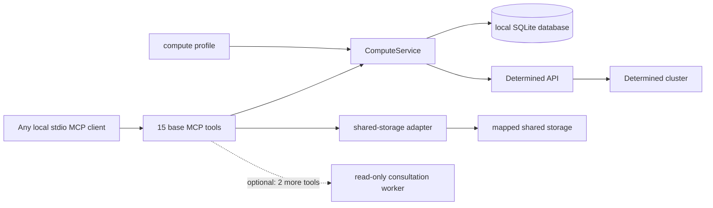

<a id="compute-service-reference"></a>
# 计算服务参考

[English](compute-service.md) | [简体中文](compute-service.zh.md)

本文说明本地 Determined 计算服务的配置和公开 MCP 接口。准备、提交和检查任务的通用 agent
流程见 [Agent 工作流](agent-workflow.zh.md)；可选的服务端建议 worker 见
[咨询后端](consultation.zh.md)。

<a id="architecture-and-trust-boundary"></a>
## 架构与信任边界



MCP server 是供一个可信用户使用的本地 stdio 服务。进程启动时绑定 `owner`，所有工具都不接受
owner 参数。多个进程可以在同一个数据库中使用不同 owner；需要协作时也可以有意共用 owner。
这只是命名空间边界，不是多用户认证。若要远程暴露服务，需要另行设计带认证的传输层。

`ComputeService` 负责规划、幂等提交、状态、日志、用量测量、取消、发现、接管以及保守的
调和。其本地 `task_id` 在服务重启后保持稳定，与 Determined 的 `remote_id` 不同。SQLite
数据库应放在持久的本地存储上；源码、数据、包、检查点、日志和输出应放在映射的共享存储上。

咨询后端默认为 `none`。此模式注册 15 个基础工具，不导入咨询 worker，不要求安装 Codex，
也不要求存在仓库 skill 目录。启用 Codex 后端会增加 `compute_consult` 和 `workflow_status`，
总计 17 个工具。咨询只提供建议，不能提交或取消任务。

<a id="compute-profile"></a>
## 计算配置

通过 `--profile PATH` 或 `DETERMINED_COMPUTE_PROFILE` 传入配置。其结构如下：

```yaml
cluster_identity: optional-deployment-label
mounts:
  - host_path: /shared/projects
    container_path: /workspace
  - host_path: /shared/reference
    container_path: /reference
    read_only: true
defaults:
  image: your-image
  pool: your-pool
  slots: 1
shell_inactivity_seconds: 7200
```

至少需要一个挂载。`host_path` 是集群 agent 上的路径，不必存在于运行 MCP client 的机器上；
请求使用 `container_path`。容器根路径不能重叠，因此每个容器路径只通过一个对应挂载进行
映射。使用可能重叠的主机根路径验证 host-path 别名时，由最具体的根路径决定策略；匹配程度
相同时只读优先。`workdir`、`output_dir` 和显式检查点目标必须位于可写挂载下，仍可从只读
挂载读取参考数据。这些检查是服务策略，不能替代文件系统权限。

镜像、资源池和 slot 数量是请求可以覆盖的默认值。`slots` 必须是非负整数；若资源池支持，
零表示请求 CPU-only 的辅助容器容量。`shell_inactivity_seconds` 可省略，并且只作为提示；
服务本身不强制 shell 空闲超时。

`cluster_identity` 是可选的运维标签。服务把本地提交记录绑定到配置指纹、解析后的 Determined
端点和这个标签。取消、调和与 launch 重试要求该绑定完全一致。如果只有配置改变，而端点和标签
仍然一致，服务在验证远端所有者和提交标记后，仍可只读地查询状态、日志和用量；参见
[跨配置只读观察](#cross-profile-observation)。端点或标签改变后，这些记录的所有操作都会被拒绝。

<a id="request-object-and-planning"></a>
## 请求对象与规划

`compute_plan` 和 `compute_launch` 接受相同的请求对象：

| 字段 | 类型 | 含义 |
| --- | --- | --- |
| `name` | 字符串 | 可选显示名称，最多 128 个字符 |
| `description` | 字符串或 null | 可选显示说明，最多 2,048 个字符 |
| `allow_queue` | 布尔值 | 当前容量不足时允许排队；默认 `false` |
| `kind` | `auto`、`command`、`shell` 或 `experiment` | 执行模式；默认 `auto` |
| `interactive` | 布尔值 | 要求 shell 模式；在 auto 模式下选择 `shell` |
| `overnight` | 布尔值 | 在 auto 模式下选择 `experiment` |
| `command` | 字符串或字符串数组 | command 或 experiment 的入口；shell 模式拒绝此字段 |
| `workdir` | 容器绝对路径 | 可写已配置挂载下的工作目录 |
| `output_dir` | 容器绝对路径 | 可写已配置挂载下的输出目录 |
| `slots` | 非负整数 | 请求的 slot 数；默认使用配置值 |
| `pool`、`image` | 字符串 | 可选的配置默认值覆盖 |
| `code_revision` | 字符串或 null | 调用方提供的版本或内容标识 |
| `experiment_config` | 对象 | 额外的实验配置；要求 experiment 模式 |
| `create_directories` | 由 `output_dir`、`checkpoint_storage` 组成的数组 | launch 在提交前创建的目录；默认不创建。见[启动路径检查](#launch-path-checks) |
| `gpu_admission` | 对象、`false` 或 null | 可选的容器内 GPU 检查，在工作负载之前运行；见 [GPU 准入](#gpu-admission) |

服务拒绝未知字段以及上传/context 字段。在 auto 模式中，`interactive` 优先选择 `shell`，
其次由 `overnight` 或 `experiment_config` 选择 `experiment`，其余请求选择 `command`。
显式 `kind` 会保留，所以 overnight command 仍是 command，并收到一条提示。

规划不访问 Determined：不做认证、容量检查、项目创建或任务提交。它返回 `kind`、`name`、
`description`、`allow_queue`、渲染后的 `config`、`code_revision` 和 `advisories`；请求使用
`create_directories` 或 `gpu_admission` 时还返回同名字段，经由 CLI 和 MCP server 调用时还返回
`path_checks`。省略
`name` 时，服务会生成名称并添加提示。command 和 shell 把名称放在 description 第一行；
experiment 使用原生 name 字段。顶层显示元数据会覆盖同名的 experiment 字段。

command 和 experiment 的入口先创建 `output_dir`，再切换到 `workdir`，最后通过
`/bin/bash -lc` 运行命令。command 和 shell 配置使用 `resources.slots`，experiment 使用
`resources.slots_per_trial`。服务提供配置中的 bind mount，并管理 `COMPUTE_WORKDIR`、
`COMPUTE_OUTPUT_DIR`、`COMPUTE_CODE_REVISION`、`COMPUTE_GPU_ADMISSION*` 策略变量和私有提交
标记；请求不能覆盖这些环境变量或 bind mount。

experiment 必须提供 `command` 或 `experiment_config.entrypoint`，但不能同时提供。显式
`checkpoint_storage` 必须使用 `type: shared_fs`、可写的映射 `host_path`，且可选的
`storage_path` 必须留在该 host path 内。服务拒绝旧的 `checkpoint_path` 和
`tensorboard_path` 别名。若省略 checkpoint storage，Determined 使用集群默认配置，离线规划
无法检查该默认值。

<a id="launch-path-checks"></a>
### 启动路径检查

CLI 和 MCP server 通过存储配置为规划提供共享存储的只读视图。此时规划结果增加
`path_checks`，按集群 agent 主机命名空间为每个启动路径给出一个条目：每个配置 bind mount
（`bind_mounts[i].host_path`）、command 或 experiment 的 `workdir`、experiment 的
`experiment_config.checkpoint_storage.host_path`，以及 `output_dir`。每个条目包含 `field`、
`host_path`、`container_path`（检查点路径未配置容器路径时为 null）、`required`、`status` 和
`reason`。入口会创建 `output_dir`，因此除非 `create_directories` 包含它，否则它不是必需路径。

只有通过可信的本地视图才能判定路径：存储配置中的显式 `local_mounts` 条目（按配置直接信任），
或在 `auto`、`local` 模式下本机存在且在本机被检测为挂载点的配置主机根路径（同一文件系统内的
bind mount 和位于挂载点之下的目录检测不到；请用 `local_mounts` 把这类根路径映射到自身）。
未被检测为挂载点的同名本地目录可能是另一块无关的磁盘，因此不被信任。某个 `local_mounts` 条目
覆盖某路径、但其本地路径不存在或不可读时，服务不会回退到主机根路径。

`status` 为 `present`、`missing`、`not_directory`、`unverified` 或 `will_create`。请依据
`status` 做判断；`reason` 仅用于诊断，取值是开放的，将来可能出现新值。客户端无法判定的路径为
`unverified`，其原因包括 `not_locally_visible`、`local_mount_unavailable`（覆盖该路径的
`local_mounts` 条目不可用）、`local_view_unconfirmed`（主机根路径在本机存在但未被检测为挂载点）、
`ssh_only_access`、`permission_denied`、`timeout`、`storage_config_unavailable`（无法加载存储
配置）、`invalid_storage_path`（本地视图经由符号链接解析到映射根目录之外），以及
`os_error:<ERRNO>`，例如 `os_error:ESTALE` 或 `os_error:ELOOP`；其他意外的探测错误以其异常名
报告。`missing` 路径可能带有 `parent_not_directory`，`will_create` 带有 `missing` 或之前的
`unverified` 原因。所有探测共享 10 秒期限，因此停滞的网络挂载不会让规划挂起。报告路径缺失之前，
服务会列出其父目录并再检查一次，以刷新网络文件系统缓存的“不存在”结果。`unverified` 路径永远
不会导致失败。必需路径为 `missing` 或 `not_directory` 时，`compute_plan` 和 `compute_launch`
返回 `path_not_found`，`details.missing_paths` 列出其 `field`、`host_path` 和 `status`。
`path_checks` 只是观察结果：规划只读取文件系统，`path_checks` 从不改变 `config` 或
`advisories`，也不属于幂等载荷。

launch 在查找 `request_id` 之后、检查容量之前执行同样的检查，因此检查失败时不会写入任务记录，
也不会提交任务。已存在的 `request_id` 会原样返回且不做检查，即使之后某个路径已被删除。
`create_directories` 指定的目录未在期限内响应时，launch 在此处返回可重试的 `storage_timeout`，
而不会通过停滞的挂载创建目录。检查之后、同样在容量检查之前，launch 构建 Determined API 客户端，
因此登录或客户端配置错误也不会留下任务记录或已创建的目录，使用同一 `request_id` 重试仍可提交。

`create_directories` 显式要求 launch 创建 `output_dir`、`checkpoint_storage`（即 experiment
的 `checkpoint_storage.host_path`；Determined 在容器启动时 bind mount 该路径，所以它必须在入口
运行前存在），或两者都创建。服务从不隐式创建目录，规划时也不创建，只报告 `will_create`。
launch 在容量检查之后、认领任务记录之前，以默认 umask 连同父目录创建每个目录：有可信本地视图时
通过该视图创建，否则在 `auto` 或 `ssh` 模式下于已配置的 SSH 登录节点上执行 `mkdir -p`，两者都
没有时返回 `configuration_required`。服务从不通过不可信的同名目录或不可用的 `local_mounts`
条目创建目录。每次本地创建同样有 10 秒期限，超时返回可重试的 `storage_timeout`；期限过后才出现
的目录会在重试时报告为 `created: false`。通过 SSH 创建受存储配置的 `timeout_seconds` 限制，超时
同样返回可重试的 `storage_timeout`。本身就是配置挂载根路径的目录从不创建：已存在的根路径报告为
`created: false`，不存在时 launch 失败，通过 SSH 检查时返回 `invalid_storage_path`。新提交的结果增加
`prepared_directories`，即 `{field, host_path, created}` 列表。服务从不删除任何内容。
`checkpoint_storage` 要求带有 `checkpoint_storage` 的 experiment。非空列表属于幂等载荷；省略或
空列表不会改变以前的载荷。

<a id="gpu-admission"></a>
### GPU 准入

`gpu_admission` 添加一个可选的预检，它在容器内运行，时机是入口切换到 `workdir` 之后、工作
负载启动之前。它适用于 command 和至少有一个 slot 的单节点 experiment；shell 没有受管入口，
因此拒绝此字段。slot 多于一个的 experiment 必须设置
`experiment_config.resources.is_single_node: true`，因为 Determined 默认允许一个 trial 跨越
多个 agent，此时每个容器只能看到自己所在 agent 的 GPU。`false` 或 null 表示禁用。对象接受：

| 字段 | 含义 |
| --- | --- |
| `count` | 正整数；`nvidia-smi` 报告的 GPU 数量必须与之相等。默认为请求的 slot 数 |
| `names` | 最多 8 个 `fnmatch` 风格模式，每个最多 128 个可打印字符且不含 `\|`；报告的每块 GPU 的名称都必须匹配其中之一 |
| `driver_versions` | 相同形式的驱动版本模式 |
| `min_free_mib`、`min_total_mib` | 非负整数，对报告的每块 GPU 检查 |
| `receipt` | `output_dir` 下的回执文件名，必须以 `.json` 结尾；默认为 `gpu-admission.json` |

检查针对 `nvidia-smi` 在容器内报告的 GPU，不应用 `CUDA_VISIBLE_DEVICES`；回执记录该变量仅供
诊断。如果资源管理器只通过 `CUDA_VISIBLE_DEVICES` 限制 GPU（例如未启用 cgroup 设备约束的
Slurm），请按整个节点设置 `count` 和显存下限，或不要使用 `gpu_admission`。

规划结果增加规范化的 `gpu_admission` 对象，config 增加受管的 `COMPUTE_GPU_ADMISSION*` 变量，
入口变为
`mkdir -p OUTPUT && cd WORKDIR && /bin/bash -c '<script v1>' determined-compute-gpu-admission || exit $?`，
下一行是 `COMMAND`，因此任一步骤失败都会在 `COMMAND` 的任何语句运行之前结束 shell。
由于 `COMMAND` 自成一行，只含注释的 `COMMAND` 在准入通过后什么也不做并以 0 退出；空白的
`COMMAND` 无论是否启用准入都会被拒绝。带版本号的脚本只需要 bash、coreutils 和
`nvidia-smi`；有 `timeout` 时会用它运行 `nvidia-smi`。只有形如 GPU 行（数字序号加六个字段）
的输出行才计为 GPU；其他行只保留可打印 ASCII 字符后记录在 `unparsed_lines` 中。脚本以原子
方式写入回执，把同一条 JSON 记录作为一行追加到回执的 `.jsonl` 历史中，使 experiment 重启后
仍保留以前的尝试，打印一行
`determined-compute gpu_admission: passed|failed ...`，失败时以退出码 86 结束，使工作负载不会
启动。缺少 `nvidia-smi` 或其运行失败都视为准入失败。回执记录 `schema_version`
（`determined-compute-gpu-admission-v1`）、`status`、`observed_at`、`policy`、`devices`（序号、
UUID、名称、驱动版本以及总显存和空闲显存 MiB）、`unparsed_lines`、`failures`、
`cuda_visible_devices`、`nvidia_visible_devices`、`hostname`，以及已设置的 Determined task、
allocation 和 trial ID；不记录其他环境变量值。

回执保存使用相同 `output_dir` 和 `receipt` 的任意任务或 trial 最近写入的记录，因此同一
experiment 中并发运行的 trial 会互相覆盖回执。`determined.allocation_id` 与该次尝试相符的
`.jsonl` 行才是权威记录；同时运行的任务或 experiment 应使用不同的 `output_dir` 或 `receipt`。
工作负载自身也可能以 86 退出，因此退出码 86 本身只是一个提示：请通过
`determined-compute gpu_admission: failed` 日志行或相符的记录确认准入失败。反过来，失败的
准入也可能让 command 任务以其他退出码结束：command 任务在登录 shell 中运行，mkdir、cd 或
准入步骤失败时会调用 `exit`，这会运行容器用户的 `~/.bash_logout`，而该文件中的 `exit` 会
替换退出码。因此应通过日志行或相符的 `.jsonl` 记录确认准入结果，而不能只看退出码或任务
状态。在 experiment 中，一次准入失败会消耗一次重启；若希望失败一次即停止，请在
`experiment_config` 中设置 `max_restarts: 0`。不含此字段的请求渲染结果与以前完全相同。

<a id="start-the-mcp-server"></a>
## 启动 MCP server

为每个已配置的 client 启动一个持久 stdio 进程：

```bash
determined-compute-mcp \
  --profile /absolute/path/to/compute-profile.yaml \
  --db /absolute/local/path/to/tasks.sqlite3 \
  --owner your-owner \
  --secrets-file /absolute/path/to/credentials.env \
  --verify-ssl
```

`--profile`、`--db` 和 `--owner` 分别对应 `DETERMINED_COMPUTE_PROFILE`、
`DETERMINED_COMPUTE_DB` 和 `DETERMINED_COMPUTE_OWNER`；`--storage-config` 对应
`DETERMINED_COMPUTE_STORAGE`；`--secrets-file` 也可通过 `DETERMINED_COMPUTE_SECRETS`
提供。API URL、token 和 TLS 验证默认来自 `DET_MASTER`、`DET_API_TOKEN` 和
`DET_VERIFY_SSL`。凭据应放在现有凭据提供方或 secrets 文件中，不要写入配置、数据库、工具
参数或报告。

CLI 的默认数据库路径是 `~/.local/state/determined-compute/tasks.sqlite3`，但 MCP 部署应显式
指定本地绝对路径。MCP 拒绝 `:memory:`。服务升级后，应重启共用该数据库的所有 MCP 进程，
使它们加载同一套工具和新增式 schema。

客户端访问映射共享存储的可选功能使用同一计算配置和独立的存储配置。参见
[共享存储访问](shared-storage-access.zh.md)。

<a id="mcp-api"></a>
## MCP API

基础 server 提供 15 个工具。下文的 `owner` 始终指启动时绑定的命名空间，不是工具参数。

| 工具 | 参数 | 返回值与作用 |
| --- | --- | --- |
| `compute_plan` | `request` | 离线规范化的规划；不访问集群或修改数据库 |
| `compute_launch` | `request`、`request_id` | 持久化任务记录；最多提交一次 |
| `compute_status` | `task_id` | 本地任务记录、刷新后的远端状态、绑定后取得的远端实体，以及 `binding` |
| `compute_logs` | `task_id`，可选 `tail=200`、`include_binding=false` | 最新远端日志按时间正序排列的列表；`include_binding=true` 时返回 `{task_id, binding, logs}` |
| `compute_usage` | `task_id`，可选 `window_seconds=3600`、`allocation_id`、`trial_id`、`metrics`、`include_samples=false` | 一个任务实测 CPU、内存和 GPU 用量的只读摘要 |
| `compute_cancel` | `task_id` | 更新后的记录、远端取消响应与确认标志 |
| `compute_reconcile` | `task_id`、`remote_id` | 仅在验证标记后绑定的记录 |
| `compute_list_tasks` | 无 | 已绑定 owner 命名空间内的本地记录，每条附带离线 `binding` |
| `compute_discover` | `kind`，可选 `limit=50`、`offset=0` | 当前账户的一页远端任务；不修改本地状态 |
| `compute_adopt` | `kind`、`remote_id` | 幂等注册的本地记录；不提交远端任务 |
| `compute_resources` | 可选 `slots=1`、`pool` | 当前调度容量和候选资源池 |
| `storage_check` | `path` | 映射容器路径的访问情况 |
| `storage_sync` | `local_dir`、`shared_dir`，可选 `dry_run=true` | 预览或把本地目录内容复制到共享存储 |
| `storage_fetch` | `shared_dir`、`local_dir`，可选 `dry_run=true` | 预览或把共享目录内容复制到本地 |
| `storage_snapshot` | `repo_dir`，可选 `revision="HEAD"`、`include`、`exclude`、`dry_run=true`、`verify=false` | 预览或把一个 git 版本发布为只读、按内容寻址的共享工作目录 |

只有启用咨询后端时才会出现 `compute_consult(question, request_id, context?)` 和
`workflow_status(workflow_id)`。其配置、生命周期和限制见[咨询后端](consultation.zh.md)。

<a id="plan-capacity-and-launch"></a>
### 规划、容量与提交

先调用 `compute_plan`，检查解析后的路径、模式、镜像、资源池、slot、提示和 `path_checks`。
`compute_resources` 返回实时快照，不保留资源。正 slot 数检查可调度的 agent slot；零检查辅助
容器容量。候选资源池只是建议，服务不会自动替换。

除非显式设置 `allow_queue: true`，`compute_launch` 会先检查容量。`request_id` 是已绑定 owner
内的幂等键。用相同 ID 和等价请求重试会返回已有记录；用不同内容复用会返回
`idempotency_conflict`。本地记录一旦认领该 ID，即使服务重启，重试也不会提交第二个远端
任务。

适配器把 command 和 shell 配置作为 mapping 发送；experiment 配置会序列化为 YAML 并请求
激活。适配器拒绝源码上传别名，从不自动创建项目，会移除 API envelope、清理用于身份调和的
材料，并返回含 `id` 的实体。

<a id="task-records-status-logs-and-cancellation"></a>
### 任务记录、状态、日志与取消

公开任务记录包含 `task_id`、`request_id`、`owner`、`origin`、`kind`、本地 `state`、
`remote_id`、`remote_state`、显示元数据、路径、版本、集群/账户绑定字段、可选的固定
`error_code` 和时间戳。内部请求 hash、配置 hash 和提交标记不会公开。服务不会在任务记录中
保存完整请求、生成的配置、API 响应、日志或原始异常文本。

`compute_status`、`compute_usage` 以及 `include_binding=true` 的 `compute_logs` 会报告
`binding`：`mode`（`profile`、`cross_profile` 或 `adopted`）、`profile_matches`（adopted 任务
为 null）、`cluster_identity_matches`、`verified`（本次调用执行的检查：`profile` 为空，带
remote ID 的 `cross_profile` 为 `remote_owner` 和 `submission_marker`，`adopted` 为
`remote_cluster` 和 `remote_owner`）、`mutations_allowed` 和 `message`。`compute_list_tasks`
为每行附加离线 `binding`，不访问 Determined；其中 `mode` 还可能是 `mismatch`（端点或标签
不同）或 `unknown`（无法解析客户端配置），adopted 记录的 `mutations_allowed` 为 null，因为
它们的检查需要实时进行。

未绑定 remote ID 时，`compute_status` 只返回本地状态，不访问 Determined；绑定后会取得远端
实体、更新 `remote_state`，并在 `remote` 中包含清理后的实体。过期的 `pending` 或
`submitting` 记录会变为 `submission_uncertain`，但不会触发自动重提。

`compute_logs` 要求 `tail` 为正数。command 和 shell 日志来自相应 task log API；experiment
日志来自数值最大的 trial ID，该 trial 由服务端排序选出，即使 experiment 超过 100 个 trial
也能正确选择；没有 trial 时返回空列表。结果按从旧到新排列。没有 remote ID
的任务也返回空列表。

`compute_cancel` 对 command 和 shell 使用 task kill endpoint，对 experiment 使用 experiment
cancel endpoint。它要求任务已绑定 remote ID；API 调用完成后返回
`cancellation_acknowledged: true`。远端终止并不能单独证明成功，还应检查退出信息和预期的
共享存储产物。

对于正在运行的 shell，应使用已清理的 `reconnectCommand`，当前为
`det shell show_ssh_command <remote-id>`。适配器会移除 `privateKey`；不要把私钥材料写入任务
记录、咨询 context 或报告。

<a id="task-usage-measurements"></a>
### 任务用量测量

`compute_usage` 是只读工具，汇总当前 owner 命名空间中某个任务实测的 CPU、内存和 GPU 用量；
`compute_resources` 描述的则是调度容量。它要求 Determined master 来自 research-cluster fork
0.40.1 或更高版本，并由管理员配置 `integrations.task_resources`（`prometheus_url` 和
`det_cluster`）。

服务先验证参数，再执行与 `compute_status` 相同的 owner 和绑定检查。没有 remote ID 的记录返回
`remote_id_unknown`，应先调和。adopted 任务会再次验证远端 owner。随后服务向 master 查询任务
资源功能是否可用：集成未启用时返回 `task_resources_disabled`，master 不提供该 API 时返回
`task_resources_unsupported`。两者都不可重试。

command 和 shell 的 `determined_task_id` 就是 remote ID。experiment 只报告一个 trial：默认是
ID 最大的 trial，指定 `trial_id` 时则为该 trial。指定的 trial 属于其他 experiment 时返回
`trial_not_found`；trial ID 不存在或无权访问时返回 Determined 的 HTTP 404。其他任务类型会拒绝
`trial_id`。服务测量所选 trial 最新的 Determined task。experiment 尚无 trial，或 trial 尚无
task 时，返回 `task_not_started`。`allocation_id` 把结果限定为该 task 列出的一个 allocation；
其他值返回 `allocation_not_found`。

`window_seconds` 必须在 60 到 604,800（七天）之间，默认 3,600。已结束任务的窗口终点是任务结束
时间（不晚于当前时间），其他任务的终点是当前时间。如果所选的每个 allocation 都在此之前结束，
例如已暂停的 trial，或通过 `allocation_id` 指定的较早 allocation，窗口终点改为其中最晚的
allocation 结束时间。起点比终点早 `window_seconds`，但不早于任务开始时间或所请求 allocation 的
开始时间，且至少比终点早一秒。`window.anchor` 说明采用的终点：`task_end`、`allocation_end` 或
`now`。步长取 15 秒与窗口长度除以 1,439 后向上取整两者中的较大值，因此每个序列不超过
1,440 个点。`metrics` 是非空列表，取值来自 `allocation_active`（count）、`cpu_cores`
（cores）、`memory_working_set_bytes` 和 `memory_rss_bytes`（bytes）、
`gpu_utilization_percent`（percent）、`gpu_memory_used_bytes`（bytes）、`gpu_power_watts`
（watts）以及 `gpu_temperature_celsius`（celsius）；省略时保留所有返回的序列。

结果包含：

| 字段 | 含义 |
| --- | --- |
| `task_id`、`kind`、`remote_id` | 本地任务身份 |
| `determined_task_id` | 实际读取测量值的 Determined task |
| `trial` | command 和 shell 为 `null`；否则包含 `id`、`state`、`selection`（`latest` 或 `requested`）、`experiment_trial_count`（指定 `trial_id` 时为 `null`）、`task_count`，以及下文所述的 trial 进度和汇总指标字段 |
| `resource_pool` | 任务所在资源池的 `name`，以及 Determined 中由运维人员填写的 `description`（去除首尾空白，最多 4,096 个字符；资源池没有描述或不在当前账户可见的资源池列表中时为 `null`）；资源池名称未知时整个字段为 `null` |
| `task_start_time`、`task_end_time` | Determined task 的生命周期 |
| `allocations` | 每个 allocation 的 `allocation_id`、`state`、`is_ready`、UTC 时间 `start_time` 和 `end_time`、`slots`、`exit_reason`（最多 1,024 个字符）以及 `status_code` |
| `allocation_details_limit` | 仅当任务的 allocation 超过 8 个时出现，值为 8；见下文 |
| `allocation_id` | 请求的 allocation 过滤条件，或 `null` |
| `window` | 以 Unix 秒表示的 `start` 和 `end`、以秒为单位的 `step`，以及 `start_at`、`end_at`、`anchor` 和 `expected_points` |
| `series` | 每个指标和标签组合一条摘要 |
| `gpus` | 每个 allocation 一条 GPU 对比；见下文 |
| `warnings` | Determined 返回的 `{code, message}` 警告，原样透传 |
| `context_unavailable` | 查询失败的上下文：`resource_pool`、`allocation_details` 或 `gpu_models` |
| `explanation`、`advisory` | 如何解读本结果 |
| `observed_at` | 服务生成结果的时间 |

每个序列包含 `metric`、`unit`，标签 `allocation_id`、`node` 和 `gpu_uuid`，`gpu_model`，
`points`、`available_points`、`first_at`、`last_at`，以及基于可用样本的 `last`、`min`、`max`、
`mean`、`p50` 和 `p95`。`p50` 和 `p95` 是最近秩（nearest-rank）百分位数。`gpu_model` 是
Determined agent 为该 `gpu_uuid` 报告的型号名称；非 GPU 序列或设备未知时为 `null`。
`gpu_utilization_percent` 序列还包含 `idle_fraction`，即其可用样本中低于 10% 的比例。

数值是每 `step` 秒一次的点采样，因此 `min`、`max`、`mean` 和百分位数描述的是这些样本，
而不是每个时刻的值。null 或缺失值表示没有测量，绝不表示用量为零。`allocation_active`
大于零表示该 allocation 在该采样点处于运行状态。CPU 和内存序列按 allocation 和节点区分；GPU
序列按 GPU UUID 区分，覆盖整块分配到的设备，可能包含其他进程。下结论前先检查 `warnings`，
例如 `rss_unverified` 或 `gpu_full_device`。空的 `series` 列表表示该窗口没有数据，
而不是任务空闲；如果 `metrics` 过滤掉了所有返回的序列，`explanation` 会列出实际返回的指标。
未指定 `trial_id` 且 experiment 有多个 trial 时，`explanation` 会说明 trial 总数以及报告的是
哪一个。

`gpus` 比较每个 allocation 内的各块 GPU。每个带有 GPU 利用率或显存序列的 `allocation_id`
对应一个条目，基于该窗口返回的所有此类序列计算，即使 `metrics` 过滤条件使其不出现在 `series`
中；指定 `allocation_id` 时只覆盖该 allocation。每个条目包含 `gpu_count`（返回了利用率或显存
序列的不同 GPU UUID 数，即使其样本全为 null）、`requested_slots`（该 allocation 的槽位数，
未知时为 `null`）、`gpu_models`（已知的不同型号名称，可能为空），以及各 GPU 平均利用率的统
计：`mean_utilization_percent` 是各 GPU 均值的平均，每块 GPU 权重相同；
`min_gpu_mean_utilization_percent` 和 `max_gpu_mean_utilization_percent` 是其中的最低值和最
高值；`utilization_spread_percent` 是两者之差；`least_utilized_gpu_uuid` 是均值最低的 GPU，
并列时取字典序最小的 UUID。这些利用率统计只包含至少有一个可用利用率样本的 GPU，因此覆盖的
GPU 数可能少于 `gpu_count`。`idle_fraction` 则是该 allocation 全部 GPU 利用率样本中低于
`idle_threshold_percent`（10）的比例。`max_memory_used_bytes` 是该 allocation 中单块 GPU
采样到的最大显存用量，而不是真正的峰值；不报告显存容量。差值较大提示存在空闲或掉队的 GPU，
可先查看 `least_utilized_gpu_uuid`；`idle_fraction` 较高表示这些 GPU 在窗口内大部分时间低于
阈值。`gpu_count` 小于 `requested_slots` 表示返回了序列的 GPU 少于该 allocation 持有的槽位；
在认定其余 GPU 未被使用之前，应先检查 `warnings` 和监控覆盖情况。

对于 experiment，`trial` 还包含 Determined 针对整个 trial（而不是测量窗口）记录的值：
`total_batches_processed`、`wall_clock_seconds` 和 `restarts`，缺失或格式异常时为 `null`。
`total_batches_processed` 是报告过的最大 `steps_completed`，`restarts` 不超过该 experiment
的 `max_restarts`。`batches_per_second_lower_bound` 是批次数除以挂钟秒数，任一值未知或挂钟时
间为零时为 `null`；其单位取决于工作负载以 `steps_completed` 报告的内容。它只是下界，因为
`wall_clock_seconds` 累加每个 allocation 从 Determined 首次报告其资源处于拉取镜像或运行状态
起，到该 allocation 结束（运行中则到当前时间）为止的时间，其中可能包括镜像拉取、启动、
初始化以及因重启损失的 allocation 时间（不含调度排队时间和 allocation 之间的暂停间隔）。
`summary_metrics` 收录 Determined 按组、按指标的统计，其中只保留 `type` 以及有限数值
`count`、`sum`、`min`、`max`、`last` 和 `mean`；`avg_metrics`（训练）和 `validation_metrics`
等组名来自 Determined，原样透传。最多保留 100 个指标条目：先是 `validation_metrics`，
然后是 `avg_metrics`，再按组名排列其他组，每组内按指标名排序；存在更多条目时
`summary_metrics_truncated` 为 true。这些字段依赖工作负载通过 Determined 的
Core API 报告。对于不这样报告的工作负载（例如普通 bash 入口）或尚未报告的工作负载，
`total_batches_processed` 为 0 属于预期，`explanation` 也会说明这一点；这并不表示工作负载
没有进展。工作负载未报告指标时，
`summary_metrics` 为 `{}`。

资源池、allocation 详情和 GPU 型号等上下文以尽力而为的方式获取，并在读取测量值之后进行。
其中某项查询出现 Determined API 错误（包括传输失败或响应格式异常）时，会把 `resource_pool`、
`allocation_details` 或 `gpu_models` 加入 `context_unavailable`，受影响字段为空或 `null`，
测量值仍照常返回。出现传输失败后，其余查询会被跳过并以相同方式报告，因此无响应的 master
只会让结果延迟一次超时，而不是每项查询各一次。submitted 任务需要额外读取一次任务实体以获得
资源池名称，`compute_logs` 不会进行这次读取；该读取失败时报告 `resource_pool`。adopted 任务
复用所有权检查时读取的实体。Determined 只在已结束的 command 或 shell 结束后 24 小时内提供
其实体，master 重启后也不再提供；对这类任务，`resource_pool` 为 `null`，且
`context_unavailable` 中没有相应条目。
只有已知资源池名称时才读取资源池列表。allocation 详情只读取 Determined 顺序（先是尚无结束时
间的 allocation，例如排队中或运行中的，再按结束时间由近到远）中的前八个 allocation，
以及请求的 `allocation_id`；其他 allocation 的详情为 `null`，并由 `allocation_details_limit`
报告上限。提供 GPU 型号名称的 agent 列表只在存在 GPU 序列时读取。RBAC 对当前账户隐藏设备
UUID 时，`gpu_model` 为 `null`，`gpu_models` 为空，且 `context_unavailable` 中没有相应条目。

`include_samples=true` 会增加 `samples_omitted`。`samples_omitted` 为 false 时，每个序列还包含
`samples`，格式为 `[unix_seconds, value_or_null]` 对。所选序列合计超过 2,880 个点时，服务省略
样本并报告 `samples_limit`；应缩短窗口、减少指标或选择一个 allocation。

master 限制每次查询最多覆盖七天、最小步长 15 秒、每个序列 1,440 个点、超时 10 秒，并且同时
最多运行四个资源查询。HTTP 503 表示测量后端繁忙或不可用，可以重试。master 会以 HTTP 400 拒绝
比其自身时钟超前 60 秒以上的终点，因此客户端时钟明显快于 master 时可能出现该错误。Determined
task 或指定的 trial ID 不存在或无权访问时返回 HTTP 404。参见
[故障排查](troubleshooting.zh.md#usage-measurements-are-unavailable-or-empty)。

<a id="discover-and-adopt"></a>
### 发现与接管

`compute_discover` 的 `kind` 可以是 `command`、`shell` 或 `experiment`。`limit` 必须在
1 到 100 之间，`offset` 必须是非负数。它只查询当前已认证 Determined 账户拥有的任务，返回
实际集群 ID、账户身份、清理后的元数据、匹配的 `local_task_id`（若有）以及包含
`next_offset` 的一致分页信息。它既不写入本地记录，也不提交任务。
command 和 shell 的 remote ID 是 UUID，experiment 的 remote ID 是正整数。

`compute_adopt` 先取得一个远端任务，再把其规范化 ID 和 `userId` 与 `/me` 对照，验证通过后
才写入。即使管理员可以看到其他任务，也不能接管其他用户的任务。注册身份由本地 owner、实际
集群 ID、kind 和 remote ID 组成；记录还会绑定并验证已认证的用户 ID。同一数据库中已有的
submitted 记录会原样返回，不会被替换。

新接管记录使用 `origin: "adopted"`、本地 `state: "adopted"` 和内部接管 request ID。记录只
保留白名单中的身份、状态、名称和说明元数据。未知的 `workdir`、`output_dir` 和
`code_revision` 对外为 `null`；存储层不会推断这些值，也不保留原始远端配置。后续状态、日志、
用量和取消操作会再次检查实际集群和账户绑定。接管任务不把提交时配置作为授权依据，也不会获得
任何存储权限。

对于通过 WebUI、原生 CLI 或同一账户的另一设备创建的工作，使用发现和接管；对于远端是否
接受某次本地提交并不确定的情况，使用调和。adopted 任务不能调和，也不能作为 launch 重试。

<a id="reconciliation-and-recovery"></a>
### 调和与恢复

传输超时可能导致远端是否接受提交未知。服务会保留本地任务，并在错误 details 中返回其
`task_id`，不会自动重提该请求。`compute_reconcile(task_id, remote_id)` 会取得候选实体，仅当
其保留的 `COMPUTE_SUBMISSION_MARKER` 等于本地不可猜测标记时才绑定；不匹配会返回
`identity_mismatch`。只有缺少已存显示元数据的迁移旧记录才会使用 description 第一行标记。

该标记把调和与接管隔离开：有匹配标记的不确定本地提交必须调和，独立创建的远端任务才可以
接管。缺少证据时应继续调查，不要再次提交同一工作。

<a id="cross-profile-observation"></a>
### 跨配置只读观察

本地 submitted 任务的所有变更操作始终绑定原始配置指纹和端点。取消和调和都要求两者一致，否则
在任何远端调用之前返回 `binding_mismatch`。解析到以其他配置提交的 submitted 记录时，接管会先
完成只读的集群、账户和实体查询，然后返回 `binding_mismatch`。配置改变后的 launch 重试返回
`idempotency_conflict`，因为配置指纹是请求哈希的一部分。状态、日志和用量是只读操作，当记录保
存的端点和标签与当前一致时，也接受以其他配置提交的记录。读取任务数据之前，服务会调用 `/me`
并取得实体，要求其 `userId` 是当前已认证账户（否则返回 `ownership_mismatch`），其 ID 等于记
录的 remote ID，且其提交标记等于记录的标记；对于没有显示元数据的旧记录，则要求 description
第一行等于该标记（否则返回 `identity_mismatch`）。即使 master 在同一地址重装后 ID 重复，该标
记也能证明远端任务就是这条记录的提交。因此跨配置读取需要实体仍然存在。实体读取返回 HTTP 404
时，该读取会在读取任何任务数据之前以 `cross_profile_unverifiable` 失败。对于 command 或
shell，常见原因是 Determined 已丢弃其实体，它会在任务结束 24 小时后以及 master 重启时丢弃实
体；任务原来的配置仍可读取其日志和用量。对于 experiment，404 表示它已被删除或对该账户不可
见；删除 experiment 也会删除其日志，因此只有 experiment 仍然存在时，原来的配置才能读取其日
志。其他实体读取错误原样返回。这样的读取多一次 `/me` 调用，日志还多一次实体读取；用量会把原
有的实体读取提前到测量之前，并要求它成功。配置完全一致时不增加调用。跨配置的状态查询只写入缓
存的 `remote_state`；没有 remote ID 的记录按存储内容原样返回，不访问远端，也不执行过期提交的
状态转换。取消、调和或重试 launch 请使用任务原来的配置。端点或标签改变后，所有操作仍会被拒
绝。adopted 任务始终绑定实际集群 ID 和已认证用户 ID。这些检查避免改变配置或账户后操作无关任
务。

<a id="errors"></a>
### 错误

MCP 失败使用 `isError: true`；其文本内容是如下形式的紧凑 JSON：

```json
{"error":{"code":"invalid_request","message":"...","retryable":false,"details":{}}}
```

`retryable` 和 `details` 仅在可用时出现，structured content 为 null。安全 details 可包含本地
task ID、容量信息，以及 `path_not_found` 的 `missing_paths`。认证、权限、传输和响应结构错误都会返回错误，而不是空结果。错误消息和
报告可以包含清理后的命令、路径、ID、状态和错误类别，但不能包含凭据或 secrets 文件内容。

Determined 的 HTTP 失败（包括 gRPC-gateway 错误响应体）显示为 `<status> <message>`。HTTP 429
以及除 501 之外的 5xx 响应可以重试；501 表示 master 缺少对应路由。用量相关的错误码见
[任务用量测量](#task-usage-measurements)。

在使用 basic authorization 的 Determined fork 0.40.1 或更高版本上，只有任务的 Determined 所有者
或管理员可以终止或取消 command、shell 和 experiment。因此，对于其他账户拥有的任务，
`compute_cancel` 对 command 或 shell 返回 HTTP 403，对 experiment 返回 HTTP 404
`experiment '<id>' not found`。submitted 记录绑定配置和端点而不是账户，所以把凭据切换到
另一个账户后可能遇到这些错误。应使用拥有该任务的账户取消，或联系管理员。

<a id="cli-equivalents"></a>
## CLI 等价命令

JSON CLI 使用相同的服务边界，并可与 MCP 共用数据库和 owner。请求可以以内联 JSON/YAML 或
文件提供；成功结果包装为 `{"ok":true,"result":...}`，失败包装为
`{"ok":false,"error":...}`。以下是完整的短配置；请把 `TASK_ID` 和 `REMOTE_ID` 替换为实际
返回的标识：

```bash
export DETERMINED_COMPUTE_PROFILE="$PWD/.local/profile.yaml"
export DETERMINED_COMPUTE_DB="$PWD/.local/tasks.sqlite3"
export DETERMINED_COMPUTE_OWNER="$USER"
export DETERMINED_COMPUTE_SECRETS="$PWD/.local/credentials.env"
export DET_VERIFY_SSL=true

determined-compute plan --request-file .local/request.json
determined-compute launch --request-file .local/request.json --request-id my-job-001
determined-compute status TASK_ID
determined-compute logs TASK_ID
determined-compute usage TASK_ID --window-seconds 7200 --metric gpu_utilization_percent

determined-compute logs TASK_ID --with-binding

determined-compute discover command --limit 20 --offset 0
determined-compute adopt command REMOTE_ID

determined-compute --storage-config .local/storage.yaml snapshot "$PWD" --revision HEAD
```

`plan` 和 `launch` 读取 `--storage-config` 或 `DETERMINED_COMPUTE_STORAGE` 用于
[启动路径检查](#launch-path-checks)；无法加载该文件时，它们把路径报告为 `unverified` 并继续。
`logs --with-binding` 返回 `{task_id, binding, logs}` 包装结构。`snapshot` 默认只预览，加
`--execute` 才发布；参见[共享存储访问](shared-storage-access.zh.md#publish-a-code-snapshot)。

文件暂存与取回见[共享存储指南](shared-storage-access.zh.md)。围绕这些确定性调用的完整 agent
流程见 [Agent 工作流](agent-workflow.zh.md)。
