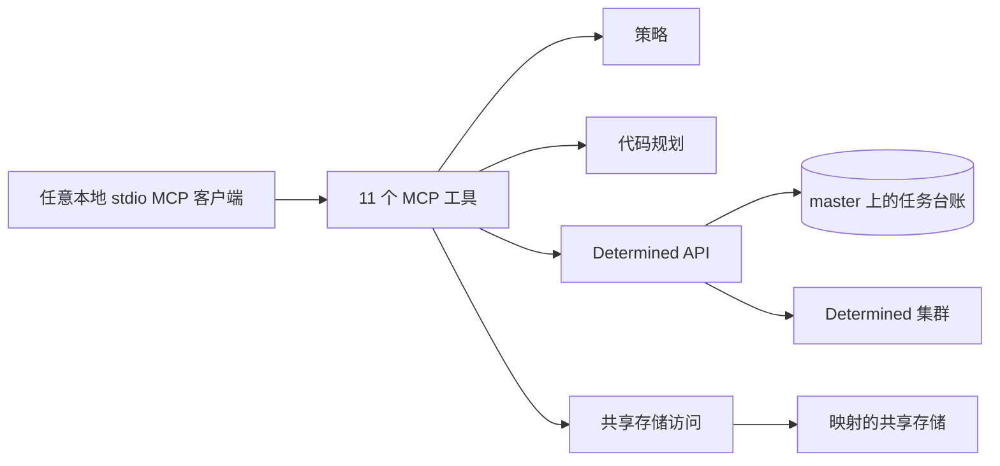

<a id="compute-service-reference"></a>
# 计算服务参考

[English](compute-service.md) | [简体中文](compute-service.zh.md)

本文说明本地 Determined 计算服务的配置和公开 MCP 接口。与具体 agent 无关的准备、提交和检查流程见 [Agent 工作流](agent-workflow.zh.md)。

<a id="architecture-and-trust-boundary"></a>
## 架构与信任边界



MCP server 是面向单个可信用户的本地 stdio 服务，不保存任何本地状态：Determined master 记录每个任务，以规划生成的 `request_id` 为键，`job_id` 是任务的唯一句柄。任务的所有者是已认证的 Determined 用户，因此该用户的所有客户端（包括 WebUI 和 CLI）都能通过 `compute_list` 看到相同的任务。远程暴露的服务需要自己的认证传输层。

master 负责身份、幂等、规划绑定、准入、调度放置以及每个 allocation 的退出类别。MCP 负责比 master 访问控制更窄的策略、用户的工作树、代码交付和结果解读。源码、数据、依赖包、检查点、日志和输出都应放在映射的共享存储上。

本服务需要支持 submission protocol 1 或更高版本的 Determined master，见[协议检查](#protocol-gate)。

<a id="policy"></a>
## 策略

通过 `--profile PATH` 或 `DETERMINED_COMPUTE_PROFILE` 传入策略文件。文件为 YAML；文件名以 `.json` 结尾时为 JSON。字段如下：

```yaml
mounts:
  - host_path: /shared/projects
    container_path: /workspace
  - host_path: /shared/reference
    container_path: /reference
    read_only: true
defaults:
  image: your-image
  pool: your-pool
  slots: 1
pools: [your-pool, your-other-pool]
max_slots: 8
allow_overwrite: false
```

| 字段 | 含义 |
| --- | --- |
| `mounts` | 必填。把每个容器路径映射到管理员在每个 agent 上绑定的宿主机路径（`task_container_defaults.bind_mounts`）。MCP 从不发送 bind mount，只用这张映射表检查路径并访问共享存储。`read_only: true` 会拒绝位于其下的 `output_dir` 和同步目标 |
| `defaults` | 必填 `image` 和 `pool`，以及 `slots`（默认 1）。请求省略时使用这些值；pool 和 slots 总是显式发送 |
| `pools` | 请求可以指定的资源池。省略时只允许默认资源池 |
| `max_slots` | 单个请求最多占用的 slots：每个 trial 的 slots 乘以搜索的并发 trial 数 |
| `allow_overwrite` | `storage_sync` 和 `storage_fetch` 能否覆盖已有文件（默认 `false`） |

未知字段会被拒绝。`host_path` 不必存在于 MCP 客户端机器上。这些检查只收窄 MCP 发送的内容，不取代 master 的访问控制或文件系统权限。

<a id="start-the-mcp-server"></a>
## 启动 MCP server

每个客户端配置启动一个常驻 stdio 进程：

```bash
determined-compute-mcp \
  --profile /absolute/path/to/profile.yaml \
  --storage-config /absolute/path/to/storage.yaml \
  --secrets-file /absolute/path/to/credentials.env \
  --verify-ssl
```

| 参数 | 环境变量 | 含义 |
| --- | --- | --- |
| `--profile` | `DETERMINED_COMPUTE_PROFILE` | 策略文件；必填 |
| `--storage-config` | `DETERMINED_COMPUTE_STORAGE` | 可选的[存储访问](shared-storage-access.zh.md)文件 |
| `--secrets-file` | `DETERMINED_COMPUTE_SECRETS` | `KEY=VALUE` 凭据文件 |
| `--api-url` | `DET_MASTER` | master 地址，用于 secrets 文件未指定时 |
| `--api-token` | `DET_API_TOKEN` | API token，用于 secrets 文件未提供凭据时 |
| `--verify-ssl`、`--no-verify-ssl` | `DET_VERIFY_SSL` | TLS 验证 |

master 地址依次取 `--api-url`、secrets 文件中的 `DET_MASTER`、环境变量 `DET_MASTER`（也读取 `DET_MASTER_ADDR` 和 `DET_MASTER_HOST`）。secrets 文件若指定了 master，其凭据只发往该 master：此时忽略环境中的 `DET_API_TOKEN`、`DET_USERNAME` 和 `DET_PASSWORD`；如果环境指定了另一个 master，服务拒绝启动。`--api-token` 始终优先。凭据为 `DET_API_TOKEN`，或同时提供 `DET_USERNAME` 和 `DET_PASSWORD`。凭据只放在 secrets 文件中，不要写进策略、工具参数或报告。

策略文件、存储文件或凭据来源无效，传入服务不接受的参数，或 master 未通过协议检查时，服务以状态码 2 退出。启动错误写入 stderr，因为 stdout 用于传输 MCP 帧。

<a id="protocol-gate"></a>
### 协议检查

submission protocol 1 即 master 上的任务台账：带幂等键和规划绑定的提交选项，以及持久的 `GetSubmission`、`ListSubmissions` 和 `CancelSubmission` 读取。启动时服务读取无需登录的 `GET /api/v1/master`；如果 `submission_protocol` 缺失或低于 1，无论 master 的版本字符串如何，都以状态码 2 退出。版本字符串只出现在错误信息中：本地构建报告上一个标签，候选版本报告下一个版本，因此它无法说明 master 具备哪些功能。

master 无法连接不会阻止启动：存储工具照常可用，同样的检查会在第一次调用 master 前执行，此时计算工具返回 `protocol_unsupported`。master 对协议承诺的路由返回 `Unimplemented` 时，同样返回 `protocol_unsupported`。不会回退到旧 API；请升级 master。

<a id="taskspec"></a>
## TaskSpec

`compute_plan` 和 `compute_launch` 接受一个 `TaskSpec`：

| 字段 | 类型 | 含义 |
| --- | --- | --- |
| `kind` | `command`、`shell` 或 `experiment` | 必填 |
| `name` | 字符串 | 必填的显示名称，最多 128 个字符 |
| `command` | 字符串 | command 和 experiment 必填；shell 没有命令 |
| `code` | 对象或省略 | 代码如何进入容器，见下文 |
| `workdir` | 相对路径 | 在代码根目录下运行的目录，不含 `..`；默认 `.`；需要 `code` |
| `output_dir` | 容器绝对路径 | command 和 experiment 必填；必须位于非 `read_only` 的策略挂载之下。命令运行前创建，并导出为 `COMPUTE_OUTPUT_DIR` |
| `admission` | `queue` | 唯一支持的值；`immediate` 以 `admission_unsupported` 拒绝，且不创建任何内容 |
| `image`、`pool`、`slots` | 字符串、字符串、≥ 0 的整数 | 覆盖策略默认值 |
| `env` | 对象 | 环境变量；`COMPUTE_` 前缀为保留前缀 |
| `workspace`、`project` | 字符串 | 名称。command 和 shell 只有 workspace；experiment 两者同时设置或都不设置 |
| `experiment` | 对象 | 实验配置；仅用于 experiment |

未知字段会被拒绝；带命令、`output_dir`、`workdir` 或 git 代码的 shell，以及没有 `code` 却设置了 `workdir` 的 spec 也会被拒绝。不在任何策略挂载之下的 `output_dir` 返回 `path_not_mounted`，位于 `read_only` 挂载之下的返回 `read_only_storage`。其余内容由 master 在 dry run 中校验。

**代码来源。**

| `code.source` | 字段 | 代码根目录（`COMPUTE_CODE_ROOT`） | 交付方式 |
| --- | --- | --- | --- |
| `git` | `repo`（共享存储上的容器路径）、`revision`（默认 `HEAD`） | `/run/determined/code` | 任务在固定的提交上克隆 `repo`；不上传任何内容 |
| `context` | `repo`（工作树的本地绝对路径）、`revision`、`include`、`exclude` | `/run/determined/workdir` | `revision` 中的已跟踪文件加上工作树中的 `include` 路径，作为任务 context 上传，最多 99,614,720 字节 |
| `path` | `dir`（共享存储上的容器路径） | `dir` | 原地运行；从不固定版本 |

规划把 `revision` 固定为完整的提交 SHA，解析后的 spec 携带该 SHA，因此提交时不会重新解析分支。`git` 仓库必须位于策略挂载之下，并能在本机通过本地挂载读取：本版本只通过本地挂载规划 `git` 代码，不支持 SSH，因此请在存储访问文件的 `local_mounts` 中映射仓库根目录（`mode: auto` 或 `local`），或改用 `context` 发送代码。提交必须位于某个分支或标签上（`commit_not_on_ref`），因为任务中的克隆借用仓库的对象，而 `git gc` 会清理不可达对象。部分克隆、linked worktree 和使用 alternates 的仓库会被拒绝，缺失 LFS 对象返回 `lfs_object_missing`，规划需要 git 2.32 或更高版本。镜像必须提供 `git`；提交包含 LFS 文件时还需要 `git-lfs`。

`context` 上传从不包含硬性 secret 规则匹配的文件（密钥、凭据、已配置的 secrets 文件）；疑似 secret 的文件名只有在 `include` 中点名时才上传，两者都列在 `excluded` 中。能读取该任务的人都能读取它的 context。

**渲染。** command 在 `bash -lc` 下运行，experiment 入口在 `sh -c` 下运行，形式为 `<prelude> || exit $?`、换行、再接命令。prelude 负责交付代码、创建 `output_dir` 并进入 `workdir`；任何一步失败（包括 workdir 实际解析到代码根目录之外）时，会打印一行以 `compute:` 开头的信息，任务在执行任何用户语句前退出。配置中包含 `COMPUTE_CODE_SOURCE`、`COMPUTE_CODE_ROOT`、`COMPUTE_CODE_COMMIT`（`git` 和 `context`）以及 `COMPUTE_OUTPUT_DIR`。MCP 从不发送 `work_dir` 或 bind mount。

**实验。** MCP 只为自己的字段定义类型，不内置 Determined 的实验 schema。`experiment` 不能设置 `entrypoint`（改用 `command`）、`name`、`workspace` 或 `project`（改用顶层字段）、`resources.resource_pool`、`resources.slots_per_trial`、`environment.image` 或 `environment.environment_variables`（改用 `pool`、`slots`、`image` 和 `env`），也不能设置 `bind_mounts`。搜索必须设置 `searcher.max_concurrent_trials`，使 slots 乘以并发数不超过 `max_slots`。旧式 `module:Class` 命令会被拒绝。`checkpoint_storage` 不能设置 `host_path`、`container_path`、`checkpoint_path` 或 `tensorboard_path`；应设置 `type: shared_fs` 和不含 `..` 的相对 `storage_path`，`host_path` 从 workspace 或 master 默认值继承。

写在命令行或 `env` 中的 secret 会保存在任务配置里，能读取该任务的人都能看到。secret 应保存在共享存储上的文件中，由工作负载读取。

<a id="mcp-api"></a>
## MCP API

| 工具 | 参数 | 返回值与效果 |
| --- | --- | --- |
| `compute_plan` | `spec` | 解析后的 spec、新的 `request_id`、master 的 `request_digest` 和生效配置；不创建任何内容 |
| `compute_launch` | `spec`、`request_id`、`request_digest` | 创建已规划的任务，或返回该 `request_id` 已创建的任务 |
| `compute_status` | `job_id` | 任务、其 task 和 allocation，以及状态说明 |
| `compute_list` | 可选 `kind`、`state`、`limit=50`、`cursor` | 该用户在所有客户端提交的任务，按时间倒序，附带 `request_id` |
| `compute_logs` | `job_id`，可选 `trial_id`、`tail=200` | 任务 task 的最后若干行日志，按时间正序 |
| `compute_usage` | `job_id`，可选 `trial_id`、`allocation_id`、`window_seconds=3600`、`metrics`、`include_samples=false` | 实测 CPU、内存和 GPU 用量；只读 |
| `compute_resources` | 可选 `pool` | 资源池及其设备型号，附 `observed_at` |
| `storage_check` | `path` | 从明确说明的视角检查容器路径是否存在、可读和可写 |
| `compute_cancel` | `job_id` | 记录取消，并短暂等待任务结束 |
| `storage_sync` | `local_dir`、`shared_dir`，可选 `dry_run=true`、`overwrite=false` | 预览或把本地目录复制到共享存储 |
| `storage_fetch` | `shared_dir`、`local_dir`，可选 `dry_run=true`、`overwrite=false` | 预览或把共享目录复制到本机 |

<a id="plan-and-launch"></a>
### 规划与提交

`compute_plan(spec)` 固定代码版本、应用策略、渲染请求，并在 master 上以 `dry_run` 发起一次创建调用。返回：

| 字段 | 含义 |
| --- | --- |
| `spec` | 解析后的 spec：版本已固定，`pool`、`slots` 和 `image` 均为显式值 |
| `request_id` | 新的 UUID；每次规划都生成一个 |
| `request_digest` | master 对该请求计算的摘要；不透明 |
| `commit`、`content_digest` | 固定的提交；内容摘要对 `git` 为 SHA，对 `context` 为清单摘要，对 `path` 为 `unpinned` |
| `code` | 规划内容：`context` 的文件数、大小以及 `included`、`excluded`、`skipped` 路径；`path` 观察到的提交和 dirty 状态，标注为未验证 |
| `effective_config` | master 合并后的配置，精简为可审核字段并已脱敏；`observed` 说明 master 和资源池默认值不受规划绑定，按提交时的值生效 |
| `warnings` | `{code, message, paths}`，例如 `path_not_bind_mounted`、`lfs_required`、`lfs_pointer`、`startup_hook`、`submodule_not_checked_out`、`secret_like_included` 或 `current_slots_exceeded` |
| `placement` | 始终为“未评估”：调度器在提交后决定放置 |

审核解析后的 spec、提交、生效配置和警告，然后用返回的 `spec`、`request_id` 和 `request_digest` 调用 `compute_launch`。提交会重新渲染 spec，以 `request_id` 作为幂等键并绑定摘要来创建任务。返回 `job_id`、`request_id`、`replayed`、`outcome`（`queued`）、`submitted_at`，以及任务当前的 `state` 和 `explanation`；trial 仍在等待资源的活动实验显示为 `running`，说明中会写明它在等待调度器。

**规划绑定。** 传入返回的 `spec`，而不是原始 spec：它带有固定的提交以及显式的 `pool`、`slots` 和 `image`，因此即使分支或策略默认值已变化，提交渲染出的仍是规划时的请求。`request_id` 必须是规划返回的 UUID，其他值返回 `invalid_request`。master 对完全相同的请求计算 `request_digest`：带入口命令和 `COMPUTE_*` 变量的渲染配置、`context` 的文件清单、workspace 和 project。固定的提交属于该请求，因此对 `git` 和 `context`，摘要绑定了代码；对 `path` 只绑定目录字符串，内容仍为 `unpinned`。master 和资源池默认值（例如 `task_container_defaults`）不受绑定：它们属于管理员策略，规划与提交之间的变化会直接作用于提交，不会返回 `plan_changed`。规划不创建任何内容，也不占用任何键，因此从未提交的规划无需清理。

- **重试。** 用相同参数重复提交会返回同一任务，且 `replayed: true`。即使 spec 已无法渲染（例如 include 的文件被删除、分支被 amend 或策略已变化）也是如此：服务会在报告错误前向 master 查询该 `request_id` 对应的任务，结果中附带 `note`。
- **规划漂移。** 如果代码或请求与规划不同（例如 spec 仍指向会移动的分支），提交返回 `plan_changed`，附新的 `commit` 和 `content_digest`，且不创建任何内容。请重新规划并审核新规划。
- **键重用。** 已用于其他请求的 `request_id` 返回 `key_conflict`，并给出那个 `job_id`。
- **结果不确定。** 提交返回 `unavailable` 时可以重试：用相同参数再次提交。`internal` 不可直接重试：任务可能已创建，因此用相同参数再提交一次，若任务存在则会返回它；如果仍返回同样的错误，说明没有创建任何内容，应修正请求后重新规划。结果不确定时不要用新的 `request_id` 重新规划；`compute_list` 会列出每个任务及其 `request_id`。

<a id="status-list-logs-and-cancellation"></a>
### 状态、列表、日志与取消

`compute_status(job_id)` 返回任务：`job_id`、`kind`、`entity_id`（command、shell 或 experiment 的 ID）、`name`、`owner_id`、`owner`、`workspace_id`、`project_id`、`request_id`、`request_digest`、`admission`、`submitted_at`、`ended_at`、`state`、`exit_class`、`exit_reason` 以及带 allocation 的 `tasks`，另附 `explanation`。状态有 `queued`、`running`、`paused`、`completed`、`failed`、`canceled` 和 `deleted`。每个 allocation 结束后都有 `exit_class`：

| 退出类别 | 含义 |
| --- | --- |
| `none` | 正常结束：完成或被取消 |
| `workload_failed` | 工作负载以错误退出；prelude 失败也算在内，并打印一行 `compute:` |
| `workload_initialization_failed` | 容器在工作负载启动前失败，例如拉取镜像时 |
| `node_preflight_failed` | 节点拒绝了该 allocation |
| `placement_unsatisfied` | 调度器无法按准入要求放置任务 |
| `infrastructure_failed` | agent 或其连接丢失，或 master 无法恢复该 task |

台账之前提交的任务没有退出类别；trial 从未启动就被取消的实验也没有。

`compute_list` 按 `kind` 和 `state` 过滤，用 `next_cursor` 翻页；`limit` 为 1 到 1,000。它覆盖该用户的所有客户端，因此丢失的 `job_id` 可以通过 `request_id` 找回。trial 仍在等待资源的活动实验列为 `running`，而不是 `queued`。

`compute_logs` 返回 `job_id`、`task_id`、`trial_id` 和 `lines`，每行包含 `timestamp`、`level`、`source`、`stdtype`、`allocation_id`、`rank_id` 和 `log`。对实验，`trial_id` 选择 trial，默认最新的 trial；没有 task 的任务不返回日志行，并附 `note`。`tail` 为 0 到 10,000。

`compute_cancel` 在 master 上记录取消（即使任务尚未启动也会结束它），然后短暂轮询。任务在此期间结束时返回 `cancel: "ended"`，否则返回 `"recorded"`；`compute_status` 会显示何时结束。已结束的任务原样返回。在 basic 授权下，只有任务所有者或管理员可以取消任务。

<a id="resources-and-storage"></a>
### 资源与存储

`compute_resources` 按 Determined 的报告投影每个资源池：`name`、`description`、`type`、`num_agents`、`slots_available`、`slots_used`、`slot_type`、`slots_per_agent`、`aux_container_capacity` 和 `aux_containers_running`，并附按 agent 统计的 `device_models`。它只是快照，不给出判断：提交前不评估放置，slots 超过资源池当前容量的任务会在队列中等待。

`storage_check(path)` 通过策略转换容器路径，并返回 `path`、`host_path`、`local_path`（本地挂载时）、`exists`、`type`、`readable`、`writable`、`read_only` 以及 `viewpoint`：`backend`（`local` 附 `local_root`，或 `ssh` 附 `ssh_host`）、运行所用的 `user`，以及“权限属于该用户而非容器用户”的说明。传输见[共享存储访问](shared-storage-access.zh.md)。

<a id="task-usage-measurements"></a>
### 任务用量测量

`compute_usage` 为只读，汇总一个任务 task 的实测 CPU、内存和 GPU 用量。它需要管理员在 master 上配置 `integrations.task_resources`；未配置时结果标注为 `measurement: "unmeasured"`，仍会描述各 allocation。

对 command 或 shell，测量任务的 task。对实验只报告一个 trial：默认最新的 trial；给出 `trial_id` 时为该 trial；给出 `allocation_id` 时为持有该 allocation 的 trial。测量该 trial 最新的 task，或持有 `allocation_id` 的 task。没有 task 的任务返回 `task_not_started`；属于其他任务的 trial 或 allocation 返回 `not_found`；allocation 属于 `trial_id` 以外的 trial 时返回 `invalid_request`。

`window_seconds` 必须为 60 到 604,800，默认 3,600。窗口在任务结束时结束（不晚于当前时间），否则在当前时间结束；如果所有选中的 allocation 都在此之前结束，窗口在最后一个结束时结束。窗口从 `window_seconds` 之前开始，但不早于提交时间或所请求 allocation 的开始时间。步长至少 15 秒，使每个序列不超过 1,440 个点。`metrics` 是非空列表，取值为 `allocation_active`、`cpu_cores`、`memory_working_set_bytes`、`memory_rss_bytes`、`gpu_utilization_percent`、`gpu_memory_used_bytes`、`gpu_power_watts` 和 `gpu_temperature_celsius`。

| 字段 | 含义 |
| --- | --- |
| `job_id`、`kind`、`task_id` | 任务及被测量的 task |
| `trial` | command 或 shell 为 `null`；否则包含 `id`、`selection`（`latest`、`requested` 或 `allocation`）、`experiment_trial_count`、`task_count`、`state`、`total_batches_processed`、`wall_clock_seconds`、`restarts`、`batches_per_second_lower_bound`、`summary_metrics` 和 `summary_metrics_truncated` |
| `allocation_id`、`allocations` | 请求的过滤条件，以及任务报告的该 task 的 allocation |
| `resource_pool` | `name` 和管理员填写的 `description` |
| `submitted_at`、`ended_at` | 任务的生命周期 |
| `measurement`、`window` | `measured` 或 `unmeasured`；`start`、`end`、`step`、`start_at`、`end_at`、`anchor`（`job_end`、`allocation_end` 或 `now`）和 `expected_points` |
| `series` | 每个指标和标签组合一个摘要：`metric`、`unit`、`allocation_id`、`node`、`gpu_uuid`、`gpu_model`、`points`、`available_points`、`first_at`、`last_at`、`last`、`min`、`max`、`mean`、`p50`、`p95`，GPU 利用率另有 `idle_fraction` |
| `gpus` | 按 allocation 给出：`gpu_count`、`requested_slots`、`gpu_models`、各 GPU 平均利用率的均值、最低值和最高值及其差值、`least_utilized_gpu_uuid`、`idle_fraction` 和 `max_memory_used_bytes` |
| `warnings` | Determined 的 `{code, message}` 警告 |
| `context_unavailable` | 失败的尽力查询：`trial`、`resource_pool` 或 `gpu_models` |
| `explanation`、`advisory`、`observed_at` | 如何解读结果，以及生成时间 |

数值是每 `step` 秒采集的点样本，因此 `min`、`max` 和 `mean` 描述的是这些样本。空值或缺失值表示没有测量，绝不表示用量为零；`series` 为空表示该窗口没有数据，而不是任务空闲。GPU 指标覆盖整张分配的设备，可能包含其他进程。`idle_fraction` 是低于 10% 的 GPU 利用率样本占比。`batches_per_second_lower_bound` 是 trial 整个生命周期的下限，因为墙钟时间包含镜像拉取、启动和重启；不通过 Determined Core API 报告进度的工作负载，其 `total_batches_processed` 为 0。`include_samples=true` 会以 `[unix_seconds, value]` 对的形式附上每个序列的样本；若合计超过 2,880 个点，则省略样本并设置 `samples_omitted` 为 true。

<a id="errors"></a>
### 错误

失败的工具调用带有 `isError: true`，其文本为 `Error executing tool <name>:` 加上紧凑 JSON：

```json
{"error":{"code":"invalid_request","message":"...","retryable":false,"details":{}}}
```

有补充信息时才出现 `details`。未通过校验的 spec 或参数返回 `invalid_request`，`details.errors` 列出每个位置和原因，但不回显被拒绝的值。

| 代码 | 含义 | 处理方式 |
| --- | --- | --- |
| `invalid_request` | spec、参数或 master 校验拒绝了请求 | 修正请求后重新规划 |
| `admission_unsupported` | `admission: immediate`；在读取任何代码或发送任何请求之前拒绝 | 使用 `queue` |
| `plan_changed` | 代码或请求与规划不同；没有创建任何内容 | 审核 `details.commit` 和 `content_digest` 后重新规划 |
| `key_conflict` | 该 `request_id` 已属于另一个请求的任务，见 `details.job_id` | 先用 `compute_status` 读取该任务，它可能正是想要的任务；否则重新规划以获得新的 `request_id` |
| `unavailable` | master 未响应或繁忙；可重试 | 重复调用；提交时用相同参数重复 |
| `internal` | master 出错 | 提交时用相同参数再重复一次；若仍返回同样错误，说明没有创建任何内容，应重新规划 |
| `invalid_response` | master 的响应格式错误 | 提交时按 `unavailable` 处理；其他情况请报告 |
| `not_found`、`permission_denied` | 任务、trial、资源池或 workspace 不存在，或当前账户无权使用 | 检查句柄和账户 |
| `protocol_unsupported` | master 低于 submission protocol 1，或缺少协议承诺的路由 | 升级 master，见[协议检查](#protocol-gate) |
| `pool_not_allowed`、`slots_exceed_limit`、`path_not_mounted`、`read_only_storage`、`invalid_policy` | 策略拒绝了请求，或策略文件无效 | 选择允许的资源池、更少的 slots 或可写的挂载路径 |
| `commit_not_on_ref`、`revision_not_found`、`partial_clone`、`lfs_object_missing`、`git_too_old`、`context_too_large`、`unsafe_symlink`、`invalid_include` 及其他代码检查 | 代码规划拒绝了代码来源 | 修正仓库或代码字段 |
| `storage_not_local`、`configuration_required`、`invalid_storage_path`、`storage_not_found`、`overwrite_not_allowed` 及其他存储代码 | 存储访问被拒绝或失败 | 见[共享存储访问](shared-storage-access.zh.md) |
| `task_not_started` | 任务尚无 task | 稍后再查询 |

错误信息和报告可以包含命令、路径、ID、状态和错误类别，但绝不能包含凭据或 secrets 文件内容。
